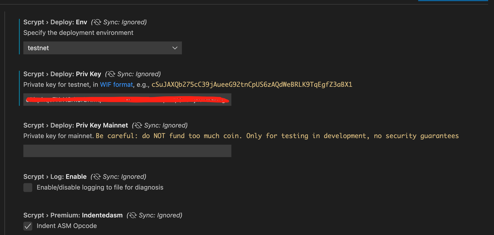
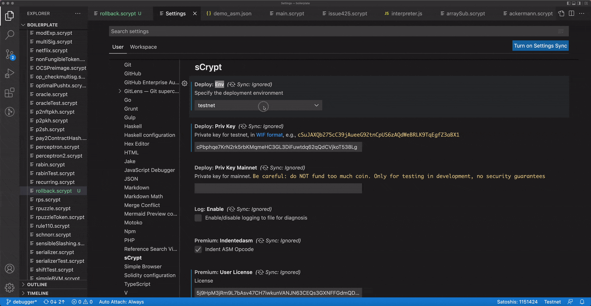
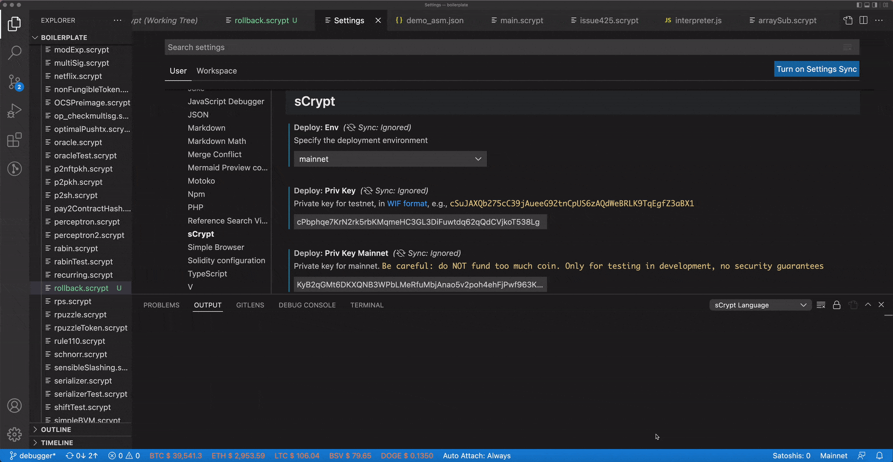

# sCrypt IDE 1.12.0 发布

sCrypt IDE 1.12.0 支持将合约部署到比特币主网。

更新IDE后，可以看到设置增加了 **Priv Key Mainnet** (主网私钥) 的设置项:

**Env** (部署环境) 也增加了 *mainnet* 的选项。选择 *mainnet* 选项后，IDE 会随机生成一个主网私钥。

同时还可以看到右下角状态栏增加了一个显示部署网络环境的按钮。点击改按钮同样可以切换部署网络。

设置好主网私钥后，或者点击状态栏的余额按钮，可以从 **OUTPUT** 视图中看到主网私钥对应的比特币地址。用你的钱包往该地址充值小额比特币，就可以开始将合约部署到主网了。部署的方法与[往测试网部署合约](https://blog.csdn.net/freedomhero/article/details/112055604)相同。

----------------------------------

**请注意：不要充值太多比特币。 该功能仅用于开发测试，无安全保证。**

