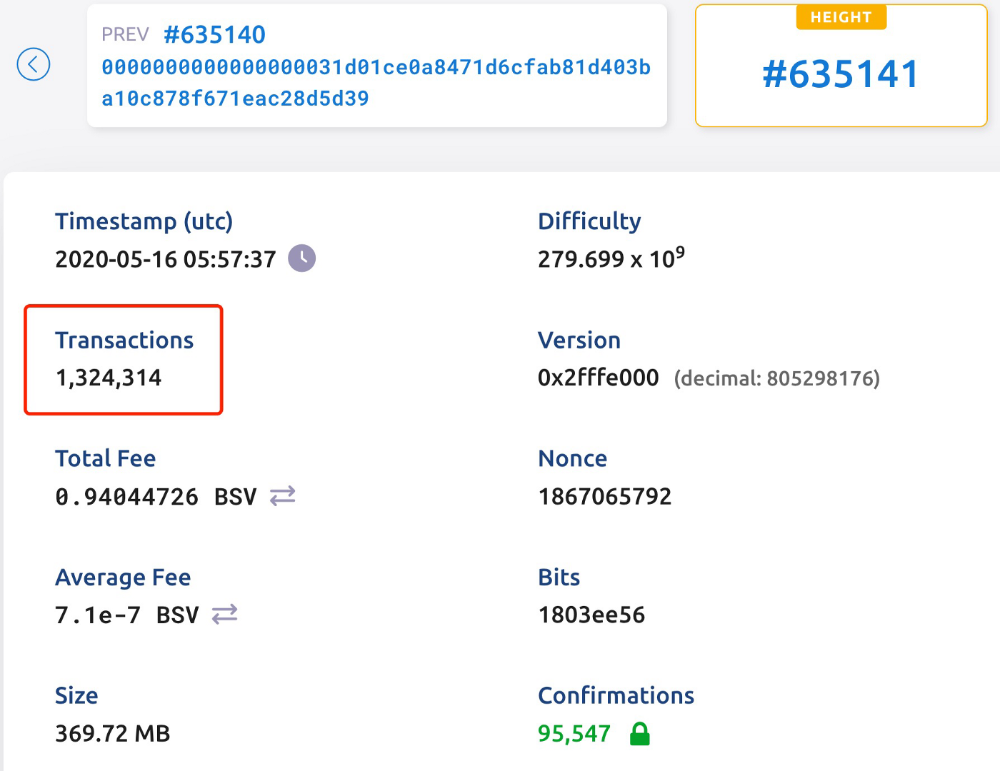
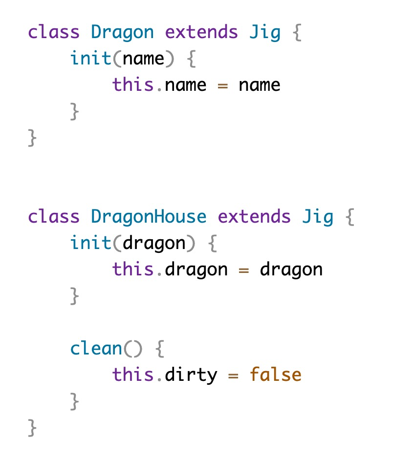
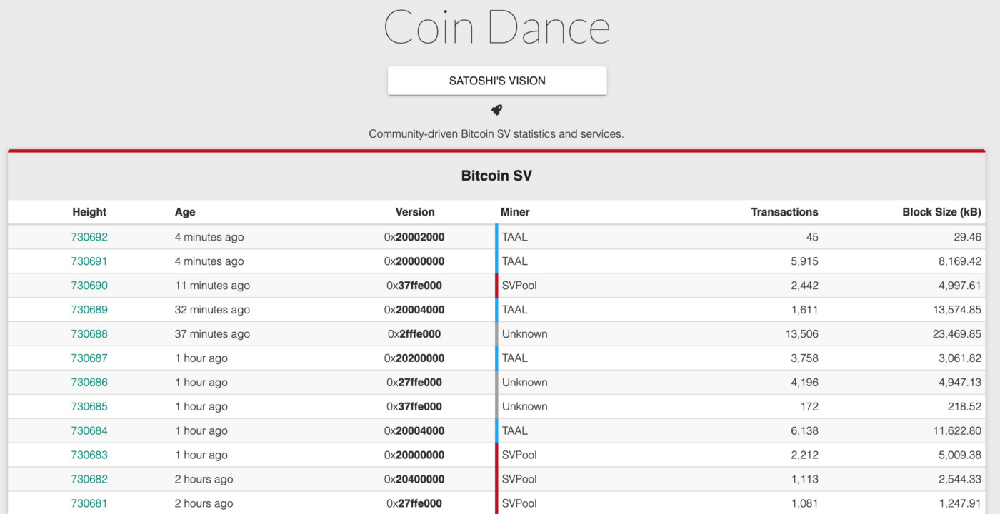
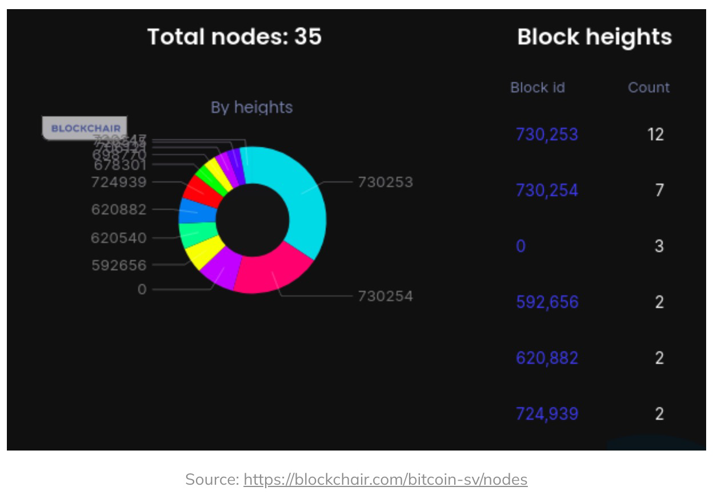

# 驳 Lopp 的 “关于 BSV 可扩展性”

我们调查了 BTC 传道者 Jameson Lopp 在他最近的关于 BSV 可扩展性的[文章](https://blog.lopp.net/bsv-scalability/)中提出的主张。我们专注于技术和客观的争论，而不是诸如用户运行节点和去中心化之类的哲学差异，这些差异是主观的，难以衡量。

## BSV 交易的特征

他挑选了 [#699154](https://whatsonchain.com/block-height/699154) 的 `1` GB 块，仅包含 `10,136` 个事务和 `14,566` 个输入，误导读者相信 BSV 只能处理大型数据存储块，其中跳过了事务验证。

他忽略了包含超过一百万个交易的区块，这样的区块有超过一百万个输入。例如，[#635141](https://whatsonchain.com/block-height/635141) 区块有 `130` 万笔交易，约为 BTC `7K` 的 `200` 倍。除其他外，还有 `110` 万笔交易的区块 [#634643](https://whatsonchain.com/block-height/634643)。

## 并行性

> *需要超过 600 倍的资源来验证。* 这意味着 1 GB 的块需要 100 分钟才能让我的机器进行验证。

这是一个基本错误。即使我们假设一个块需要 `600X` 资源来验证所声称的，这并不意味着它一定需要 `600X` 时间来验证，因为验证可以并行化。事实上，并行处理是链上扩展的核心。如果我们查看[#635141](https://whatsonchain.com/block-height/635141) 区块，按照他的逻辑验证大约需要 100 * (370 MB / 1 GB) = `37` 分钟，而实际上只需要 `13` 分钟即可挖掘¹。

**对 BSV 可扩展性的“深入研究”已经成功地忽略了其可扩展性中最重要的部分：并行的交易/块验证。**

## Run

> Run 似乎是一种智能合约语言，可让您创建代币、合约和其他数字资产。

[Run](https://run.network) 基于 Javascript，而不是智能合约语言。任何访问其主页的人都会发现很多 Javascript 代码。要么他甚至没有访问过他们的主页，要么他不认识 Javascript，这对于一个成为 BTC 影响者的[Web开发者](https://web.archive.org/web/20131023235956/https://www.linkedin.com/in/jamesonlopp)来说是令人惊讶的。

 <a href="https://run.network" >https://run.network</a>

也许他将 Run 误认为 [sCrypt](https://scrypt.io)，一种真正的智能合约语言。

## Coin Dance

> 在为本报告研究 BSV 时，我注意到的一件事是 coin.dance 显示了其他主要比特币分叉的统计数据，[但没有显示 BSV](https://sv.coin.dance)。

如果有人真的点击了链接，Coin Dance 会显示 BSV 的统计数据，与其他分叉一样全面。上述说法明显是错误的。我想我是第一个注意到这一点的人，因为没有人愿意阅读他的文章。

<a href="https://sv.coin.dance">https://sv.coin.dance</a>

他借助 Wayback 机器上的一张旧图片来误导读者相信 Coin Dance 放弃了 BSV, “大概是因为他们根本无法处理数据量”。

## Blockchair

> 我在其他服务/区块浏览器（例如 blockchair）上看到了类似的问题。

他声称，[blockchair](https://blockchair.com) 由于成本高昂而放弃了支持 BSV。他继续在下一段引用blockchair的统计数据，立即自相矛盾。您可以在 [blockchair](https://blockchair.com/bitcoin-sv) 上找到 BSV，以及许多其他区块链。

## OP_RETURN

> 什么是 OP_RETURN？这是一个脚本操作码，用于将交易输出标记为无效。

BSV 中的 OP_RETURN 已恢复为原始比特币的含义： 终止脚本，使堆栈保持原样，并让堆栈顶部的结果确定脚本的成功或失败。因此，如果顶部堆栈不为零，则视为成功。他仍然认为它还是像 BTC 那样总是失败。

当他正在学习更新的 OP_RETURN 时，他可能也有兴趣了解自 [Genesis 升级](https://wiki.bitcoinsv.io/index.php/Genesis_upgrade)以来已重新启用的许多操作码。在不破坏更改比特币的情况下, 支持了那些被认为不可能的高级智能合约，例如：

- [Schnorr 签名](https://xiaohuiliu.medium.com/schnorr-signatures-on-bitcoin-397ca51d8bda)
- [Merklized Alternative Script Trees(MAST)](https://blog.csdn.net/freedomhero/article/details/119301247?spm=1001.2014.3001.5501)
- [Pay to Script Hash (P2SH)](https://blog.csdn.net/freedomhero/article/details/112344420?spm=1001.2014.3001.5501)
- [Covenant](https://xiaohuiliu.medium.com/op-push-tx-3d3d279174c1)
- [Tree Signatures](https://xiaohuiliu.medium.com/tree-signatures-8d03a8dd3077)

## 结论

我们赞赏 Lopp 通过运行节点并测量其性能来研究 BSV 可扩展性的经验方法。我们鼓励他继续探索强大的 BSV 功能，这些功能只会不断增长。当 BTC 有任何值得探索的功能时，我们会考虑做同样的事情。

---------------

[1] 时间戳 5:57-5:44 = 13 分钟，假设区块时间戳在分钟粒度上或多或少是准确的。