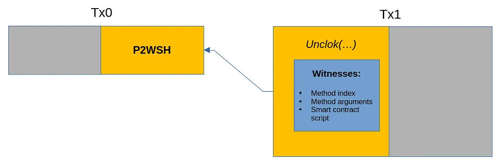

# 介绍 sCrypt：BTC 的 Layer-1 智能合约框架

> 在 TypeScript 中开发 BTC 智能合约


我们非常高兴地推出 sCrypt：一种现代 Typescript 框架，用于在 BTC 上开发第一层智能合约，无需分叉。 现在，人们可以使用现代开发工具在易于使用的统一框架中编写、测试、调试、部署和调用智能合约。 任何 web2 开发人员都可以在 BTC 上开发智能合约驱动的应用程序，只要她了解 JavaScript/TypeScript。 它为将 BTC 转变为智能合约平台奠定了坚实的基础。


## BTC 上的智能合约

传统上，比特币被认为只能支付和存储价值。 Ordinals 通过证明它也支持令牌来改变这种误解。 另一个误解是比特币缺乏智能合约功能。 事实上，BTC 从第一天起就以[比特币脚本](https://en.bitcoin.it/wiki/Script)的形式支持智能合约。 哈希锁、时间锁和多重签名是一些突出的例子。

BTC 智能合约的最大障碍之一在于脚本。 作为一种低级汇编语言，Script 非常难以编码和推理。 实际上没有像典型软件开发工作流程那样的测试、调试和部署工具。 用原生脚本编写智能合约既麻烦又容易出错。 当合约规模和复杂性增加时，它很快就会变得棘手。

## sCrypt

输入密码。 借助 sCrypt，开发人员可以直接使用 Typescript 编写 BTC 智能合约，[Typescript](https://www.typescriptlang.org/) 是世界上最流行的编程语言之一，每天都有数百万开发人员使用。 sCrypt 合约被编译成比特币脚本。

sCrypt 提供了很多好处：

无需学习新的编程语言。 我们选择 TypeScript 是因为它提供了一种简单、熟悉的语言 (JavaScript)，而且具有类型安全性，可以轻松开始编写安全的智能合约。 如果您已经熟悉 TypeScript/JavaScript，则无需学习新的编程语言或工具。

无需学习新工具。 Web2 开发人员可以重用数百万现有的 TypeScript/JavaScript 库和他们最喜欢的工具：用于 IDE 的 Visual Studio Code/WebStorm、用于包管理的 NPM、用于测试的 Jest/Mocha/Jasmine。

## 一个有效示例


让我们来看看一个实用的智能合约。

下面的代码代表了 [BitVM](https://bitvm.org/bitvm.pdf) 的简单逻辑 [NAND](https://en.wikipedia.org/wiki/NAND_gate) (NOT-AND) 门承诺，取自其[白皮书](https://bitvm.org/bitvm.pdf)中的图 2。 它检查门的两个输入位 (A, B) 和一个输出位 (E)（全部使用哈希值提前提交）是否匹配，即 `E = NAND(A, B)`。

该代码如何工作的具体细节并不重要。 这里的中心信息是，它与现代编程语言的样子相去甚远，而且显得深奥。

```
// Reveal Preimage of hashE0 or hashE1
<hashE0/1>
OP_BITCOMMITMENT
OP_TOALTSTACK
// Now the bit value of "E" is on the stack
// Reveal Preimage of hashB0 or hashB1
<hashB0/1>
OP_BITCOMMITMENT
OP_TOALTSTACK
// Now the bit value of "B" is on the stack
// Reveal Preimage of hashA0 or hashA1
<hashA0/1>
OP_BITCOMMITMENT
OP_TOALTSTACK
// Now the bit value of "A" is on the stack
//
// Verify that "A NAND B == E"
//
// Read "B" from alt stack
OP_FROMALTSTACK
// Compute A NAND B
OP_NAND
// Read "E" from alt stack
OP_FROMALTSTACK
// Check A NAND B == E
OP_EQUALVERIFY
```

<center>脚本中的 NAND 门承诺</center>

功能上的等价物在 sCrypt 中简单地表示为：

```ts
const bitA = BitVM.bitCommit(this.hashPairA, preimageA)
const bitB = BitVM.bitCommit(this.hashPairB, preimageB)
const bitE = BitVM.bitCommit(this.hashPairE, preimageE)
assert(BitVM.nand(bitA, bitB) == bitE)
```

比较 Script 和 sCrypt 实现，很明显后者对于现代开发人员来说更加友好和平易近人。 前者只有少数能够使用过时的汇编语言进行编码的开发人员知道，而后者可以由数百万了解 JavaScript/TypeScript 或任何其他面向对象编程语言（例如 Java、C++ 或 Golang）的开发人员掌握。 智能合约越复杂，用 sCrypt 开发比用 Script 开发就越有利。

下面列出了基于 sCrypt 库 [scrypt-ts-btc](https://www.npmjs.com/package/scrypt-ts-btc) 的完整代码。

```ts
import {
    assert, ByteString, hash160, method, prop, Ripemd160, SmartContract,
} from 'scrypt-ts-btc'

type HashPair = {
    hash0: Ripemd160
    hash1: Ripemd160
}

export class BitVM extends SmartContract {
    @prop()
    hashPairA: HashPair
    @prop()
    hashPairB: HashPair
    @prop()
    hashPairE: HashPair
    
    constructor(hashPairA: HashPair, hashPairB: HashPair, hashPairE: HashPair) {
        super(...arguments)
        this.hashPairA = hashPairA
        this.hashPairB = hashPairB
        this.hashPairE = hashPairE
    }
    
    @method()
    public openGateCommit(
        preimageA: ByteString,
        preimageB: ByteString,
        preimageE: ByteString
    ) {
        const bitA = DemoBitVM.bitCommit(this.hashPairA, preimageA)
        const bitB = DemoBitVM.bitCommit(this.hashPairB, preimageB)
        const bitE = DemoBitVM.bitCommit(this.hashPairE, preimageE)
        assert(DemoBitVM.nand(bitA, bitB) == bitE)
    }
    
    @method()
    static bitCommit(hashPair: HashPair, preimage: ByteString): boolean {
        const h = hash160(preimage)
        assert(h == hashPair.hash0 || h == hashPair.hash1)
        return h == hashPair.hash1
    }
    
    @method()
    static nand(A: boolean, B: boolean): boolean {
        return !(A && B)
    }
}
```

[BitVM 合约](https://github.com/sCrypt-Inc/demo-bitvm/blob/master/src/contracts/demoBitvm.ts)

## 部署和调用智能合约

我们使用 Pay-to-Witness-Script-Hash ([P2WSH](https://en.bitcoin.it/wiki/BIP_0142)) 进行合约部署。 部署包括编译智能合约代码以生成脚本、对该脚本进行哈希处理，并将哈希值放入 P2WSH 交易 (Tx0) 中，该交易将广播到网络。

当有人想要调用已部署的合约时，她将嵌入完整的合约脚本以及被调用方法的输入，作为后续交易（Tx1）中花费 Tx0 的见证数据。



<center>部署和调用交易：左边代表输入，右边代表输出</center>

以下是部署和调用合约的代码片段：

```ts
await BitVM.loadArtifact()

// instantiate a new contract
const instance = new BitVM(hashPairA, hashPairB, hashPairE)
await instance.connect(getDefaultSigner())

// deploy with 1000 sats
const deployTx = await instance.deploy(1000)
console.log(`Deployed contract "DemoBitVM": ${deployTx.id}`)

// call contract
const callRes = await instance.methods.openGateCommit(preimageA, preimageB, preimageE)
console.log(`Called "openGateCommit" method: ${callRes.tx.id}`)
```

[部署和调用](https://github.com/sCrypt-Inc/demo-bitvm/blob/master/tests/demoBitvm.test.ts)

值得注意的是，部署（第 `8`` 行）和调用（第 `12`` 行）合约只需要一行。

部署交易 ID：

[a651b22a8fc6d424233d94087d89744694f7710f175d9cd6fe2a0f66b3b35227](https://blockstream.info/tx/a651b22a8fc6d424233d94087d89744694f7710f175d9cd6fe2a0f66b3b35227)

调用交易ID：

[fa06d0f10f2642f9f677c105970559b15e8d9281e744b5ddc1da49fafc15b9d7](https://blockstream.info/tx/fa06d0f10f2642f9f677c105970559b15e8d9281e744b5ddc1da49fafc15b9d7)


这些交易 ID 代表在 BTC 上部署和调用的 `BitVM` 合约的实例。

该示例的完整代码可在 [GitHub](https://github.com/sCrypt-Inc/demo-bitvm) 上找到。 有兴趣的开发人员可以访问完整的代码并自行运行。 有关 sCrypt 的更多信息，请参阅我们的[详细文档](https://docs.scrypt.io/)。

## 已知限制


sCrypt 可以在任何支持比特币脚本的区块链上运行。 这包括比特币分叉和比特币衍生链，例如莱特币和Doge。

BTC [禁用](https://en.bitcoin.it/wiki/Script)了 `OP_CAT` 和 `OP_MUL` 等许多 Script 操作码，极大地限制了 sCrypt 可以表达的智能合约类型。 BTC 社区正在积极讨论重新启用此类操作码并引入新的操作码，如果提议的更改被接受，这将使 BTC 上的 sCrypt 比现在更强大。

与此同时，有些链拥有全套脚本操作码，例如 Bitcoin SV 和 [MVC](https://www.microvisionchain.com/)。 sCrypt 今天在这些链上达到了其全部能力。

## 在Taproot中使用

为了便于在示例中进行说明，我们使用 P2WSH 类型脚本嵌入 sCrypt 合约，该脚本允许最大脚本大小为 10KB。 sCrypt 合约也可以在 [Taproot](https://bitcoin.stackexchange.com/questions/117594/what-are-bitcoins-transaction-and-script-limits) 脚本中使用。 它们可以变得更具表现力和复杂性，因为 Taproot 的脚本大小限制更大，约为 4MB。

## 相关工作

### 与其他 Layer-1 (L1) 比较

还有其他一些尝试来提高脚本的可编程性，我们在下面列出了一些。

- [Miniscript](https://bitcoinops.org/en/topics/miniscript/)：一种独立的语言，用于以可组合且可读的方式表示比特币脚本。 它的范围非常有限，并且表达能力不如脚本：它只能表达签名要求、时间锁、哈希原像以及这些的任意组合。
- [Simplicity](https://blog.blockstream.com/en-simplicity-github/)：一种正在开发的低级编程语言，比比特币脚本具有更大的灵活性和表现力。 它需要一个分叉才能在 BTC 上实现。

与这两者相反，sCrypt 并没有发明一种新的编程语言，只是重用了 TypeScript，它的学习曲线明显更浅。 它还提供了除智能合约语言之外更全面的框架，包括 IDE、包管理、调试器、SDK 和 API。 也就是说，它提供了开发人员构建由智能合约支持的全栈应用程序所需的一切。

### 与第 2 层 (L2) 比较

sCrypt 是一种基于 Typescript 的[领域特定语言](https://en.wikipedia.org/wiki/Domain-specific_language) (DSL)，编译为[比特币脚本](https://wiki.bitcoinsv.io/index.php/Script)，目前无需任何分叉即可在 BTC 上运行。 它继承了 BTC 的全部安全性，从而使其比任何 BTC L2 都更加安全和去信任。

话虽如此，如果 BTC L2 也使用脚本并启用比 BTC L1 更多的操作码，那么 BTC L2 可以使用更多的 sCrypt 功能。 事实上，已经有 L2 以这种方式利用 sCrypt，例如 [Note Protocol](https://noteprotocol.org/docs/Protocol/NOTE-Protocol-V2-English#25-on-chain-contracts)。