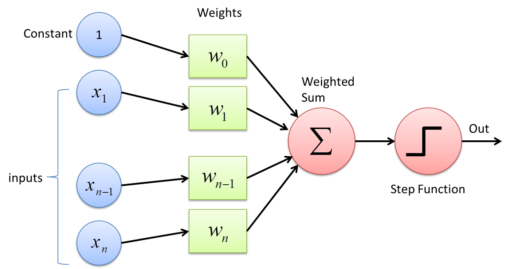

# 比特币上的人工智能

> 以感知机为例

人工智能，尤其是机器学习形式的人工智能，最近取得了巨大的进步，应用范围从人脸识别到自动驾驶汽车。我们建议将 AI 与比特币区块链结合起来，以获得许多其他方式无法实现的显着优势¹：

1. 公开透明：区块链上的代码和数据都是公开的，任何人都可以验证，因此是可信的。
2. 协作数据集：与传统的孤立数据集相比，每个人都可以贡献数据并访问已发布的数据。

比特币不仅可以维护链上的数据集以作为 AI 的输入，它还可以托管 AI 算法本身来处理这些数据集²。

我们已经实现了一个机器学习的基本构建块——感知器，并展示了在比特币上构建 AI 的巨大潜力。

## 感知器

与作为神经网络构建块的神经元类似，感知器相当于人工神经网络 (ANN)。感知器是单层神经网络，如下所示：



它消耗多个输入，对它们进行加权、求和，将其馈送到阶跃函数（如下所示）并产生一个二进制输出（只有 0 或 1）。


## 一个性别分类感知器

我们使用感知器来解决一个简单的分类问题。输入是多人的身高和体重，输出是他们的性别。


<center><a href="https://medium.com/@nikhilc3013/simple-perceptron-training-algorithm-explained-7bbfdff2c57d">红色标记表示男性和洋红色表示女性</a></center>

我们的目标是拟合一条将所有男性样本与女性样本分开的边界线。当样本变得庞大时，感知器是一种很好的找到界限的方法。

我们已经将这样的感知器实现为[有状态合约](https://blog.csdn.net/freedomhero/article/details/107307306)。它的状态由所有权重和偏差（图中的 w0）组成。最初，它们被分配一些随机值，然后在每次交易更新状态时进行调整。学习阶段一直运行到收敛。


```js
// Perceptron's internal state includes 2 inputs: height & weight
struct State {
	int heightWeight;
	// 1st weight means weight in KGs
	int weightWeight;
	int bias;
}

struct Input {
	// in inches
	int height;
	// in KGs
	int weight;
}

// correct classification of gender: 0 means female, 1 male
type Output = int;

/*
 * A simple perceptron classifying gender based on height & weight
 */
contract Perceptron {
	// sample size
	static const int N = 10;
	// learning rate
	static const int LR = 1;

	// training data set
	// inputs
	Input[N] inputs;
	// outputs
	Output[N] outputs;

	// train the perceptron
	function train(State s) : State {
		loop (N) : i {
			int prediction = this.predict(s, i);
			int delta = this.outputs[i] - prediction;
			s = this.adjust(s, delta);
		}
		return s;
	}

	// prediction for the i-th input
	function predict(State s, int i) : int {
		int sum = s.bias;
		sum += this.inputs[i].height * s.heightWeight + this.inputs[i].weight * s.weightWeight;
		return stepActivate(sum);
	}

	// learn internal state
	function adjust(State s, int delta) : State {
		int scaledDelta = delta * LR;
		loop (N) : i {
			s.heightWeight += this.inputs[i].height * scaledDelta;
			s.weightWeight += this.inputs[i].weight * scaledDelta;
		}
		s.bias += scaledDelta;
		return s;
	}

	// binary step function
	static function stepActivate(int sum): int {
		return (sum >= 0 ? 1 : 0);
	}
}
```

<center><a href="https://github.com/sCrypt-Inc/boilerplate/blob/master/contracts/perceptron.scrypt">感知器合约</a></center>


我们的感知器找到的最终边界如下所示。


<center><a href="https://github.com/nikhilc3013/Perceptron-model/blob/master/Simple%20Perceptron%20Model%20from%20Scratch.ipynb">性别分类感知器</a></center>

## 总结

一旦我们将感知器构建为基本模块，就可以在比特币之上构建更先进、更实用的人工神经网络，从而开辟无限机会。

--------------------------


[1] [区块链上的去中心化和协作 AI，JD Harris，2019](https://arxiv.org/abs/1907.07247)

[2] [区块链上的人工智能实现。用例和未来应用](https://www.mdpi.com/1999-5903/11/8/170)