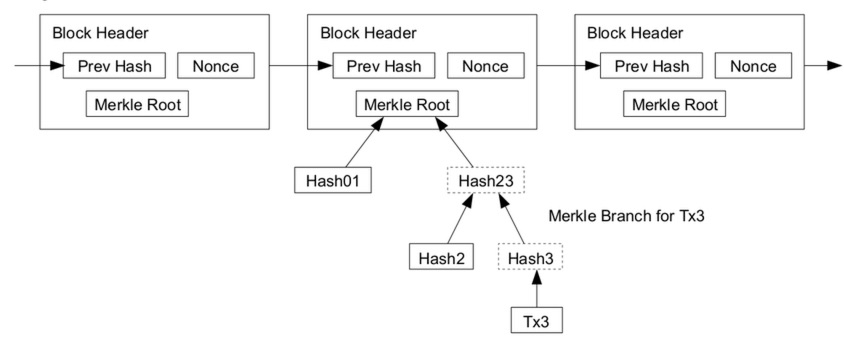

# 从比特币智能合约访问区块链数据：第 2 部分

在[上一篇文章](https://blog.csdn.net/freedomhero/article/details/121582456)中，我们介绍了一种以最小信任访问块和其中的交易的方法。
本文中, 我们将其扩展为在包含多个区块。使用该技术，我们基于区块时间开发了一个简单的投注合约。我们还展示了另一种阻止伪造块的方法。




<center>一个由 3 个区块组成的链</center>


## 多个区块组成的链

如下所示，`isBlockHeaderValid()` 验证一个区块链，而不是我们在上一篇文章中所做的单个区块。我们在第 `8` 行重用现有代码中的函数 `isBlockHeaderValid()` 来验证每个单独的块。此外，我们在第 `12` 行对区块头进行哈希处理，并确保哈希与第 `14` 行的下一个区块头中的 `prevBlockHash` 字段匹配。

```javascript
// is a chain of block headers valid
static function isBlockHeaderChainValid(static const int N, BlockHeader[N] headers, int blockchainTarget) : bool {
    bool res = true;

    loop (N) : i {
        if (res) {
            // each block is valid
            if (!isBlockHeaderValid(headers[i], blockchainTarget))
                res = false;

            if (i > 0) {
                Sha256 prevBlockHash = blockHeaderHash(headers[i - 1]);
                // blocks are chained
                if (prevBlockHash != headers[i].prevBlockHash)
                    res = false; 
            }
        }
    }

    return res;
}
```

<center><a href="https://github.com/sCrypt-Inc/boilerplate/blob/master/contracts/blockchain.scrypt">Blockchain 源代码</a></center>

也就是说，这两个块是链接在一起的。

## 案例研究：押注出块时间

平均而言，在比特币上挖掘一个区块需要 10 分钟。爱丽丝和鲍勃想打赌挖掘特定区块需要多长时间。他们每个人都在一个包含的以下智能合约的交易中锁定了一些比特币。交易广播后，将被挖掘进一个区块。如果该区块的挖掘时间少于 `10` 分钟，则 Alice 获胜并拿走所有锁定的硬币；否则，鲍勃获胜。我们使用块的时间戳（标头中的第 4 个字段）与其前一个块的时间戳之间的差异作为块时间¹。

```javascript
// bet on block time: how long it takes to mine the block containing the bet transaction
contract BlockTimeBet {
    // only 2 is needed; 7 means the transaction has 6 confirmations
    static const int N = 7;
    // 10 minutes in seconds
    static const int AVG_BLOCK_TIME = 600;
    // maximal target for any block to be considered valid
    int blockchainTarget;

    PubKey alice;
    PubKey bob;


    // header[1] is the block containing the contract tx
    public function main(BlockHeader[N] headers, MerkleProof merkleproof, Sig sig,  SigHashPreimage txPreimage) {
        require(Tx.checkPreimage(txPreimage));

        // get id of previous tx
        Sha256 prevTxid = Sha256(SigHash.outpoint(txPreimage)[:32]);

        // validate a chain of block headers
        require(Blockchain.isBlockHeaderChainValid(N, headers, this.blockchainTarget));

        // verify previous tx is in block with index 1
        require(Blockchain.txInBlock(prevTxid, headers[1], merkleproof));

        // block time is the time difference between this block and last
        int blockTime = headers[1].time - headers[0].time;

        // Alice wins if block is mined within 10 mins; otherwise Bob wins
        PubKey winner = blockTime < AVG_BLOCK_TIME ? this.alice : this.bob;
        require(checkSig(sig, winner));
    }
}
```

<center><a href="https://github.com/sCrypt-Inc/boilerplate/blob/master/contracts/blockTimeBet.scrypt">BlockTimeBet 合约源代码</a></center>

与上一篇文章的 BlockchainPRNG 合约一样，我们使用 [OP_PUSH_TX 技术](https://blog.csdn.net/freedomhero/article/details/107306604) 来获取包含投注合约的交易的 `txid` 。第 `20` 行验证区块头链是否合法，第 `23` 行验证投注交易在其中。第 `26` 行计算出块时间，用于在第 `29` 行确定获胜者。

## 鉴别假块

在上一篇文章中，我们引入了 `blockchainTarget` 参数来控制可接受的区块头的难度。我们还可以要求在一个区块之上构建多个区块，从而使在比特币公共区块链之外导入假区块变得更加困难。要求的区块越多，伪造它的成本就越高。这类似于使用比特币购买商品时所需的 `6` 次确认。在上面的投注合约中，我们只需要将 N 改为 `7` 即可确保包含该合约的交易有 `6` 个确认。

# 附录

[1]: 比特币区块时间戳不精确，通常不能用于衡量 `10` 分钟的时间间隔。但只要它是随机且难以预测的，投注合约就可以，因为它依赖于区块时间的随机性，而不是其精度。