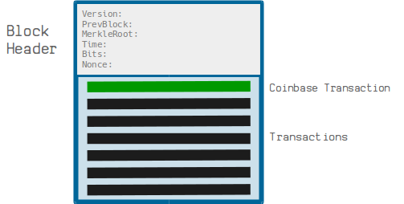
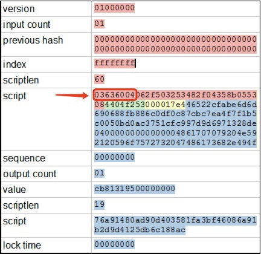

# 从比特币智能合约访问区块链数据：第 3 部分

> 访问区块高度和 `Coinbase` 交易


区块头包含区块创建时的时间戳。但通常我们想要访问块高度，它不包含在块头中。我们设计了一种新技术来无需信任地获取包含在 `coinbase` 交易中的块高度。

## Coinbase 交易的区块高度

[coinbase](https://wiki.bitcoinsv.io/index.php/Coinbase) 交易是区块中的第一笔交易。



<center>区块中的 Coinbase 交易</center>

[BIP34](https://github.com/bitcoin/bips/blob/master/bip-0034.mediawiki) 规定区块高度必须是 coinbase 交易解锁脚本中的第一项，如下所示。



<center>一个Coinbase 交易</center>

函数 `blockHeight()` 返回具有给定区块头的块的高度，如下所示。使用我们[之前的技术](https://blog.csdn.net/freedomhero/article/details/121582456)，我们可以在第 `13` 行和第 `16` 行使用 Merkle 证明访问给定块中的交易。我们可以进一步验证它是满足第 `5` 行到第 `8` 行三个约束条件的 coinbase 交易：

```javascript
// is raw transaction a coinbase tx
static function isCoinbase(bytes tx) : bool {
    return tx[4:5] == b'01' // only 1 input
        && tx[5:37] == b'0000000000000000000000000000000000000000000000000000000000000000' // null txid: all zeros
        && tx[37:41] == b'FFFFFFFF';    // null vout: all Fs
}


// get height of the block identified by the header
static function blockHeight(BlockHeader bh, bytes coinbaseTx, MerkleProof merkleproof) : int {
    
    // ensure coinbase it's in the block
    require(txInBlock(hash256(coinbaseTx), bh, merkleproof));

    // ensure it's coinbase
    require(MerklePath.isCoinbase(merkleproof));
    // alternative
    // require(isCoinbase(merkleproof));

    return readBlockHeight(coinbaseTx);
}

// parse block height from coinbase tx: BIP34
static function readBlockHeight(bytes coinbaseTx) : int {
    // block height is at the beginning of the unlocking script and encoded in varint
    return Utils.fromLEUnsigned(Utils.readVarint(coinbaseTx[BLOCK_HEIGHT_POS:]));
}
```

<center><a href="https://github.com/sCrypt-Inc/boilerplate/blob/master/contracts/blockchain.scrypt">Blockchain 源代码</a></center>


## 验证 Coinbase 的其它方法

还有另一种验证交易的方法是 coinbase，使用它的 Merkle 路径。由于 coinbase 是区块中的第一笔交易，因此其 Merkle 路径上的所有节点都必须位于右侧，如下图所示。

<center>Coinbase 交易及其默克尔路径</center>

```javascript
// a tx if coinbase if all nodes on its Merkle path are on the right branch
static function isCoinbase(MerkleProof merkleproof) : bool {

    bool res = true;
    loop (DEPTH) : i {
        Node node = merkleproof[i];
        if (node.left != INVALID_NODE) {
            // node on the right
            res = res && node.left == RIGHT_NODE;
        }
    }
    return res;
}
```

<center><a href="https://github.com/sCrypt-Inc/boilerplate/blob/master/contracts/merklePath.scrypt">MerklePath 源代码</a></center>

#  总结

一旦我们有了一个区块的高度，我们就可以在各种智能合约中使用它。

我们在下面列出了几个例子：

一种只能在一定区块高度后才能解锁的合约，类似于 [CheckLockTimeVerify](https://github.com/sCrypt-Inc/boilerplate/blob/master/contracts/cltv.scrypt)。

如果矿工至少开采了从高度 720000 到 720010 的区块中的一个，则只向矿工支付报酬，矿工接受合作伙伴的私人低费用交易。

我们期待您可以在这些技术的基础上建立各种创造性的合约。

