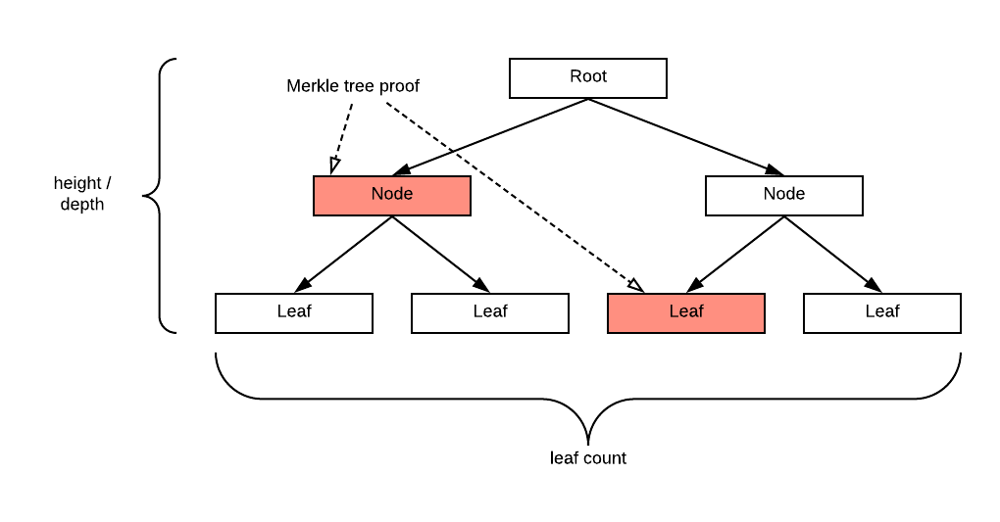
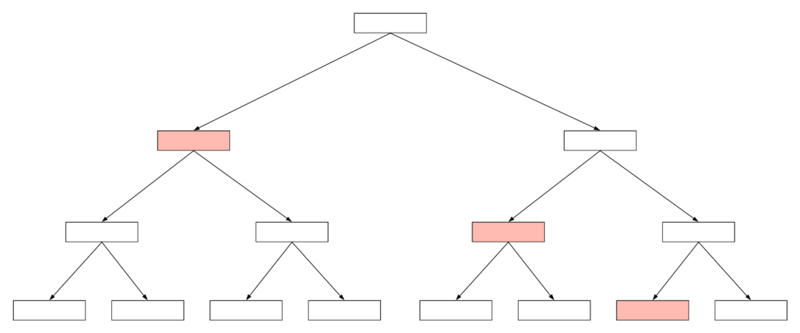
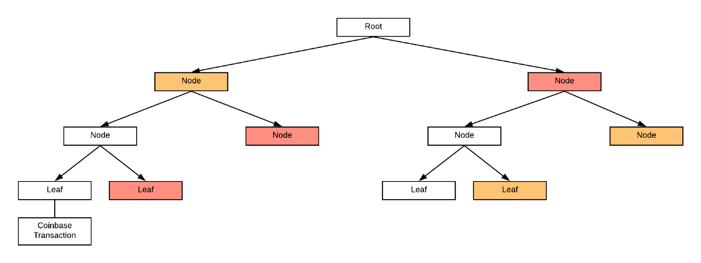
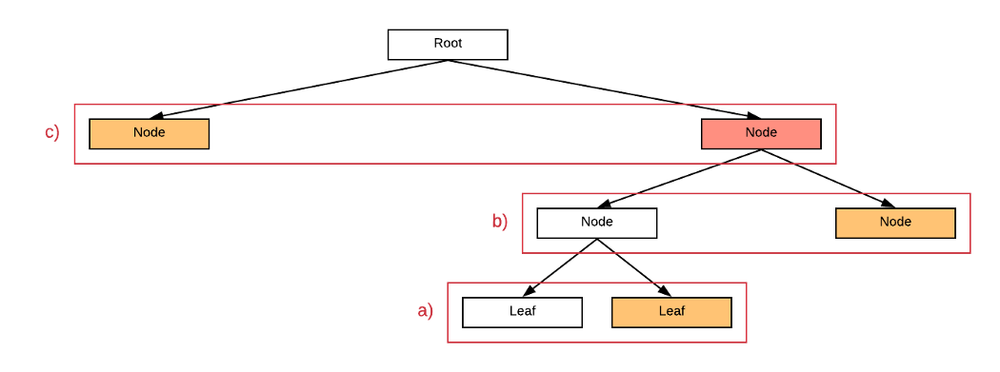

# 从比特币智能合约访问区块链数据：第 4 部分

> 获取区块中的交易总数

一个区块中的交易总数是一个重要的信息。我们展示了如何在没有受信任的第三方的情况下获得它，这在以前被认为是不可能的。

## 范围

让我们将 Merkle 路径的长度表示为 `n`。叶子的数量，即一个区块中的交易数量，介于 `2^(n-1) + 1` 和 `2^n` 之间。这是因为高度为 `n` 的满二叉树¹ 恰好有 `2^n` 个叶子。Merkle 路径的长度与 Merkle 树的高度相同。



<center>高度 2 的满二叉树</center>

## 确切数字

**查找最后一笔交易**


在[上一篇文章]()中，我们访问了区块中的第一个 coinbase 交易。如果我们还可以访问最后一笔交易，我们就可以推断出交易总数。我们可以通过验证其 Merkle 路径上的所有节点都在右分支上来识别第一个/最左边的交易。类似地，通过要求所有 Merkle 路径节点都在左分支上，找到最后/最右边的交易很诱人。不幸的是，这可能并不总是正确的。

如果我们有一个满的 Merkle 树，那么最后一笔交易的 Merkle 路径上的所有节点确实都在左分支上，如下所示。




<center>最后一笔交易的彩色默克尔路径</center>

但是，当树不满时，情况并非如此。

例如，下面的树有 5 个叶子，最后一个交易的 Merkle 路径由所有颜色为橙色的节点组成。其中两个躺在右边的树枝上，只有最上面的一个在左边。



为了克服这个问题，我们注意到当 Merkle 树的任何单层中有奇数个节点时，最后一个节点被复制。这意味着，如果最后一笔交易的 Merkle 路径上的任何节点在右分支上，则必须从当前的左分支复制它，如下图所示。



下面的代码直接实现了算法。

```javascript
// is txid the last transaction in a block
static function lastTxInBlock(Sha256 txid, BlockHeader bh, MerkleProof merkleproof) : bool {
    bool last = true;
    Sha256 root = txid;

    loop (MerklePath.DEPTH) : i {
        Node node = merkleproof[i];

        if(node.left != MerklePath.INVALID_NODE) { // s is valid
            // if node on the merkle path is on the right, it must be a duplicate
            // if node on the merkle path is on the left, it must NOT be a duplicate
            if (node.left != MerklePath.LEFT_NODE && node.hash != root || node.left == MerklePath.LEFT_NODE && node.hash == root) {
                last = false;
            }

            root = node.left == MerklePath.LEFT_NODE ? hash256(node.hash + root) : hash256(root + node.hash);
        }
    }

    return last && root == bh.merkleRoot;
}
```

<center><a href="https://github.com/sCrypt-Inc/boilerplate/blob/master/contracts/blockchain.scrypt">Blockchain 源代码</a></center>

## 从默克尔路径到交易索引

为了导出交易的索引，我们遵循从根到代表它的叶子的 Merkle 路径。当路径上的一个节点在左分支上时，我们向右走（即二进制1）；否则，我们向左走（二进制 0）。容易看出，我们可以通过这种方式获得其索引的二进制表示。在下面的示例中，我们将此规则应用于最后一笔交易，然后一直向右走，得到二进制的 `111`，这正是它的十进制索引 `7`。


<center>一棵所有叶子都以二进制索引的树</center>

此代码如下所示：

```javascript
// calculate a tx's index in a block from its merkle path
// goes from top to bottom, the path basically encodes the index in binary form
// left/L means 1, and right/R 0: e.g., (L, R, L) denotes 101 in binary, and 5 in decimal
static function txIndex(MerkleProof merkleproof) : int {
    int sum = 0;

    // traverse the path from top to bottom
    loop (MerklePath.DEPTH) : i {
        Node node = merkleproof[MerklePath.DEPTH - i - 1];

        if(node.left != MerklePath.INVALID_NODE ) {
            sum *= 2;
            if (node.left == MerklePath.LEFT_NODE) {
                sum++;
            }
        }
    }
    return sum;
}
```

<center><a href="https://github.com/sCrypt-Inc/boilerplate/blob/master/contracts/blockchain.scrypt">Blockchain 源代码</a></center>

## 总结

一旦我们可以访问一个区块中的交易数量，我们就可以使用它来构建以前被认为不可能的智能合约。

我们仅在下面列出几个示例：

- 放置一个仅在一个区块包含超过 100 万笔交易时才支付的赏金合约，以赞助压力测试。
- 结合之前获得的时间信息，无论是区块头中的时间戳还是区块高度，都可以忠实地计算每秒交易量（TPS）并在合约中使用。例如，只有在 TPS 达到 100,000 时才解锁的合约。


我们期待看到您能提出什么样的令人兴奋的新合同。

## 致谢

这篇文章的灵感来自 [shilch 的工作](https://shilch.me/the-infinite-stream-of-transactions-attack-that-isnt)。