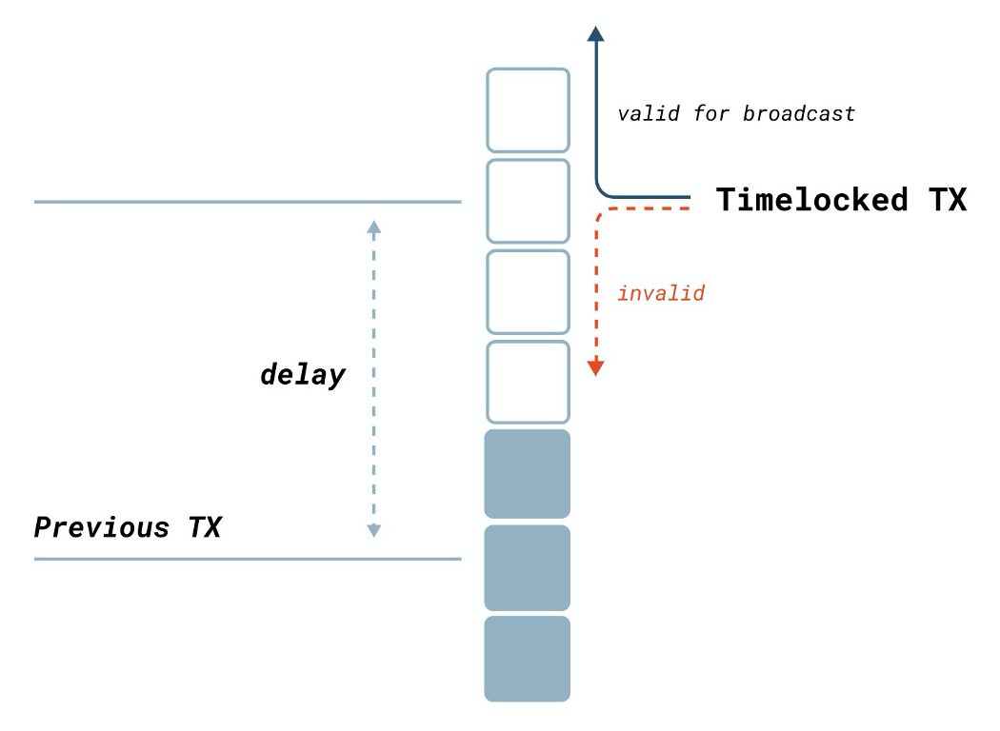

# 从比特币智能合约访问区块链数据：第 5 部分

> 没有 OP_CheckSequenceVerify 的相对锁定时间


在本系列前几部分奠定的基础上，我们已经演示了如何在比特币中实现相对锁定时间，而无需新的操作码 `OP_CheckSequenceVerify`。


## 时间锁

时间锁会限制某些比特币的支出，直到指定的未来时间或区块高度。有两种类型的时间锁：

1. 绝对：例如，可以证明可以锁定 1,100,000 个比特币，直到区块高度 800,000，或直到 2025 年 1 月 1 日。
2. 相对：例如，可以锁定 21 个比特币，这些比特币只能在 100 个区块或 3 天后使用。

为了启用绝对和相对时间锁，[BIP65](https://github.com/bitcoin/bips/blob/master/bip-0065.mediawiki) 和 [BIP68/112/113](https://en.bitcoin.it/wiki/Timelock#CheckSequenceVerify) 中分别引入了新的操作码 `OP_CheckLockTimeVerify/OP_CLTV` 和 `OP_CheckSequenceVerify/OP_CSV`。


## 没有 `OP_CSV` 的相对锁定时间

比特币SV恢复了原有的比特币协议，[恢复](https://bitcoinsv.io/2020/01/15/changes-for-the-genesis-upgrade/)了上述变化。
证明 `OP_CSV` 可以用原始协议实现。




在[第 1 部分](https://blog.csdn.net/freedomhero/article/details/121582456)中，我们展示了如何访问包含给定合约 UTXO 的块。结合这个区块头和指定的相对时间锁，我们可以知道该 UTXO 可以被花费的最早区块。我们要求在截止日期之后的任何块都可用于解锁 UTXO，本质上是像 `OP_CSV` 那样在其上放置一个相对时间锁。

下面列出了完整的代码。

```javascript
import "blockchain.scrypt";

// relative locktime, aka, OP_CheckSequenceVerify https://en.bitcoin.it/wiki/Timelock#CheckSequenceVerify
contract CheckSequenceVerify {
    // relative timelock: specified in either unix time or block height
    int relativeTime;
    // maximal target for any block to be considered valid
    int blockchainTarget;

    // unlock based on unix timestamp
    public function unlockWithTime(BlockHeader utxoBh, BlockHeader latestBh, MerkleProof merkleproof, SigHashPreimage txPreimage) {
        this.validateHelper(utxoBh, latestBh, merkleproof, txPreimage);

        // enough time has elapsed since the UTXO is mined
        require(latestBh.time - utxoBh.time >= this.relativeTime);
    }

    // unlock based on block height
    public function unlockWithBlockHeight(BlockHeader utxoBh, BlockHeader latestBh, MerkleProof utxoMerkleproof, MerkleProof latestMerkleproof,
        bytes utxoCoinbaseTx, bytes latestCoinbaseTx, MerkleProof merkleproof, SigHashPreimage txPreimage) {
        this.validateHelper(utxoBh, latestBh, merkleproof, txPreimage);

        // get block height from header
        int utxoBlockHeight = Blockchain.blockHeight(utxoBh, utxoCoinbaseTx, utxoMerkleproof);
        int latestBlockHeight = Blockchain.blockHeight(latestBh, latestCoinbaseTx, latestMerkleproof);

        require(latestBlockHeight - utxoBlockHeight >= this.relativeTime);
    }

    // common validation for both relative timelock: Unix timestamp and block height
    // @utxoBh: block header containing the UTXO containing the contract
    // @latestBh: latest block header
    function validateHelper(BlockHeader utxoBh, BlockHeader latestBh, MerkleProof merkleproof, SigHashPreimage txPreimage) : bool {
        require(Tx.checkPreimage(txPreimage));
        // get id of previous tx
        Sha256 prevTxid = Sha256(SigHash.outpoint(txPreimage)[: 32]);
        // verify previous tx is in the block
        require(Blockchain.txInBlock(prevTxid, utxoBh, merkleproof));

        // validate block headers
        require(Blockchain.isBlockHeaderValid(utxoBh, this.blockchainTarget));
        require(Blockchain.isBlockHeaderValid(latestBh, this.blockchainTarget));

        return true;
    }
}

```

<center><a href="https://github.com/sCrypt-Inc/boilerplate/blob/master/contracts/csv.scrypt">CheckSequenceVerify 源代码</a></center>

第 `11` 行实现了基于 unix 时间（例如，以秒为单位）的解锁。第 `33` 行的 `validateHelper()` 函数验证包含 UTXO 的块和最新的块是否有效（第 `41-42` 行）。它还使用与[第 1 部分](https://blog.csdn.net/freedomhero/article/details/121582456)中相同的技术验证前一个块实际上包含 UTXO（第 `34-38` 行）。第 `15` 行确保自挖出 UTXO 后所需的时间已经过去。

第 `19` 行实现了基于区块高度（例如，区块数量）的解锁。第 `24-25` 行获取两个块的高度，如 [第 3 部分]() 所述。第 `27` 行检查在 UTXO 之后已经开采了指定数量的区块。

# 总结

除了 `OP_CSV` 之外，我们之前已经实现了 [OP_CLTV](https://blog.csdn.net/freedomhero/article/details/107306604)，而没有对原始比特币协议进行任何更改。这有两个含义：

1. 如前所述，这两个操作码都不是启用 UTXO 级时间锁所必需的。
2. OP_CSV/CLTV 支持的所有用例，例如闪电网络、侧链和 [CLTV 风格的支付渠道](https://en.bitcoin.it/wiki/Payment_channels#CLTV-style_payment_channels)，都可以直接构建在原始比特币上。
