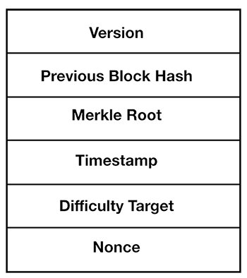
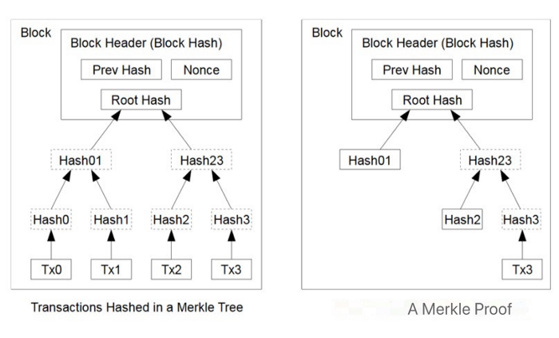

# 无需预言机即可从比特币智能合约访问区块链数据

> 脚本中的 SPV

智能合约对外部世界一无所知，一般必须依靠预言机来导入外部数据。我们之前已经展示了两种基于 Rabin 签名和 ECDSA 从预言机导入数据的方法。在本文中，我们将展示可以在没有预言机的情况下访问特定类型的外部数据，即区块链上的数据（例如区块头和交易），同时仍然保持数据完整性。通过允许智能合约以最少的信任访问链上数据，这将为所有新的比特币智能合约提供无限的机会。

## 访问区块头

顾名思义，比特币区块链由一个区块链组成。一个区块有两部分：区块头和交易。


<center>一个块和它的头</center>


区块头包含区块的元数据，有六个字段，如下所示。



<center>比特币区块头</center>

值得注意的是，比特币区块头是比特币工作量证明共识算法的一部分。更具体地说，序列化区块头的哈希值不应超过难度目标（即前导零的数量）。由于工作量证明的不可信性质，生成一个有效的区块头的成本非常高，尤其是在难度很高的情况下。但是很容易检查给定的区块头是否有效。这正是我们在不依赖任何预言机的情况下将区块头导入如下所示的智能合约的方式。

```javascript
import "Util.scrypt";
import "mast.scrypt";

struct BlockHeader {
    bytes version;
    Sha256 prevBlockHash;
    Sha256 merkleRoot;
    int time;
    // difficulty target
    bytes bits;
    bytes nonce;
}

// a library to trustlessly access the blockchain: including blockheaders and transactions
library Blockchain {
    // SPV: is a txid in a block
    static function txInBlock(Sha256 txid, BlockHeader bh, MerklePath merklePath) : bool {
        return MAST.calMerkleRoot(txid, merklePath) == bh.merkleRoot;
    }

    // is block header valid with difficulty meeting target
    static function isBlockHeaderValid(BlockHeader bh, int blockchainTarget) : bool {
        int bhHash = blockHeaderHash(bh);
        int target = bits2Target(bh.bits);

        // block hash below target and target below blockchain difficulty target
        return bhHash <= target && target <= blockchainTarget;
    }

    // convert difficulty from bits to target
    static function bits2Target(bytes bits) : int {
        int exponent = unpack(bits[3 :]);
        bytes coefficient = bits[: 3];
        int leadingZeroBytes = exponent - 3;

        bytes targetBytes = num2bin(0, leadingZeroBytes) + coefficient;
        return Util.fromLEUnsigned(targetBytes);
    }

    // serialize a block header
    static function serialize(BlockHeader bh) : bytes {
        return bh.version + bh.prevBlockHash + bh.merkleRoot + num2bin(bh.time, 4) + bh.bits + bh.nonce;
    }

    // block header hash
    static function blockHeaderHash(BlockHeader bh) : int {
        bytes bhSerialized = serialize(bh);
        // hash is reversed
        return unpack(reverseBytes(hash256(bhSerialized), 32));
    }
}
```

第 22 行的 `isBlockHeaderValid()` 检查区块头是否有效。第 31 行的 `bits2Target()` 从紧凑形式（通常称为 `nBits` 的 4 字节字段）计算难度目标。我们只是在第 23 行散列区块头，并确保它满足第 27 行的难度目标。

## 假区块头

我们还在第 27 行检查了难度目标不大于 `blockchainTarget` 参数，以控制产生假区块头的难度。否则，攻击者可以轻松创建一个块头，其哈希满足其中的难度目标（例如，只有 2 个前导零）。与比特币的许多其他方面（例如零确认）一样，以这种方式导入区块头的安全性是通过经济手段来保障的，而不仅仅是技术性保障。这意味着在实践中，依赖真实区块头的智能合约必须锁定的比特币数量不应超过产生虚假区块头的成本。

## 访问交易

一旦区块头可用，我们就可以轻松访问区块中的任何交易。这是因为区块头包含所有交易的 Merkle 树的根。与 [SPV](https://wiki.bitcoinsv.io/index.php/Simplified_Payment_Verification) 类似，我们将交易及其 Merkle 路径传递到智能合约中，并验证它与区块头中的根哈希匹配。第 17 行的 `txInBlock()` 演示了这一点。



## 案例：使用区块链生成随机数 

一般来说，在区块链中安全公平地生成伪随机数被认为是一个难题，因为区块链既是确定性的又是透明的。我们利用区块链数据，特别是区块头的 `nonce` 字段，作为熵的来源。

Alice 和 Bob 都将相同数量的比特币锁定到以下合约中。一旦包含合约的交易被广播，它将被挖掘到未来的区块中。根据块的随机数（很难预测并且可以被视为随机），确定赢家并拿走所有锁定的比特币。

```javascript
import "blockchain.scrypt";

/*
  A trustless psuedo-random number generator using the block containing the deployed contract tx as an entropy source
*/
contract BlockchainPRNG {
    PubKey alice;
    PubKey bob;

    /*
      @bh: header of the block containing the contract tx/UTXO
      @merklePath: Merkle proof for the tx
      @sig: winner signature
      @blockchainTarget: difficulty target on mainnet
     */
    public function bet(BlockHeader bh, MerklePath merklePath, Sig sig, int blockchainTarget, SigHashPreimage txPreimage) {
        require(Tx.checkPreimage(txPreimage));

        // get id of previous tx
        Sha256 prevTxid = Sha256(Util.outpoint(txPreimage)[:32]);

        // validate block header
        require(Blockchain.isBlockHeaderValid(bh, blockchainTarget));

        // verify previous tx is in the block
        require(Blockchain.txInBlock(prevTxid, bh, merklePath));

        // use block header's nonce's last bit as a psuedo-random number
        PubKey winner = unpack(bh.nonce) % 2 ? this.alice : this.bob;
        require(checkSig(sig, winner));
    }
}
```

第 17 行和第 20 行使用 [OP_PUSH_TX](https://blog.csdn.net/freedomhero/article/details/107306604) 技术获取包含合约的交易的 txid。第 23 行验证区块头是否合法，第 26 行验证前一个交易是否在该区块中。如果 nonce 字段为奇数，则 Alice 获胜；否则，鲍勃获胜。

# 总结

我们已经展示了如何以最小的信任访问比特币智能合约中的区块链数据。由于序列化的比特币标头只有 80 字节长，并且 Merkle 证明按对数缩放，因此该技术非常高效（与 SPV 相同）。我们还展示了一个使用区块链数据生成伪随机数的示例。这只是可能的开始，我们将在以后的文章中探讨。敬请关注。


