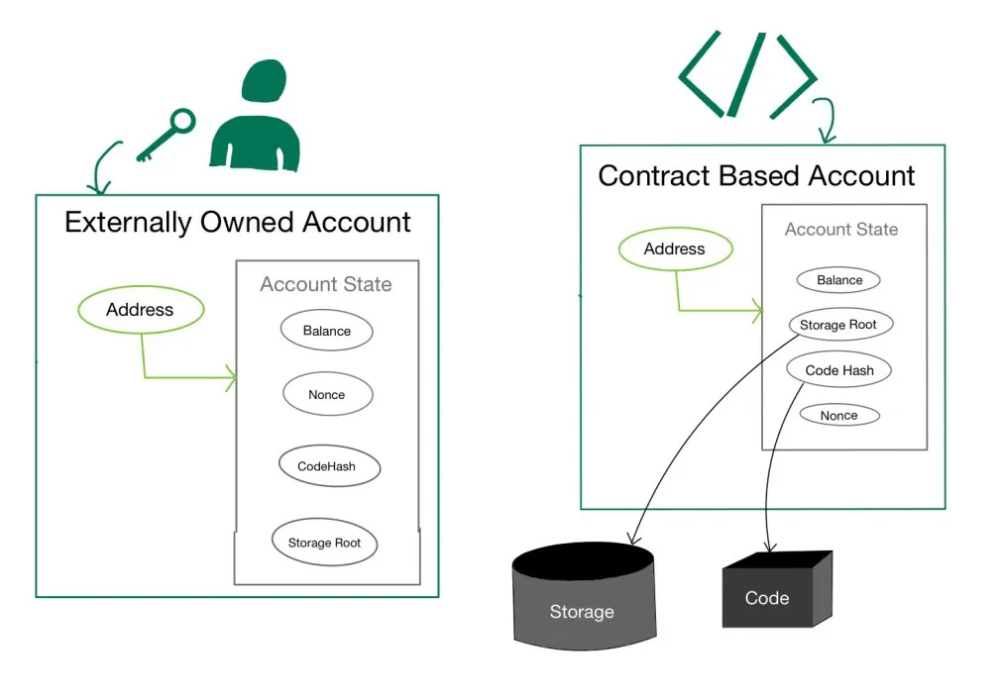
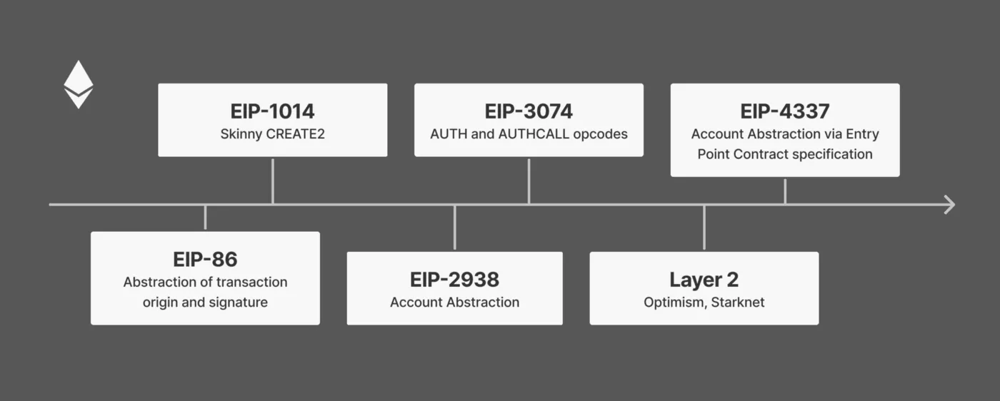
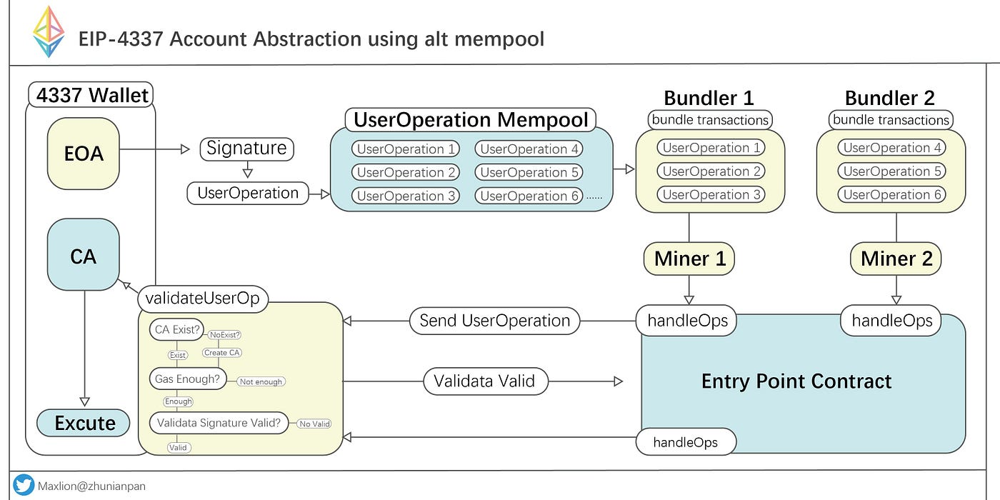
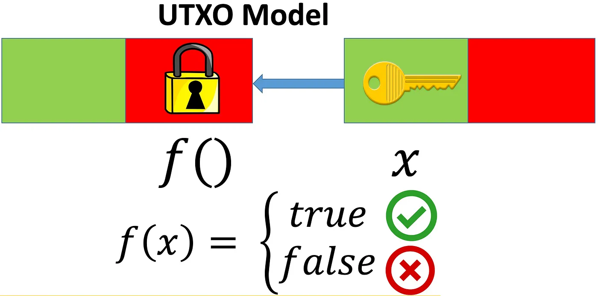

# 比特币与生俱来的账户抽象功能

长期以来，账户抽象一直是[以太坊的梦想](https://medium.com/infinitism/erc-4337-account-abstraction-without-ethereum-protocol-changes-d75c9d94dc4a)，最近成为热门话题。

我们证明了比特币从诞生之日起就伴随着账户抽象/统一。 因此，账户抽象承诺的所有显着功能都可以并且已经在比特币上开发，无需任何协议更改且几乎没有增加复杂性。 以太坊有缺陷的初始设计需要不断和复杂的改造才能实现账户抽象，而账户抽象仍未交付，这比比特币晚了 14 年多。

## 账户抽象（Account Abstraction）
要了解账户抽象，我们首先需要了解账户在以太坊上是如何运作的。 以太坊账户类似于银行账户，但持有以太币或 ETH 而不是法定货币。 以太坊上有两种类型的账户，均由唯一地址标识。

### 1. 外部账户 (EOA)

EOA 是由区块链外部的某些东西拥有的帐户：用户。 它们是用户使用 MetaMask 等钱包创建的传统账户。 EOA 有一个由用户私钥控制的公共地址，可以签署和发起交易。 签名验证被硬编码到基础层中，并在以太坊虚拟机 (EVM) 之外运行。

### 2. 合约账户 (CA)

这些账户通常被称为智能合约，由它们的智能合约代码控制，而不是私钥。 智能合约在 EVM 中运行。 CA 有存储和代码，而 EOA 两者都没有。

以太坊账户类型——EOA 和 CA。 （<a href="https://www.geeksforgeeks.org/what-are-ethereum-accounts/">来源</a>）

## 账户抽象的动机

EOA 存在一个放之四海而皆准的问题。 无论 EOA 的余额是 1 个以太币还是价值数十亿美元的以太币，它都由一个私钥保护。 如果用户由于一个小错误丢失了私钥（或种子短语），她可能会失去一切。 这使得自我监护对主流观众来说不可行。

账户抽象旨在通过统一EOA和CA来提升用户体验，消除两类账户的存在。 它通过将签名交易的验证逻辑移动到 EVM 中，使 EOA 可编程，就像在 CA 中一样。 EOA 可以根据每个用户的需求量身定制。

## 账户抽象的历史和现状

多年来，关于如何在以太坊上实现账户抽象的提案很多。

有些需要对协议进行重大更改，例如 EIP-2938。 其他不需要协议更改但从根本上改变用户钱包的工作流程，例如最新的 [EIP-4337](https://eips.ethereum.org/EIPS/eip-4337)。 它引入了一个新的内存池、一个称为捆绑器的新参与者和多个新层，以及其他变化。 鉴于引入的巨大复杂性，EIP-4337 没有得到任何有意义的采用也就不足为奇了。

## 比特币上的账户抽象

账户的比特币等价物是所谓的未花费交易输出（UTXO）。 UTXO 中的比特币由其中的智能合约代码控制/锁定。 要花费它们，用户必须提供匹配的“密钥”，这通常需要某种秘密信息。

至关重要的是，由私钥控制的 UTXO 和不受私钥控制的 UTXO 之间没有区别。 UTXO 的支出条件始终在比特币虚拟机（BVM）中得到验证。 最流行的 UTXO 类型有一个所有比特币钱包都使用的地址，并由相应的私钥1控制。 然而，它的签名验证仍然在 BVM 中完成，而不是嵌入到基础层中，因此与以太坊相比不需要特殊处理。

## 使用场景

比特币从一开始就有账户抽象，因为它统一了所有账户/UTXO 处理。 为了证实这一点，我们列出了一些已在比特币上实现的最突出的账户抽象功能。 其他账户抽象功能可以类似地实现。

### 1. 赞助交易

它允许第三方（例如付款人和应用程序）代表其用户支付交易费用。 这对于没有任何比特币的用户来说是必需的。 启用它的一种方法是使用 ANYONECANPAY sighash 标志。 它允许任何人向部分签名的交易添加输入，该交易可用于支付矿工费用。

### 2. 不同的签名方案

比特币默认在称为 secp256k1 的特定椭圆曲线上使用称为 ECDSA 的特定签名方案，与以太坊相同。 由于 UTXO 由可编程智能合约控制，我们可以使用任何替代签名方案。 例如，我们实现了 [Schnorr](https://blog.csdn.net/freedomhero/article/details/127314733) 和 [BLS](https://medium.com/coinmonks/bls-signatures-on-bitcoin-fc837c799380) 签名。

我们还在 [secp256r1](../Turn%20Every%20Smartphone%20into%20a%20Bitcoin%20Hardware%20Wallet%20Using%20Secure%20Enclaves/Turn%20Every%20Smartphone%20into%20a%20Bitcoin%20Hardware%20Wallet%20Using%20Secure%20Enclaves.md) 等替代曲线上实施了 ECDSA，它支持使用 iOS 和 Android 设备的安全区域进行硬件签名。

### 3. 社交恢复

用户将比特币锁定在智能合约中。 默认情况下，合约只需要一个用于签署交易的签名密钥，就像属于比特币地址的比特币一样。 此外，合约使用多个用户选择的“监护人”以提高安全性。 如果用户丢失了签名密钥，她可以联系大多数监护人（比如 5 人中的 3 人）将签名密钥更改为她的新密钥，从而恢复访问权限。

### 4. 保险库

一个[非托管的比特币保险库](../Non-Custodial%20Bitcoin%20Vaults/Non-Custodial%20Bitcoin%20Vaults.md)已经建成，锁定在里面的比特币只能在用户定义的时间延迟后转移。 用户还可以设置每天的支出限额和白名单/黑名单等。

### 5. 定期付款

比特币上类似 [Patreon](https://blog.csdn.net/freedomhero/article/details/114636728) 的服务已经实现，以允许定期支付。

### 6. 多签 (Multisig)

比特币内置了开箱即用的[多重签名](https://wiki.bitcoinsv.io/index.php/Complex_Script_Options)支持。

----------------

[1] 智能合约称为支付公钥哈希 (P2PKH)。