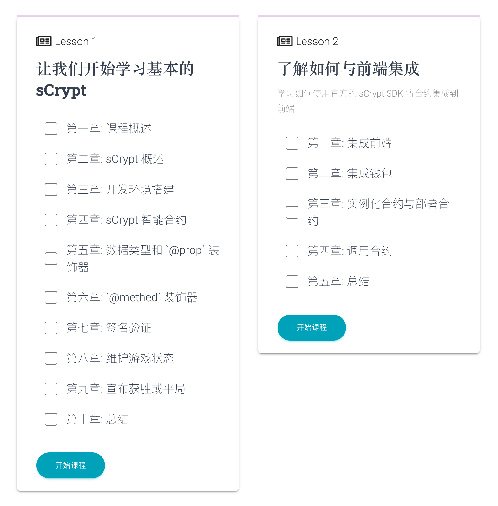

# 《使用 sCrypt 构建井字游戏》课程上线

《使用 sCrypt 构建井字游戏》课程上线 [Learn sCrypt](https://learn.scrypt.io/zh)。Learn sCrypt 是一个交互式学习网站，旨在帮助开发者更快、更轻松地学习和掌握比特币智能合约开发语言 sCrypt。

井字游戏非常简单，就是使用两个玩家(分别是 Alice 和 Bob)的比特币地址初始化合约，各自下注相同的金额锁定到合约中。只有赢得那个人可以取走合约里面的钱。如果最后没有人赢，则两个玩家各自可以取走一半的钱。

通过此课程，你将学会如何使用 sCrypt 构建一个比特币上的井字棋dApp。

课程链接：

https://learn.scrypt.io/zh/courses/Build-a-Tic-tac-toe-Game-with-sCrypt-614c387bc0974f55df5af1e5

本课程内容包括:

