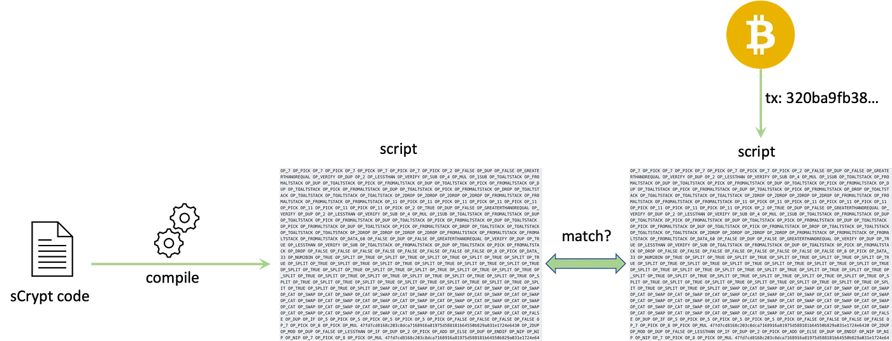
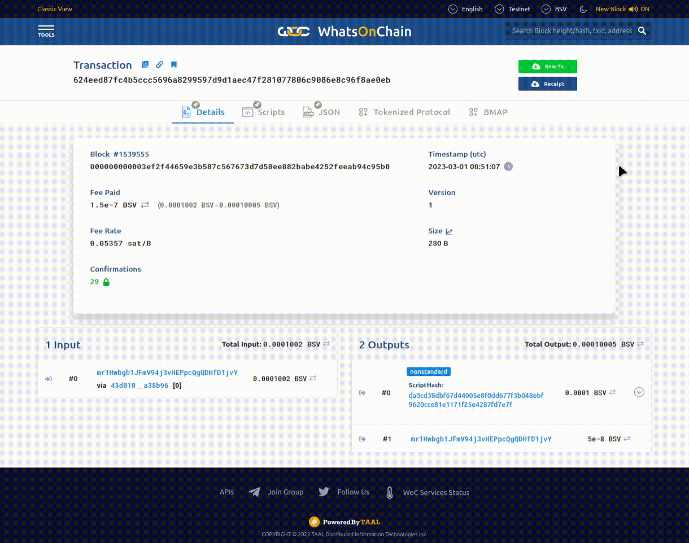
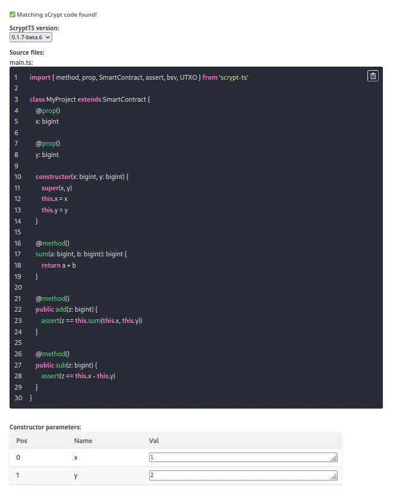

# WhatsOnChain 中 的 sCrypt 合约验证插件

我们很高兴地宣布在 [WhatsOnChain](https://whatsonchain.com/) 上集成了 sCrypt 智能合约验证插件。该插件允许任何人为已部署的智能合约提交和验证 sCrypt 代码。

## 智能合约验证

在与智能合约交互之前，用户需要确保智能合约按照其声称的方式行事。理论上，每个人都可以查看合约并验证其逻辑，因为它是完全上链的。然而，实际上，对于任何非简单的合约来说，这很快就会变得几乎不可能。这是因为链上合约是底层字节码，称为脚本(Script)，难以理解和推理。

智能合约验证将智能合约的高级语言源代码（例如 sCrypt）与其链上脚本相匹配。它将智能合约源代码重新编译为脚本，并与链上脚本进行比较。如果相同，则合约验证成功。

验证后，任何人都可以在 sCrypt 中阅读智能合约并轻松验证其业务逻辑。由于合约是不可变的并且在部署后不能被篡改，它仍然是免信任和透明的，可以说是智能合约最重要的前提。

发布智能合约的源代码还可以让多方独立审核它，识别潜在的安全漏洞。

## 如何在 WhatsOnChain 上验证智能合约

要验证 WhatsOnChain 上已部署的智能合约，您可以打开其部署交易并导航至 sCrypt 插件选项卡。您粘贴智能合约代码并点击提交。

该插件检查源代码是否编译为与交易中相同的脚本。如果是，则智能合约已通过验证！

<a href="https://test.whatsonchain.com/script/da3cd38dbf67d44005e8f0dd677f3b048ebf9620cce81e1171f25e4287fd7e7f">经过验证的智能合约示例</a>

## 致谢

我们感谢 WhatsOnChain 团队的支持，尤其是 Liam Missin 和 Muhammad Raza。他们的[插件系统](https://docs.taal.com/core-products/whatsonchain/woc-plugins)可以灵活地为各种链上数据提供元数据。