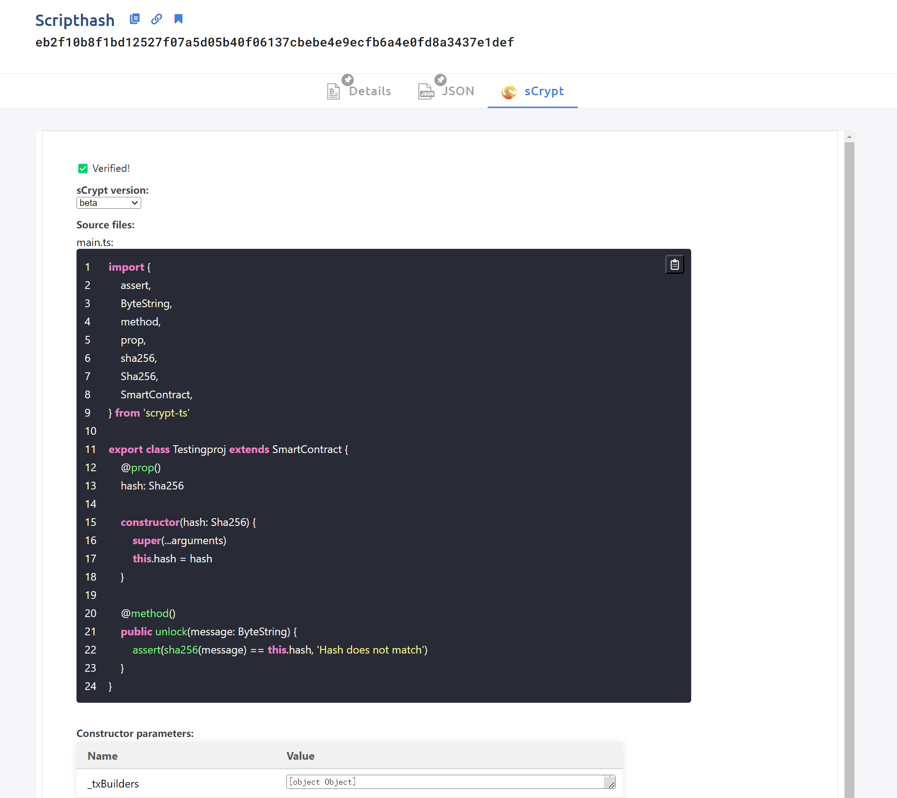

# 使用 sCrypt CLI 工具验证合约

通过向 Whatsonchain 提交合约源代码可以实现合约的验证。

另外一种方法是使用 [sCrypt CLI](https://www.npmjs.com/package/scrypt-cli) 工具来验证合约。

You can verify the deployed smart contracts script using the verify command:

```
scrypt verify <scriptHash> <contractPath>
```

第一个位置参数是已部署合约的脚本哈希，第二个是包含 sCrypt 智能合约的文件的路径。 请注意，该文件还必须包含它所依赖的所有代码，即第三方库。

使用 `network` 选项，您可以指定在哪个网络上部署合约。 这默认为 `test`，表示比特币测试网：

```
scrypt verify --network main <scriptHash> <contractPath>
```


您还可以指定验证期间使用的 sCrypt 版本。 默认情况下，该命令将使用 `package.json` 中指定的版本：

```
scrypt verify -V 0.2.0-beta.9 <scriptHash> <contractPath>
```

例如，如果我们想验证与上面相同的已部署合约，我们只需运行以下命令：

```
scrypt verify eb2f10b8f1bd12527f07a5d05b40f06137cbebe4e9ecfb6a4e0fd8a3437e1def src/contracts/demoproject.ts
```

执行后，指定的合约代码将在 sCrypt 的服务器上进行验证。 如果成功，结果将显示在 WoC 上的[“sCrypt”选项卡](https://test.whatsonchain.com/script/eb2f10b8f1bd12527f07a5d05b40f06137cbebe4e9ecfb6a4e0fd8a3437e1def)下。



