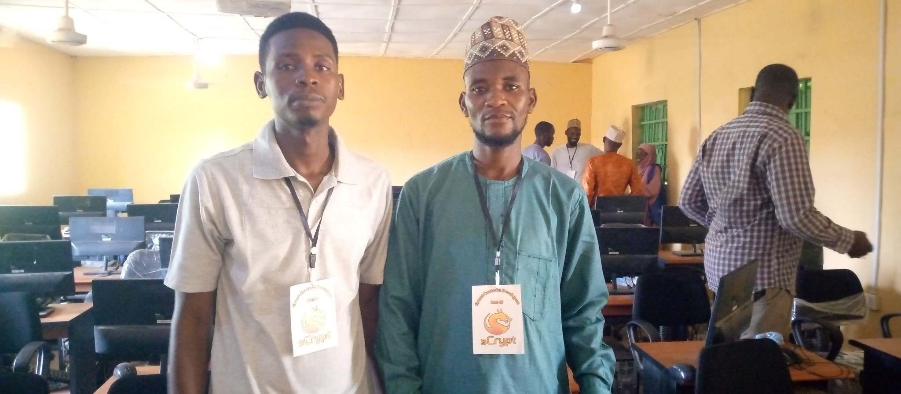
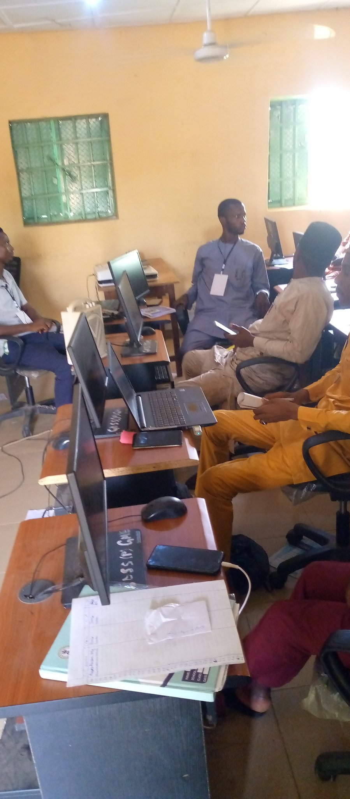

# sCrypt 首次非洲开发者聚会圆满举行

5月27日，sCrypt 首次非洲开发者聚会在尼日利亚圆满举行。

sCrypt 是一个用于在比特币 SV 上编写智能合约的 Typescript 框架，提供 FULL STACK 的 Web3 智能合约开发平台。

Yusuf Idi Maina 和 Haruna Dangabas 是两位非洲区块链专家。同时也是 sCrypt 智能合约开发者。在会议上他们分享了如何使用sCrypt 来开发比特币智能合约。

让我们期待更多非洲开发者加入sCrypt。

- 左：Yusuf Idi Maina
- 右：Haruna Dangabas

现场活动照片:

现场活动视频:

https://www.youtube.com/watch?v=uEUNKLodchc

