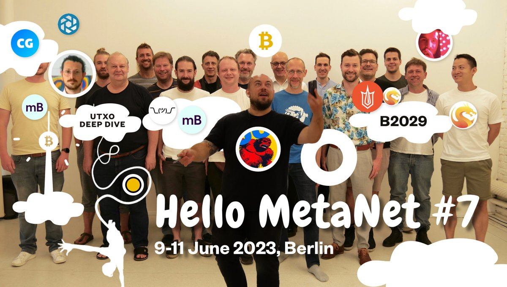
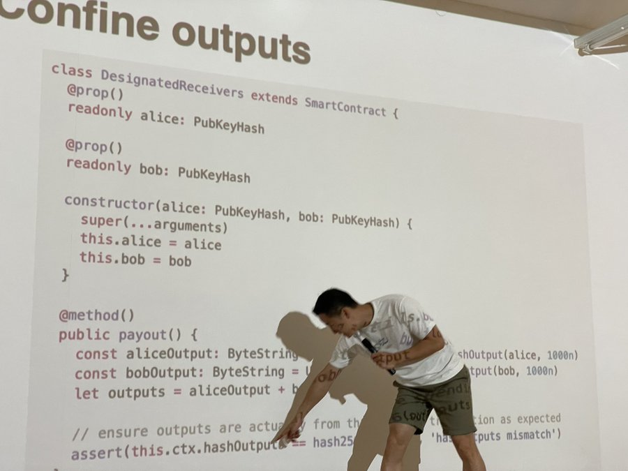

# 活动通知：柏林 B2029 开发者周

[B2029](https://www.b2029.org/about-us) 是柏林的一个区块链爱好者、艺术家和建设者聚会，学习、讨论和共同构建比特币区块链地方。

2023 年 6 月 9-11 日，举行了第 7 次 Hello Metanet 研讨会。

sCrypt Inc 的创始人兼 CEO，刘晓晖，在研讨会期间，指导大家完成从了解基础知识到部署自己的智能合约的整个过程。

一群忠诚和有爱心的人一起进行的另一种超级紧张的学习体验。这就是 BSV 真正脱颖而出的地方！

