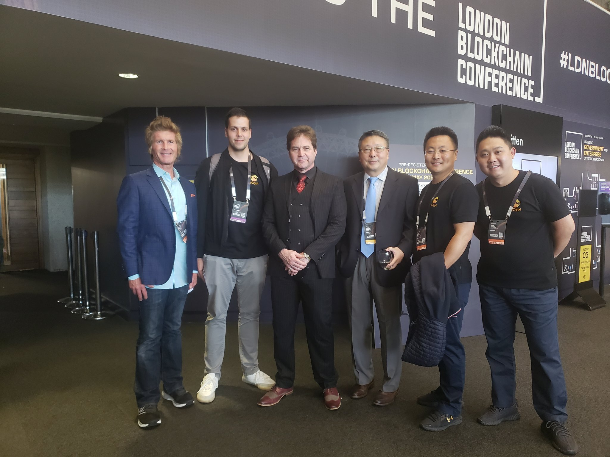

# 【活动回顾】伦敦区块链大会

2023伦敦区块链大会，是本年度最盛大的比特币及区块链行业活动。大会于2023年5月31日至6月2日，在伦敦女王伊丽莎白二世中心举行，旨在展示BSV区块链的真正潜力。

sCrypt Inc 的创始人兼 CEO，刘晓晖， 作为演讲嘉宾出席了会议。他向大家隆重介绍 sCrypt 开发者平台。 sCrypt 开发平台是一个全栈的Web3 智能合约开发平台，旨在为开发者提供最强大的区块链开发平台基础设施和工具套件，并可轻松构建和扩展 dApp。

sCrypt 开发平台包括：

- 完整和强大 SDK 和 API。
- 无需自己运行区块链节点。
- 智能合约事件的实时通知。
- 支持多种钱包：Sensilet/DotWallet/TAAL。


欢迎注册并体验sCrypt 开发者平台：

```
https://scrypt.io/sign-up
```

期待您使用 sCrypt 开发者平台 构建出杀手级的区块链应用。

伦敦区块链大会现场照片:





