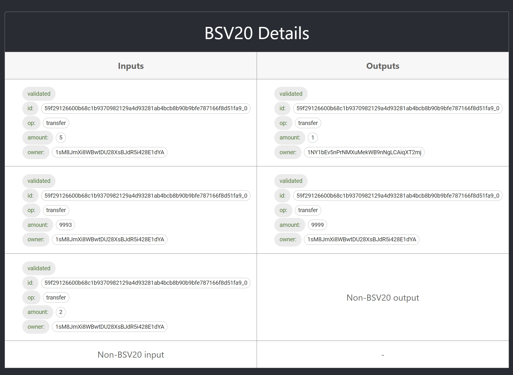

# 发布 Whatsonchain 上的 BSV20 插件


我们发布了 [whatsonchain](https://whatsonchain.com/) 上的 BSV20 插件来验证 BSV20 代币。


对于任何交易，whatsonchain 都可以通过以下网址打开：

````
https://whatsonchain.com/tx/{hash}
````

我们使用此 bsv20 v2<sup>1</sup> [交易](https://whatsonchain.com/tx/2c499c1c15924e04cc009ddc2efe2b16bb8492483b13f514f9689cd7effdd48e) 打开 Whatsonchain 。 打开whatsonchain后你会看到BSV20插件：


点击插件，你会看到：



根据插件我们可以看到以下信息：

- **id:** 代币 ID
- **op：** bsv20 术语中的操作类型
- **amount：** utxo 持有的 bsv20 代币数量
- **owner：** bsv20 代币所有者

我们还可以看到 bsv20 代币的状态：

- **validated:** 包含已验证的有效 bsv20 代币
- **pending：** 包含未经验证的有效 bsv20 代币
- **invalid：** 包含无效的 bsv20 代币

如果该交易是代币部署交易，我们将看到：


代币部署交易不包含任何 BSV20 代币输入。 但它还有其他字段：

- **symbol:** 代币的符号
- **decimals:** 设置小数精度，默认为`0`。 这与 BRC20 不同，BRC20 默认为 `18`。


------------------------

[1] 还支持bsv20 v1 代币