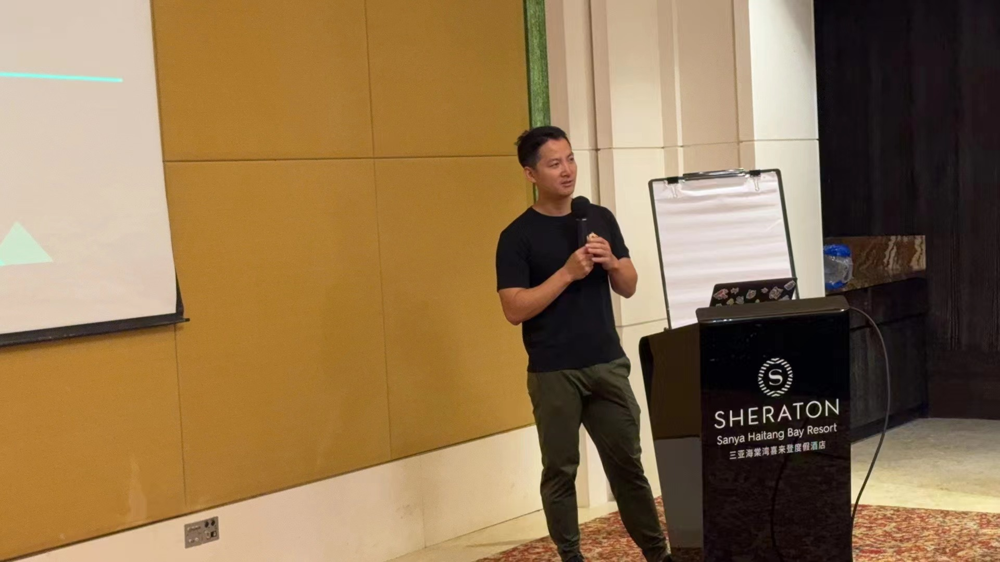
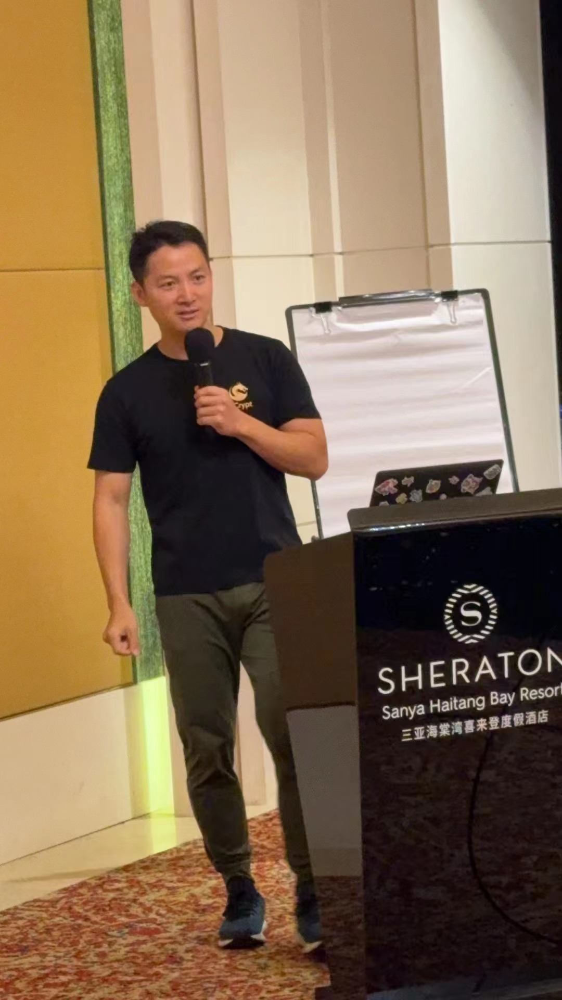
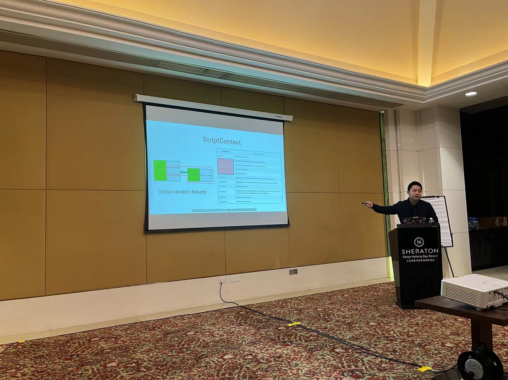
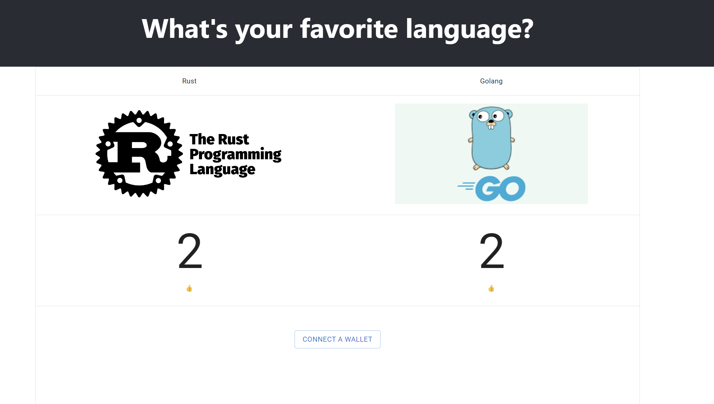
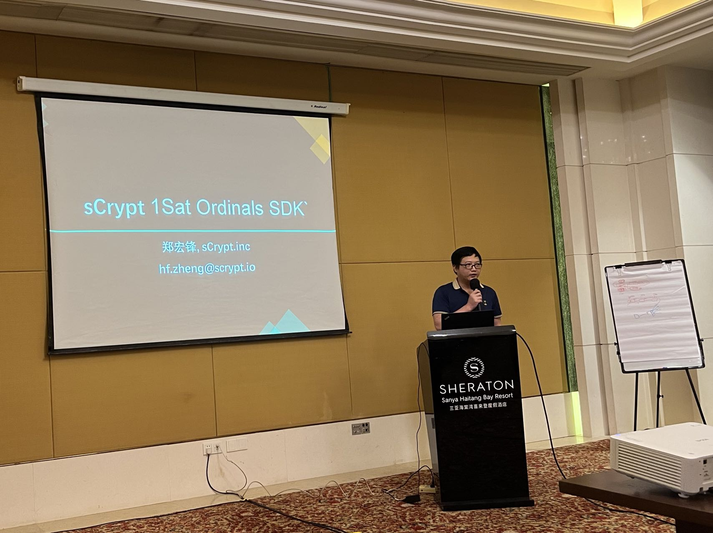
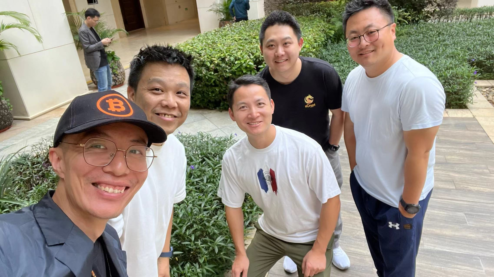
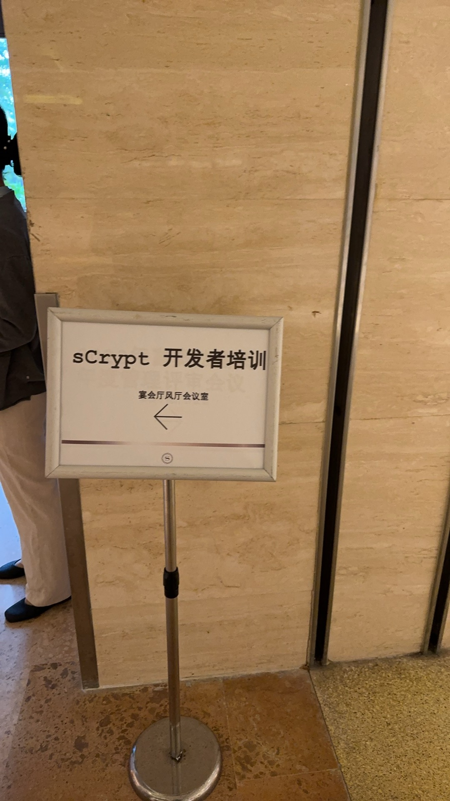

# sCrypt 三亚开发者培训活动通告

首先祝所有关注 sCrypt 的朋友 2024 新年快乐 !

sCrypt 在 2023年12月28~29日举行了为期两天的开发者培训活动。本次活动圆满结束。2023 完美收官了!

sCrypt CEO **刘晓晖**发表了开场演讲和欢迎致辞。他介绍了sCrypt 2023 的主要工作： 

1. 基于TypeScript 来开发智能合约的新版sCrypt发布正式版
2. 发布了能够帮助开发者快速开发DApp的开发者平台
3. 推出集成 1Sats Ordinals的官方SDK

sCrypt 工程师**周全**介绍 sCrypt 基础知识以及如何使用sCrypt编写智能合约。同时还在现场手把手教开发者开发
基于sCrypt 的投票DApp.

> 开发现场作品:

https://byts024.github.io/scrypt_voting

sCrypt 工程师**郑宏锋**介绍 sCrypt 官方的 1Sats Ordinals SDK。
有了它，您可以轻松开发与 1Sat Ordinals 集成的智能合约，涵盖不可替代代币 (NFT) 和可替代代币 (FT)。

------------------

## 更多活动照片

