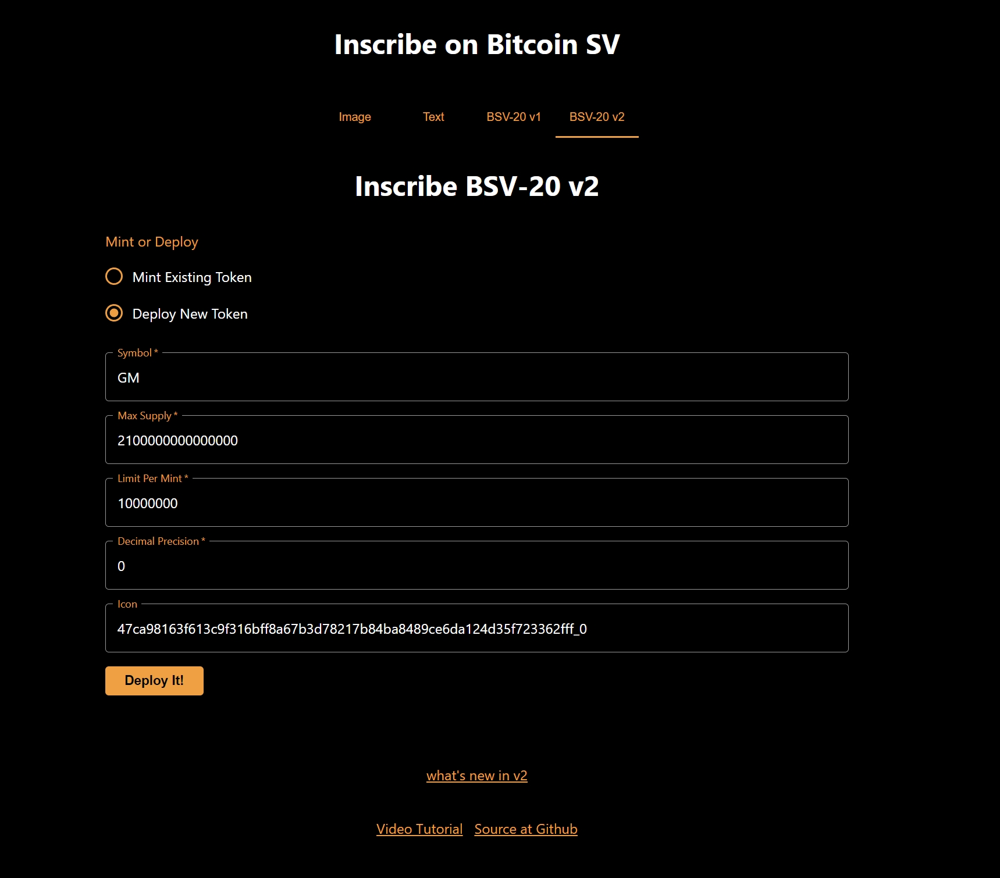
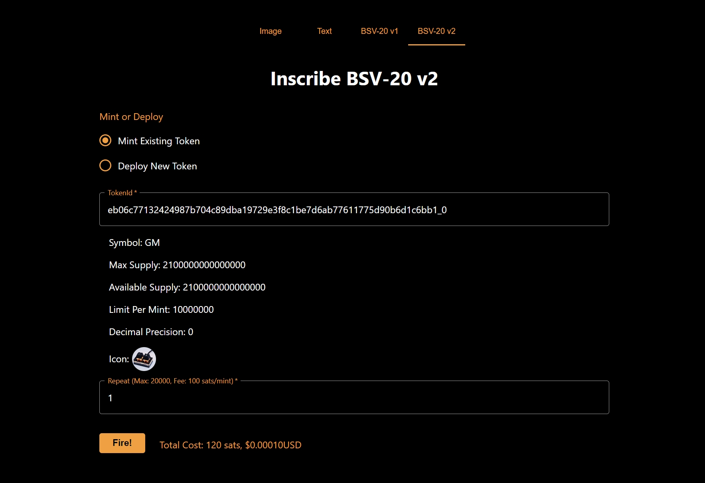

# **sCrypt Inscribe** 已支持 `BSV20 v2`

现在你可以通过 [sCrypt Inscribe](https://inscribe.scrypt.io/) 来部署和铸造基于 `BSV20 v2` 协议的铭文。

# 部署

填写铭文的相关信息后，点击 **Deploy It!** 按钮部署铭文。部署成功可以看到铭文的 ID.

# 铸造

在 `TokenId` 输入框输入铭文的 ID。 点击 **Fire!** 按钮开始铸造铭文。铸造一张铭文 sCrypt 收取 `100` 聪的手续费 。

<!-- 
# 查看铭文

铸造成功之后，可以在 [Panda](https://chromewebstore.google.com/detail/panda-wallet/mlbnicldlpdimbjdcncnklfempedeipj) 钱包查看铭文。 -->

