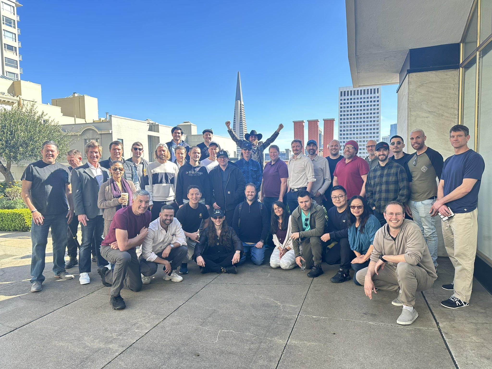
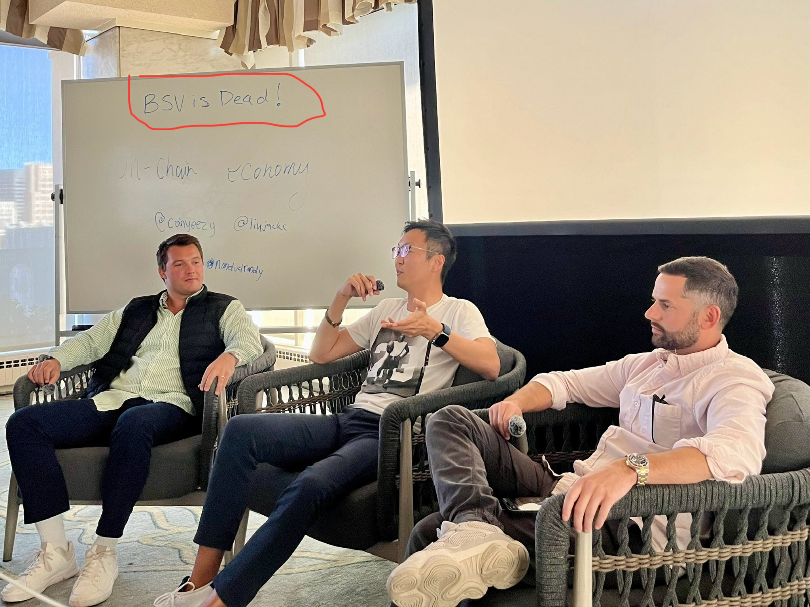
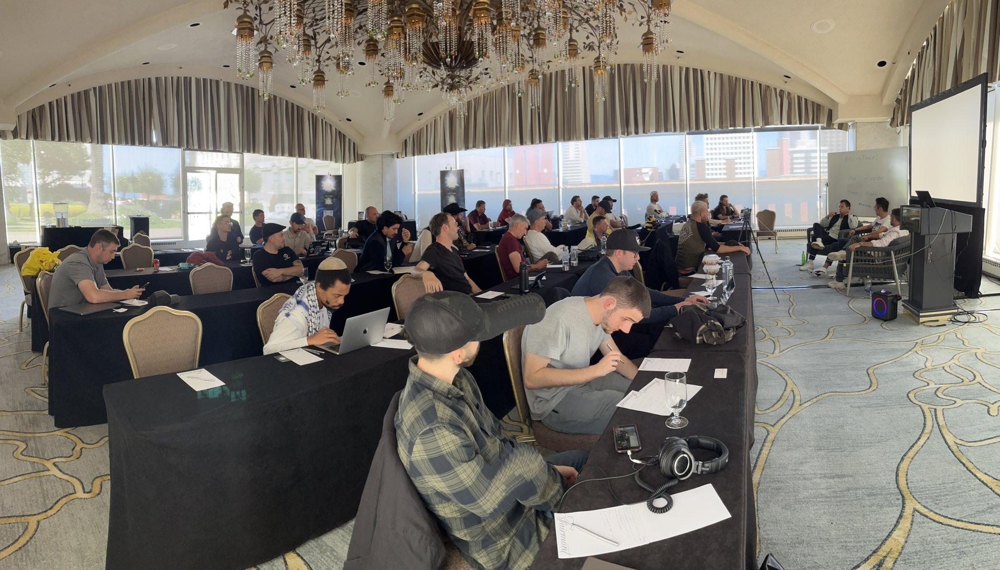
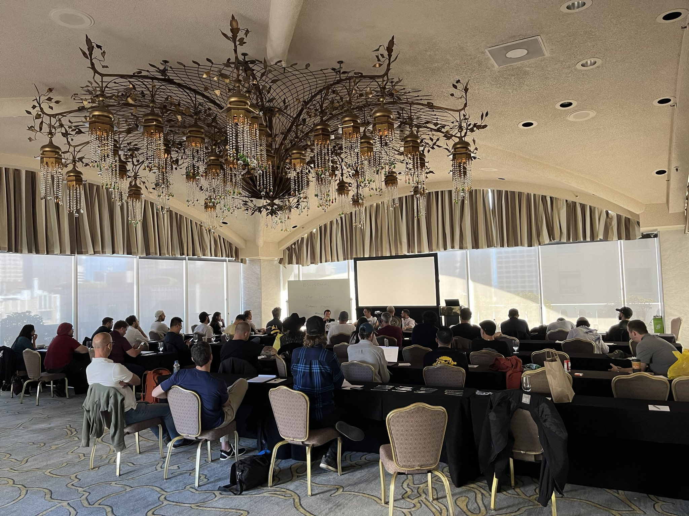
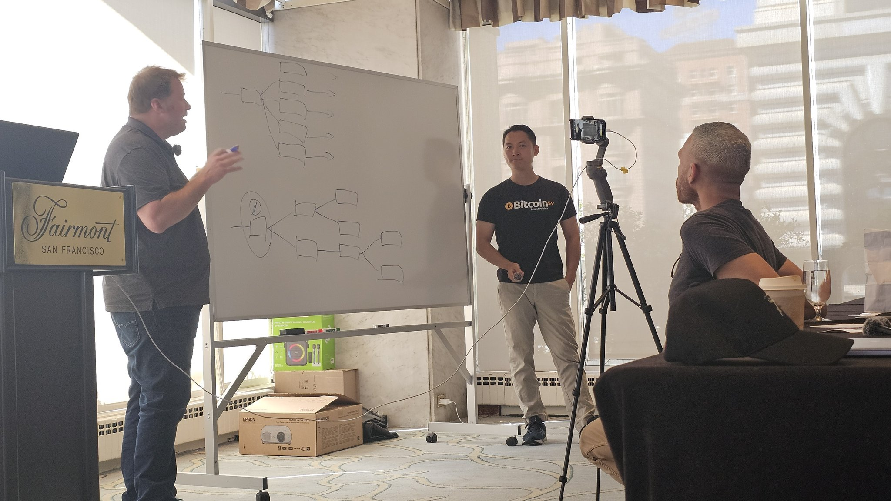
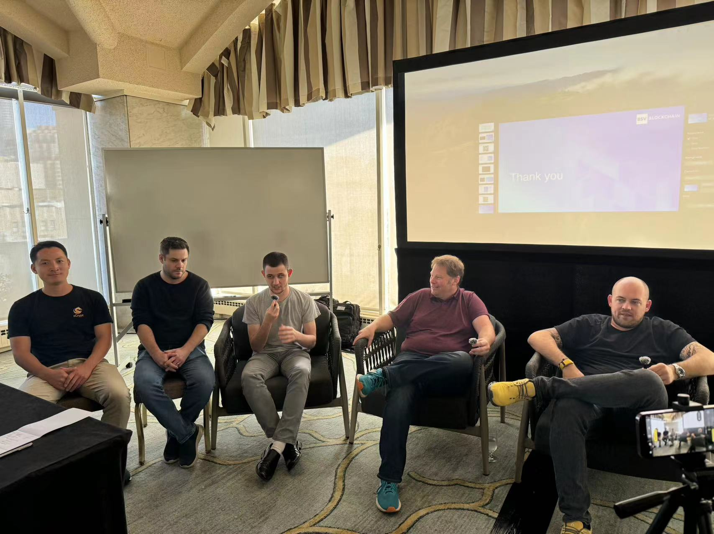

# 旧金山费尔蒙酒店 sCrypt 2024 黑客马拉松启动会

sCrypt 2024 黑客马拉松启动会于3月16日 和 3月17日在旧金山费尔蒙酒店举办，并在 youtube 上进行全球直播， `3` 千多人在线观看了直播。

费尔蒙酒店接待了众多会议代表并参加了 1945 年联合国国际组织会议的讨论，该会议产生了最初的《联合国宪章》。旧金山本身也是 1840 年代至 50 年代加州淘金热的主要基地和到达点。淘金热的新来者想要参与其中，想要致富，但无法赤手空拳。sCrypt CEO 刘晓辉说，sCrypt 的工作是为那些希望努力工作并加入区块链热潮的人生产铲子和镐 。

> “这就是我们在这里提供的。我们希望您成功。这里的所有开发人员都出去利用比特币的许多功能来开采黄金。打造杀手级应用，让我们进入主流的应用。”

他还指出了潜在区块链开发人员的两个世界：致力于企业、监管、风险投资并将区块链带入主流科技世界的“潮一代”方法，以及关注 NFT、Ordinals 的（年轻的）“degen”方法。两种能量都需要在房间里。

sCrypt 的工作主要是在智能合约方面，最热门的合约用例是代币。sCrypt 联合创始人王一强更详细地介绍了公司 新的 [Ordinals SDK](https://github.com/sCrypt-Inc/scrypt-ord)，该 SDK 将 1SatOrdinal 代币注册与合约逻辑相结合。他说，这是“一种非常复杂的管理代币的方式”，它支持可替代和不可替代的代币（NFT），没有任何其他要求或依赖性。

会议主要内容:

3月16日
1. 上午 9 点至 10 点 | 刘晓辉：比特币智能合约和比特币代币
2. 上午 10 - 11 点 | David Case:：Ordinal与sCrypt
3. 下午 1 - 2 点 | 王一强：sCrypt Ordinal SDK
4. 下午 2 - 3 点 | Ty Everett：Babbage、sCrypt 和数字资产的未来
5. 下午 3 - 4 点 | Matt Welsh：水瓶座时代的世界货币

3月17日
1. 上午 9 点至 10 点 | Jake Jones：Teranode
2. 上午 10 - 11 点 | Kurt Wuckert Jr：JungleBus 和采矿业的未来
3. 下午 1 - 2 点 | Thomas Giacomo：链、协会和路线图以及核心 BSV 开源组件
4. 下午 3 - 4 点 | Joshua Petty 和 Jack Liu：链上经济

任何有兴趣的人都可以通过以下链接重新观看整个会议:

17 号上午: https://www.youtube.com/watch?v=XEoU0pH20wY

17 号下午: https://www.youtube.com/watch?v=K-VfNXeGhHY

**黑客马拉松报名地址**

sCrypt 黑客马拉松于 2024 年 3 月 25 日至 4 月 25 日正式举办，开发者仍可报名。
详情及报名地址: [sCrypt 2024 黑客马拉松](https://scrypt.devfolio.co)

**联系我们:**

- Email: support@scrypt.io
- 官网: https://sCrypt.io
- Twitter: https://twitter.com/scryptplatform
- Discord: https://discord.gg/bsv

# 现场活动照片

