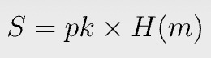
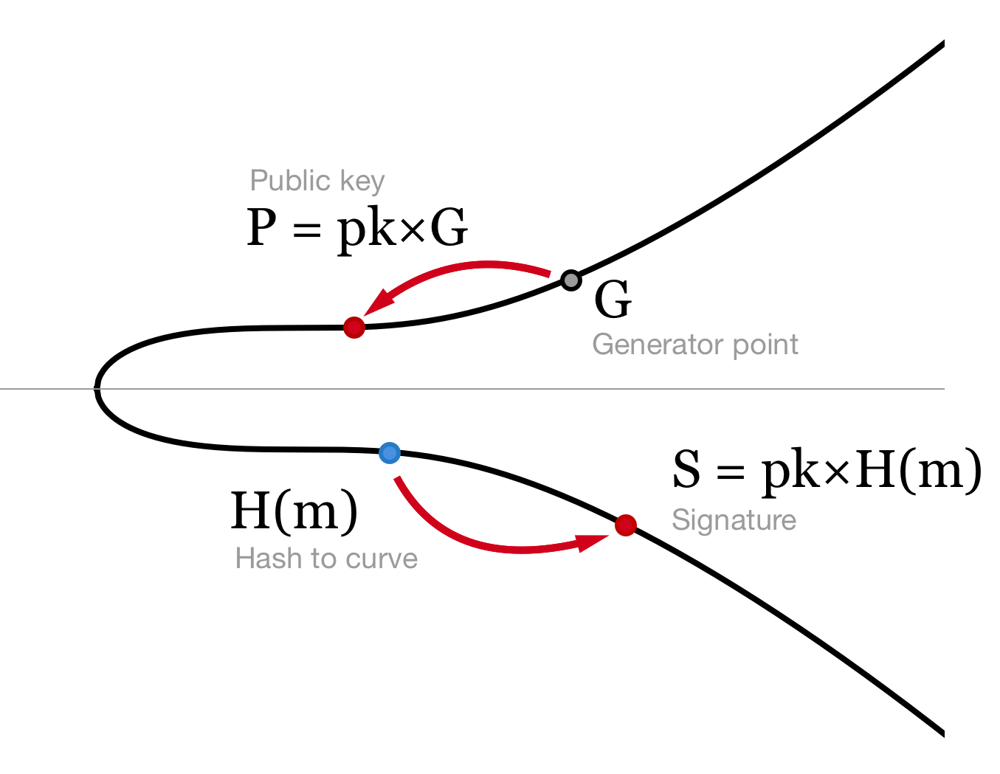
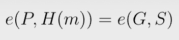
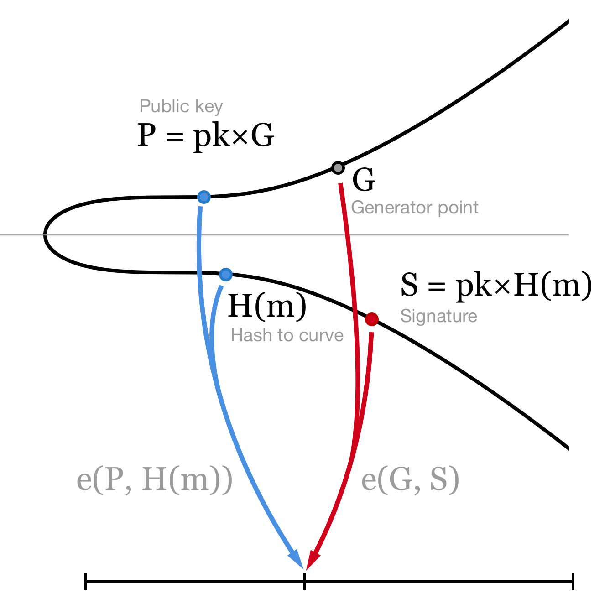
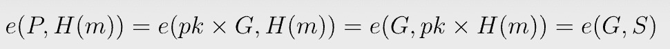

# 比特币上的 BLS 签名

> 基于配对的密码学：第 2 部分


[Boneh-Lynn-Shacham](https://datatracker.ietf.org/doc/html/draft-irtf-cfrg-bls-signature-04) (BLS) 是一种基于[双线性配对](https://blog.csdn.net/freedomhero/article/details/124943936)的签名方案。

与 [ECDSA](https://en.wikipedia.org/wiki/Elliptic_Curve_Digital_Signature_Algorithm) 或 [Schnorr](https://en.wikipedia.org/wiki/Schnorr_signature) 签名相比，它具有几个显着优势：

* 时间缩短 2 倍
* 对签名和密钥聚合友好
* 具有确定性：它不依赖于随机数生成器。

由于其最小的存储和带宽要求，它已被以太坊、Dfinity、Algorand 和 Chia 等多个区块链采用。我们说明了如何在比特币本地实现它。


## BLS 签名：理论

### 哈希曲线：H(m)

在 ECDSA 中，消息 m 被散列成一个数字。在 BLS 中，我们将其散列到椭圆曲线上的一个点。

一种原生的方法是对消息进行哈希处理并将结果与​​生成点 G 相乘以获得曲线点。但是，这是[不安全的](https://crypto.stackexchange.com/questions/83981/mapping-the-hash-of-message-to-a-point-of-elliptic-curve-for-signature)。

为了安全地执行此操作，我们首先使用 SHA-256 对消息进行哈希处理，并将 256 位结果视为一个点的 x 坐标。如果曲线上不存在这样的点，我们增加 x 坐标并重试，直到找到第一个有效点<sup>1</sup>。

### 签名

签名是微不足道的。我们简单地相乘:



pk 是私钥，m 是消息。注意不需要随机数。S 只是一个曲线点，可以[压缩](https://bitcoin.stackexchange.com/questions/3059/what-is-a-compressed-bitcoin-key)到 33 个字节，大约是 ECDSA 签名大小的一半。



### 验证

要验证签名，我们只需比较两个配对：






让我们看看验证签名的工作原理，



双线性配对 e 允许我们将标量 pk 从第一个输入移动到第二个输入。

## 在比特币上的实现

```js
import "pairing.scrypt";

library BLS {
    static function verifySig(bytes msg, Point sig, Point pubKey, int y) : bool {
        Point H = hashToPoint(msg, y);

        return Pairing.pairing(pubKey, H) == Pairing.pairing(EC.G, sig);
    }

    static function hashToPoint(bytes msg, int y) : Point {
        int x = Utils.fromLEUnsigned(sha256(msg));
        // y^2 = x^3 + a * x + b
        require((y * y - x * x * x + EC.a * x + EC.b) % EC.P == 0);
        return {x, y};
    }
}
```

请注意，我们让用户直接传递 y 坐标并对其进行验证，以避免计算模平方根<sup>2</sup>。

# 总结

我们演示了如何验证比特币上的单个 BLS 签名。BLS 的主要功能在于[聚合签名和密钥](https://medium.com/cryptoadvance/bls-signatures-better-than-schnorr-5a7fe30ea716)。我们将他们在比特币上的实现留给读者作为练习。

--------------


[1] 这种方法称为哈希和祈祷，它在非常量的时间内运行。存在恒定时间方法，例如 [Fouque 和 Tibouchi](https://link.springer.com/chapter/10.1007/978-3-642-33481-8_1)，但较难实现。

[2] 为了便于说明，我们假设存在一个具有 x 坐标的曲线点。可以轻松添加哈希和祈祷方法。
