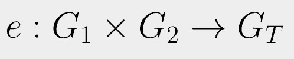
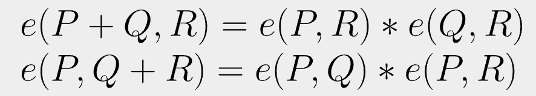
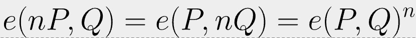
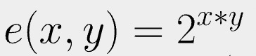
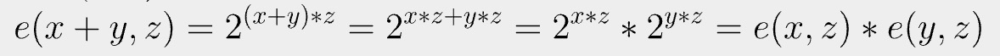
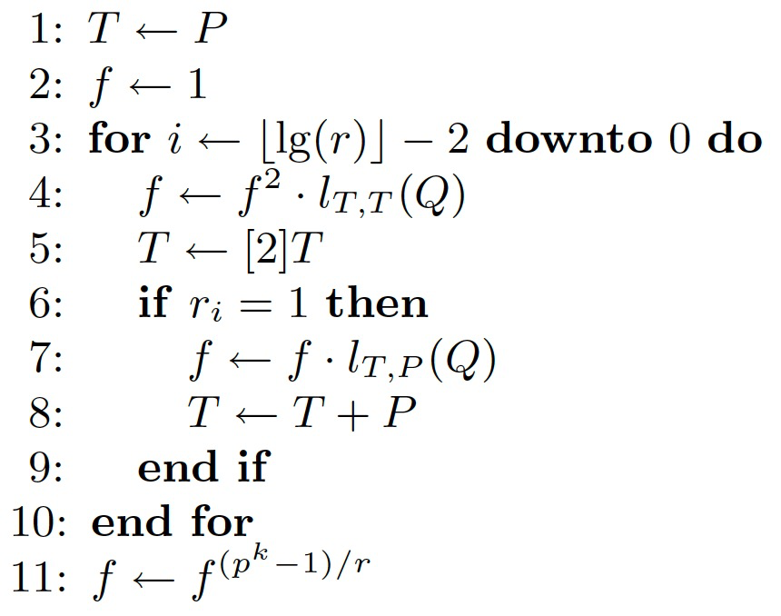

# 比特币的双线性配对

基于配对的密码学是椭圆曲线密码学的一种变体。由于配对的特点，新的密码算法和协议可以实现传统密码学无法实现的功能或效率，例如基于身份的加密（IBE）、基于属性的加密（ABE）、认证密钥交换（AKE）和短签名。


<center>双线性配对</center>

基于配对的密码学的几种应用已在许多区块链中得到实际应用。

- `Zcash` 实现了自己的零知识证明算法，名为 zk-SNARKs（零知识简洁非交互式知识论证）
- 以太坊支持[配对检查](https://eips.ethereum.org/EIPS/eip-197)以执行 zkSNARK 验证
- DFINITY（现在称为互联网计算机）构建了一个基于 BLS 签名的方案，比 ECDSA 签名更短。


我们将展示配对可以直接在比特币上实现，从而使以前认为不可能在比特币上实现的各种基于配对的密码学应用成为可能。

## 双线性配对

配对 `e` 只是一个函数，它接受两个输入<sup>1</sup> 并返回一个输出，如下所示。



<center>配对</center>

双线性配对具有以下性质：



也就是说，它在每个输入中都是线性的。很容易看到以下成立。



直观地说，可以在其输入之间交换标量 `n` 并将其作为指数取出。

## 示例

让我们看看下面的配对函数。



它是双线性的，因为它满足上面的两个方程。例如，



## 椭圆曲线上的双线性配对

实际上，上述配对对于加密使用来说并不安全。相反，我们使用椭圆曲线上的配对。输入是椭圆曲线上的点，输出是数字<sup>2</sup>。有多种方法可以在椭圆曲线上构建配对，例如 [Weil 配对](https://crypto.stanford.edu/pbc/notes/ep/pairing.html)、[Tate 配对](https://crypto.stanford.edu/pbc/notes/ep/tate.html) 和 [Ate  配对](https://www.esat.kuleuven.be/cosic/publications/talk-73.pdf)。

## 米勒算法

[米勒算法 (Miller’s algorithm)](https://crypto.stanford.edu/pbc/notes/ep/miller.html) 用于有效地计算配对。它由两部分组成：


1. 主循环：第 `3` 行到第 `10` 行。在计算标量点乘法时，它在结构上类似于[双加算法](https://crypto.stanford.edu/pbc/notes/ep/miller.html)。
2. 第 `11` 行的最终求幂。


`p`、`k` 和 `r` 是椭圆曲线所用的参数<sup>3</sup>。



<center>计算 Tate 配对 e(P, Q) 的米勒算法</center>

## 实现

我们已经实现了米勒算法来计算下面的Tate配对，基于我们的[椭圆曲线算术库](https://xiaohuiliu.medium.com/elliptic-curve-arithmetic-in-script-cb0ab37e4f63)。

```js
static function millerLoop(Point P, Point Q): int {
    Point T = P;
    int f = 1;

    // main miller loop
    loop (N) : i {
        f = f * f * linefunc(T, T, Q);
        T = EC.doublePoint(T);

        int j = N - 1 - i;
        if (r & (mask << j)) {
            f = f * linefunc(T, P, Q);
            T = EC.addPoints(T, P);
        }
    }
    return f;
}

// compute the pairing e(P, Q)
static function pairing(Point P, Point Q): int {
    int f = millerLoop(P, Q);
    // final exponentiation
    return pow(f, EXP);
}
```

<center>实现Tate配对 e(P, Q)</center>


`linefunc(P, Q, R)` 是一个通过 `P` 和 `Q` 并在 `R` 处求值的线性函数。

。。。

---------------

[1] 因而称为配对。

[2] 严格来说，它是乘法群中的一个元素。由于这是对配对的介绍，因此我们在整篇文章中选择可读性而不是数学严谨性。

[3] 并非所有椭圆曲线都可以用于配对。在实践中只使用那些能够高效计算的配对的曲线。它们被称为[配对友好](https://tools.ietf.org/id/draft-yonezawa-pairing-friendly-curves-00.html)曲线，其中 [Barreto-Naehrig](https://tools.ietf.org/id/draft-kasamatsu-bncurves-01.html) (BN) 或 [Boneh-Lynn-Shacham](https://hackmd.io/@benjaminion/bls12-381) (BLS) 曲线是值得注意的例子。