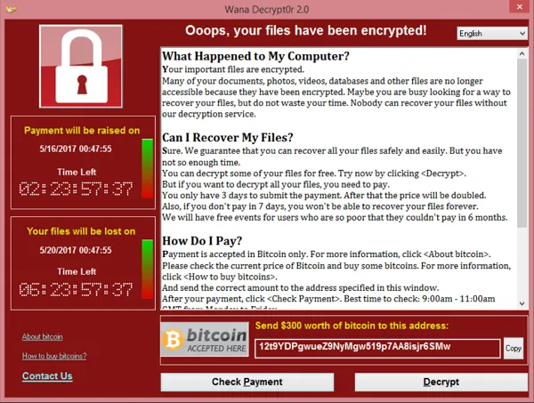

# 比特币 ZK 赏金系列：第 1 部分——支付解密密钥

以前，我们使用[零知识赏金 (ZKB)](https://github.com/sCrypt-Inc/article/blob/c9fd0019ec05566afacd10f4ab2d7453ced7cd2c/Private%20Non-interactive%20Bounties%20for%20General%20Computation%20on%20Bitcoin/Private%20Non-interactive%20Bounties%20for%20General%20Computation%20on%20Bitcoin.md) 来支付比特币上的数独解决方案。在本系列中，我们将使用 ZKB 来解决范围更广的更实际的问题。


在第 1 部分中，我们应用 ZKB 来支付解密密钥。假设 Alice 使用对称密钥 `K` 加密她的文件。为了安全起见，她联系了在线备份服务 Bob，以保留 `K` 的副本。她不想让 Bob 知道 `K`，所以她使用[门限秘密共享方案](https://en.wikipedia.org/wiki/Shamir%27s_Secret_Sharing)将 `K` 分成 `N` 份，这样任何 `M` 份的法定人数都可以恢复 `K`。Bob 生成一个椭圆曲线私钥/公钥对 `(sk, pk)` 并将 `pk` 给 Alice。Alice 使用非对称加密算法用 `pk` 对 `K` 的份额进行加密。例如 [ElGamal](https://en.wikipedia.org/wiki/ElGamal) 或 [ECIES](https://en.wikipedia.org/wiki/ECIES)，并将其发送给 Bob。她对其他 `(M-1)` 台备份服务器也这样做。


如果 Alice 丢失了她的本地 `K`，她会向 Bob 索要解密密钥 `sk`，而 Bob 只有在获得报酬后才交付 `sk`。这是 ZKB 解决的经典公平交易问题，因为它保证付款会导致正确解密密钥的泄露。

## 实现

与[数独付费](https://github.com/sCrypt-Inc/article/blob/cfeda570dccf3ab720c6141c81e6e514924238d3/The%20first%20successful%20Zero-Knowledge%20Pay-to-Sudoku%20Bounty%20on%20Bitcoin/The%20first%20successful%20Zero-Knowledge%20Pay-to-Sudoku%20Bounty%20on%20Bitcoin.md)相比，我们只需要改变子电路C来验证解密密钥对应于用于加密 `K` 的公钥，而不是验证数独解。电路的其他部分保持不变，可以重复使用。

```
template Main(n, k) {

  // little-endian
  signal private input privkey[k];
  signal public input pubkey[2][k];


  // get pubkey from privkey
  component privToPub = ECDSAPrivToPub(n, k);
  for (var i = 0; i < k; i++) {
    privToPub.privkey[i] <== privkey[i];
  }

  // verify input pubkey
  signal pub_x_diff[k];
  signal pub_y_diff[k];
  for (var i = 0; i < k; i++) {
    pub_x_diff[i] <-- privToPub.pubkey[0][i] - pubkey[0][i];
    pub_x_diff[i] === 0;
    pub_y_diff[i] <-- privToPub.pubkey[1][i] - pubkey[1][i];
    pub_y_diff[i] === 0;
  }
  
  
  
  //// Assert that (db * Qa) = Qs ////////////////////////////////////////////////

  ...

  //// Assert that (db * G) = Qb /////////////////////////////////////////////////

  ...

  //// Assert that encrypting w with Qs produces ew. /////////////////////////////

  ...
  
}
```

请注意，用于解密的私钥作为私有输入传递给电路，因此永远不会向公众透露。公钥作为公共输入传递，以便验证者智能合约可以确保证明是使用正确的私钥生成的。


这与[支付到私钥谜题](https://github.com/sCrypt-Inc/article/blob/72a720030bb4cd14f97fd7682b41782b99e19bf6/Private%20Key%20Puzzles/Private%20Key%20Puzzles.md)不同，后者将私钥公开暴露在链上。


## 勒索软件

可以想象恶意黑客可以使用相同的方法来支付解密密钥。

黑客用恶意软件感染受害者的计算机并加密他的文件，例如，让受害者点击网络钓鱼电子邮件中的恶意内容。

该恶意软件显示赎金要求，以比特币支付，并在受害者的计算机上显示支付说明。



受害者和黑客彼此不信任。受害者希望得到保证，他在支付赎金后能够解密他的文件。

在这种情况下可以使用相同的 ZK 赏金，但有一个主要区别。在备份情况下，用户可以确定用于加密的公钥，因为他自己执行了加密。在勒索软件案例中，需要额外的证据让受害者相信赏金智能合约中使用的公钥确实与用于加密他的文件的公钥相同。一种简单的解决方案是随机选择几个文件供黑客解密。

如何缓解此类勒索软件攻击不在本文讨论范围之内。感兴趣的读者可以在例如 [1] 中找到更多信息。

[1] [Gyges 之戒](https://dl.acm.org/doi/10.1145/2976749.2978362)：调查犯罪智能合约的未来
