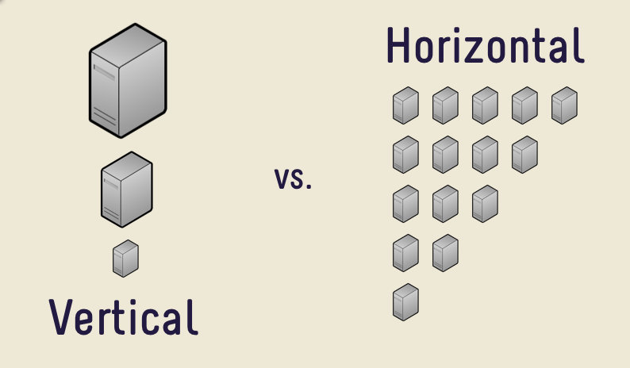

# 比特币与以太坊智能合约

>>> 智能手机与袖珍计算器

​​我们并排比较了两个智能合约区块链，比特币和以太坊。我们发现，由于其巧妙构建的基础设计，比特币具有卓越的性能、安全性和成本效益。本文重点介绍它们的技术差异。经济、哲学、法律和环境差异超出了本文的范围。

## 可扩展性

### 以太坊：账户模型和垂直扩展

 

在以太坊，每个智能合约都驻留在一个帐户中。它有自己的存储空间，这种存储空间在整个契约执行过程中持续存在。为了了解如何做到这一点，让我们研究一下以太坊的核心智能合同引擎: Ethereum 虚拟机(EVM)。它是基于堆栈的，并将数据存储在三个地方: 堆栈、内存和存储。前两个是不稳定的和短暂的，这意味着当 EVM 开始运行一个新的契约调用时，它们将被重置。存储不会重置，而是世界/全局状态的一部分。

因此，每个合约都可以依赖于另一个合约，因为它们可能读/写相同的存储。每个合约执行都会看到前一个合约执行留下的世界状态。没有并发，合约必须按顺序执行。一次执行一个合同以避免竞争条件。

以太坊可以被认为是一台单线程机器，它受限于该机器的容量。换句话说，它使用垂直扩展，这对于任何旨在支持数百万用户的系统来说都是有根本性缺陷的。

### 比特币：UTXO 模型和水平扩展

在比特币中，智能合约驻留在所谓的未 花费交易输出(UTXOs) 中。比特币还使用称为 [比特币虚拟机](https://blog.csdn.net/freedomhero/article/details/106801904) (BVM) 的虚拟机来处理基于堆栈的智能合约。关键的区别在于 BVM 中没有持久存储，因此没有单一的全局状态。相反，全局状态由独立的 UTXOs 组成，它们彼此独立。因此，UTXO 在设计上是最大并行的。

比特币可以看作是一个机器池，所有机器都并行运行。它是水平可扩展的，只需将任意数量的机器添加到现有池中即可无限扩展。这就是 Google、Facebook、Amazon 已证明可以扩展以支持数十亿用户的方式。

 

今天，比特币在主网上每秒可以处理3000笔交易(tps)。在测试网上，已经实现了[9000 tps](https://bitcoinassociation.net/zh-hans/9000-transactions-per-second-bitcoin-sv-hits-new-record/)。随着 [Teranode](https://www.youtube.com/watch?v=tMhVzeUs89E) 的推出，在未来几个月，50,000 tps 预计将达到。Teranode 应该处理兆兆字节的块，相当于百万级 tps。相比之下，以太坊多年来只停留在15个 tps 上，一再违背诺言，看不到任何改进。

 

## 安全
智能合约处理具有实际财务价值的资产，安全性至关重要。

 

比特币的 UTXO 模型类似于函数式编程。合同的执行是纯粹的和无状态的。它接近于数学中的函数(例如，f(x) = x * x)。给定相同的输入，一个函数总是产生相同的输出，并且不会产生副作用。这种设计使得比特币智能合约更容易推理，因此更不容易出错。此外，他们可以准确测试脱离链，因为他们的行为相同，无论如何，何时，在哪里执行。

相比之下，以太坊的账户模式类似于命令式编程。每个合同调用都可能产生副作用，影响另一个调用，使合同难以推理，特别是当它们变得复杂时。由于这种易受攻击的设计选择，它一直受到数十种，甚至数百种[攻击类型](https://swcregistry.io/)的困扰，造成了数亿美元的损失。

## 成本

 

主要归功于其无限的可扩展性，在比特币上运行的智能合约的交易费用比在以太坊上运行的智能合约便宜1000倍¹。

## 生态系统成熟度

一年多以前，比特币才在2020年重新启用了智能签约能力，而在以太坊上的智能签约自2015年以来就已经开发出来。鉴于其5年的领先优势，在开发工具、库和应用程序方面，以太坊的生态系统今天更加成熟也就不足为奇了。然而，许多比特币开发工具正在迅速赶上，有时甚至超过他们在 以太坊的同行。例如，比特币中最流行的 [IDE](https://marketplace.visualstudio.com/items?itemName=bsv-scrypt.sCrypt) 支持调试、部署和测试，而以太坊的 IDE 则不支持。鉴于比特币无法扩大规模，比特币生态系统赶上并抛弃以太只是个时间问题。

# 概括

我们得出结论，比特币是构建智能合约的更好平台。

 

致谢

感谢 **荣哥理财师**  翻译文章

[1] 这假设一个典型的智能合约交易是普通比特币转账交易的 10 倍左右。

