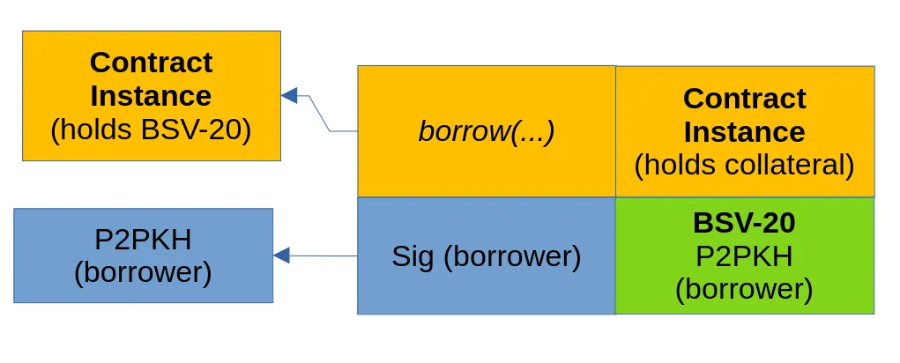

# BSV 上的借贷

我们很高兴推出贷款智能合约的实现，该合约允许直接在链上借贷。 贷款合约是重要的金融工具，允许个人或实体按照商定的条款和条件借钱。 利用智能合约技术的优势有可能彻底改变贷款的管理方式，提高安全性、效率和透明度。 我们的实现重点是有期限的抵押贷款。


## 有期限的抵押贷款如何运作

在我们的示例中，借款人使用比特币作为抵押品从贷方借入代币。


- **抵押品**：借款人提供资产（在我们的例子中是比特币）作为抵押品。 这在贷款期间被锁定在智能合约中。 抵押品的价值通常超过贷款金额（超额抵押），为贷方提供安全保障。
- **贷款支付**：一旦抵押品被锁定，将以 BSV-20 代币形式的贷款金额支付给借款人。 合约规定了贷款金额、利率、还款期限等条款。
- **还款期限**：借款人必须在特定期限内偿还贷款以及任何商定的利息。 这包括本金和利息金额。
- **违约和清算**：如果借款人未能在截止日期前还款，智能合约允许贷方撤回借款人提供的抵押品。
- **还款和抵押品释放**：如果借款人在截止日期前全额偿还贷款，智能合约会将抵押品释放回借款人。

## 单一借款人

以下贷款智能合约示例生命周期包括以下步骤：

- **初始化**：合约根据贷款条款（金额、利率、抵押品、期限）以及贷款人和借款人的身份进行初始化。
- **借款**：借款人触发借款方法，成功锁定抵押品后收到贷款金额。
- **还款或取消抵押品赎回权**：
    如果借款人按时偿还贷款，则触发还款方法`repay`，返还抵押品并向贷方付款。
    如果借款人未能还款，贷款人可以调用 `foreclose` 来索取抵押品。


```ts
class Bsv20Loan extends BSV20V2 {
    @prop()
    lender: PubKey

    @prop()
    borrower: PubKey
    // Lent BSV-20 token amount.
    @prop()
    tokenAmt: bigint
    // Fixed interest rate of the loan.
    // 1 = 1%
    @prop()
    interestRate: bigint
    // Collateral satoshis.
    @prop()
    collateral: bigint
    // Deadline of the loan.
    @prop()
    deadline: bigint
    // Flag that indicates wether the
    // loan was already taken.
    @prop(true)
    taken: boolean
    @prop()
    oraclePubKey: RabinPubKey
    ... 
    @method()
    public borrow() {
        // Check loan isn't taken yet.
        assert(this.taken == false, 'loan already taken')
        this.taken = true
        // Pay borrower the principal, i.e. token amount locked in the contract.
        let outputs = BSV20V2.buildTransferOutput(
            pubKey2Addr(this.borrower),
            this.id,
            this.tokenAmt
        )
        // Make sure borrower deposited collateral and propagate contract.
        outputs += this.buildStateOutput(this.collateral)
        outputs += this.buildChangeOutput()
        assert(hash256(outputs) == this.ctx.hashOutputs, 'hashOutputs mismatch')
    }

    @method()
    public repay(oracleMsg: ByteString, oracleSig: RabinSig) {
        // Check loan is already taken.
        assert(this.taken == true, 'loan not taken yet')
        // Check oracle signature.
        assert(
            RabinVerifier.verifySig(oracleMsg, oracleSig, this.oraclePubKey),
            'oracle sig verify failed'
        )
        // Check that we're unlocking the UTXO specified in the oracles message.
        assert(
            slice(this.prevouts, 0n, 36n) == slice(oracleMsg, 0n, 36n),
            'first input is not spending specified ordinal UTXO'
        )
        // Get token amount held by the UTXO from oracle message.
        const utxoTokenAmt = byteString2Int(slice(oracleMsg, 36n, 44n))
        // Check token amount is correct.
        const interest = (this.tokenAmt * this.interestRate) / 100n
        assert(utxoTokenAmt == this.tokenAmt + interest, 'invalid token amount')
        // Pay lender back the principal token amount plus interest.
        let outputs = BSV20V2.buildTransferOutput(
            pubKey2Addr(this.lender),
            this.id,
            this.tokenAmt + interest
        )
        // Pay back borrowers collateral.
        outputs += Utils.buildAddressOutput(
            pubKey2Addr(this.borrower),
            this.collateral
        )
        outputs += this.buildChangeOutput()
        // Enforce outputs.
        assert(hash256(outputs) == this.ctx.hashOutputs, 'hashOutputs mismatch')
    }

    @method()
    public foreclose(sigLender: Sig) {
        // Check lender sig.
        assert(this.checkSig(sigLender, this.lender), 'invalid sig lender')
        // Check if deadline reached.
        assert(this.timeLock(this.deadline), 'deadline not yet reached')
    }
}
```



<center>描述借用方法调用的事务图</center>


和[以前](https://github.com/sCrypt-Inc/article/blob/master/On-chain%20Limit%20Orders%20Using%20Covenants/README.md#%E9%99%90%E4%BB%B7%E4%B9%B0%E5%85%A5%E8%AE%A2%E5%8D%95)一样，查询预言机来验证令牌的真实性。

## 多个借款人

上述贷款合约仅允许单一借款人。 我们可以扩展它以支持多个借款人。 该智能合约能够同时管理多笔贷款。

在升级后的合约中，我们改进了方法，以在单个智能合约中容纳多个借款人。 该合约现在使用借款人数据结构，其中存储每个借款人的详细信息，例如公钥、贷款金额和截止日期。

贷款管理流程得到简化，以支持动态的借款人互动。 借款人可以请求贷款，这些请求以及根据贷款金额计算的必要抵押品记录在合约中的各个位置中。 贷方有能力审查和批准这些请求、设定贷款条款并启动资金转移。

此外，该合约还有助于处理还款以及贷款人在违约时取消贷款赎回权的选择。

让我们定义一下这个更新后的智能合约的技术工作流程：

### 申请贷款

借款人请求贷款，提供其公钥和所需的贷款金额。 合约计算必要的抵押品并更新借款人的额度。

```ts
@method()
public requestLoan(
    slotIdx: bigint,
    amt: bigint,
    borrowerPubKey: PubKey,
    borrowerSig: Sig
) {
    // Check slot index is empty.
    const borrower = this.borrowers[Number(slotIdx)]
    assert(borrower.emptySlot == true, 'slot is not empty')

    // Check borrower sig.
    assert(
        this.checkSig(borrowerSig, borrowerPubKey),
        'invalid sig borrower'
    )
    // Add to borrowers array.
    this.borrowers[Number(slotIdx)] = {
        emptySlot: false,
        approved: false,
        pubKey: borrowerPubKey,
        amt: amt,
        deadline: 0n,
    }
    // Ensure that borrower deposited collateral
    // and propagate contract.
    const collateral = this.collateralPerToken * amt
    let outputs = this.buildStateOutput(this.ctx.utxo.value + collateral)
    outputs += this.buildChangeOutput()
    assert(hash256(outputs) == this.ctx.hashOutputs, 'hashOutputs mismatch')
}
```

### 批准贷款

贷方审查贷款请求，如果可以接受，则批准它。 贷款金额转移给借款人，并设定还款期限。 为了便于执行相对时间锁定，我们从最新合约实例的[块头中提取块高度](https://github.com/sCrypt-Inc/article/blob/master/Access%20Blockchain%20Data%20from%20Bitcoin%20Smart%20Contracts%20Part%205/Access%20Blockchain%20Data%20from%20Bitcoin%20Smart%20Contracts%20Part%205.md#L1)。

```ts
@method()
public approveLoan(
    slotIdx: bigint,
    oracleMsg: ByteString,
    oracleSig: RabinSig,
    merkleProof: MerkleProof,
    blockHeader: BlockHeader,
    lenderSig: Sig
) {
    // Check slot index is not empty and not yet approved.
    const borrower = this.borrowers[Number(slotIdx)]
    assert(borrower.emptySlot == false, 'slot is empty')
    assert(borrower.approved == false, 'request was already approved')

    // Check lender sig.
    assert(this.checkSig(lenderSig, this.lender), 'invalid sig lender')
    
    // Check merkle proof.
    const prevTxid = Sha256(this.ctx.utxo.outpoint.txid)
    assert(
        Blockchain.isValidBlockHeader(blockHeader, this.minBHTarget),
        'BH does not meet min target'
    )
    assert(
        Blockchain.txInBlock(prevTxid, blockHeader, merkleProof),
        'invalid Merkle proof'
    )
    // Mark slot approved and set deadline.
    // Get block-height via block header.
    this.borrowers[Number(slotIdx)] = {
        emptySlot: false,
        approved: true,
        pubKey: borrower.pubKey,
        amt: borrower.amt,
        deadline: blockHeader.time + 52560n, // ~ 1 year
    }
    // Check oracle signature.
    assert(
        RabinVerifier.verifySig(oracleMsg, oracleSig, this.oraclePubKey),
        'oracle sig verify failed'
    )
    // Check that we're unlocking the UTXO specified in the oracles message.
    assert(
        slice(this.prevouts, 0n, 36n) == slice(oracleMsg, 0n, 36n),
        'first input is not spending specified ordinal UTXO'
    )
    // Get token amount held by the UTXO from oracle message.
    const utxoTokenAmt = byteString2Int(slice(oracleMsg, 36n, 44n))
    // Check token amount is correct.
    assert(utxoTokenAmt == borrower.amt, 'invalid token amount')
    // Construct next instance of contract.
    let outputs = this.buildStateOutput(this.ctx.utxo.value)
    // Pay borrower the token amount.
    outputs += BSV20V2.buildTransferOutput(
        pubKey2Addr(this.lender),
        this.id,
        borrower.amt
    )
    outputs += this.buildChangeOutput()
    // Enforce outputs.
    assert(hash256(outputs) == this.ctx.hashOutputs, 'hashOutputs mismatch')
}
```

### 偿还或取消抵押品赎回权

借款人要么在截止日期前偿还贷款，要么贷款人在违约时启动取消抵押品赎回权以索取抵押品。

```ts
@method()
public repay(
    slotIdx: bigint,
    oracleMsg: ByteString,
    oracleSig: RabinSig,
    borrowerSig: Sig
) {
    // Check slot index is not empty and approved.
    const borrower = this.borrowers[Number(slotIdx)]
    assert(borrower.emptySlot == false, 'slot is empty')
    assert(borrower.approved, 'borrow request not approved')

    // Check borrower sig.
    assert(
        this.checkSig(borrowerSig, borrower.pubKey),
        'invalid sig for borrower'
    )
    // Check oracle signature.
    assert(
        RabinVerifier.verifySig(oracleMsg, oracleSig, this.oraclePubKey),
        'oracle sig verify failed'
    )
    // Check that we're unlocking the UTXO specified in the oracles message.
    assert(
        slice(this.prevouts, 0n, 36n) == slice(oracleMsg, 0n, 36n),
        'first input is not spending specified ordinal UTXO'
    )
    // Get token amount held by the UTXO from oracle message.
    const utxoTokenAmt = byteString2Int(slice(oracleMsg, 36n, 44n))
    // Check token amount is correct.
    assert(utxoTokenAmt == borrower.amt, 'invalid token amount')
    // Construct next instance of contract.
    const collateral = this.collateralPerToken * utxoTokenAmt
    let outputs = this.buildStateOutput(this.ctx.utxo.value - collateral)
    // Pay lender back the owed amount.
    const interest = (borrower.amt * this.interestRate) / 100n
    outputs += BSV20V2.buildTransferOutput(
        pubKey2Addr(this.lender),
        this.id,
        borrower.amt + interest
    )
    // Pay back borrowers collateral.
    outputs += Utils.buildAddressOutput(
        pubKey2Addr(borrower.pubKey),
        collateral
    )
    outputs += this.buildChangeOutput()
    // Enforce outputs.
    assert(hash256(outputs) == this.ctx.hashOutputs, 'hashOutputs mismatch')
}
```

该合约还实现了取消请求和拒绝批准的方法。

[单借款人](https://github.com/sCrypt-Inc/boilerplate/blob/master/src/contracts/bsv20Loan.ts)和[多个借款人](https://github.com/sCrypt-Inc/boilerplate/blob/master/src/contracts/bsv20LoanMultiple.ts)合约的完整代码可以在 GitHub 上进一步探索。