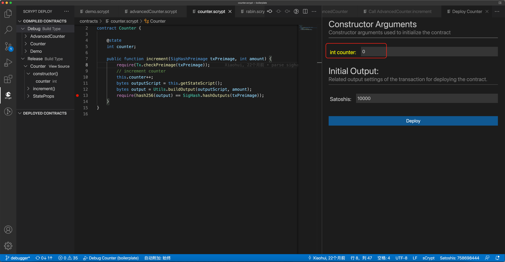
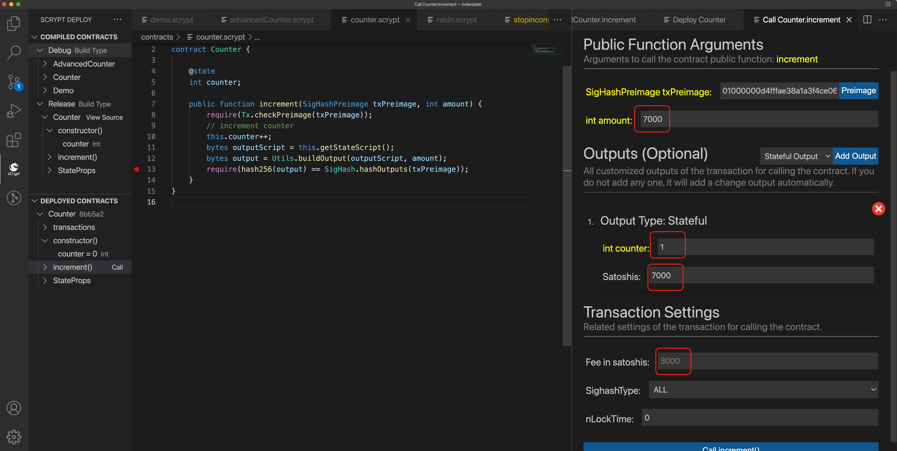

# 通过 GUI 连续调用有状态合约

sCrypt IDE 允许用户部署有状态合约并在 GUI 中重复调用其方法，扩展了我们之前的功能。我们使用示例合约 [Counter](https://github.com/sCrypt-Inc/boilerplate/blob/master/contracts/counter.scrypt) 来说明如何使用该功能。

## 部署

`Counter` 包含一个计数器 `counter` ，每次调用 `increment()` 时都会增加一。我们将其初始化为 `0` 并将 `10000` *satoshis* 锁定到合约中。点击 **Deploy** 后，它应该被成功部署。

部署

## 多次调用

在 **Call** 面板中，除了上次介绍的 **Public Function Arguments** 部分之外，还有一个附加部分 **Outputs (Optional)** 和 **Transaction Settings**。它允许自定义输出，这在许多有状态合约中是必需的。我们目前支持四种类型的输出：

- **Stateful Output**: 需要填写被装饰器 `@state` 修饰的属性， 或者是 ASM 格式的序列化状态。

- **P2PKH Output**: 地址是一个普通的比特币地址，默认为用户[私钥](https://xiaohuiliu.medium.com/deploy-a-contract-and-call-its-methods-with-a-few-clicks-43c5e73cc2d0)派生的地址。

- **OpReturn Output**: `OP_FALSE OP_RETURN` 为前缀的输出，数据是 ASM 格式。

- **Hex Output**: 可以是*hex*格式的任意输出脚本

所有输出都需要填写锁定的  *satoshis* 数量。

注意参数 `amount` 等于输出中 **Satoshis** 的数量：`7000`（输出 1）+ `3000`（费用）= `10000`（UTXO 总数）。填写完所有字段后，我们点击调用按钮。

调用

由于这是一个有状态的合约，我们可以一次又一次地调用 `increment()`1。每个调用都会在 **transactions** 条目下生成一个交易。

连续调用

---------------

[1] 目前，解锁有状态合约时只允许输入一个。