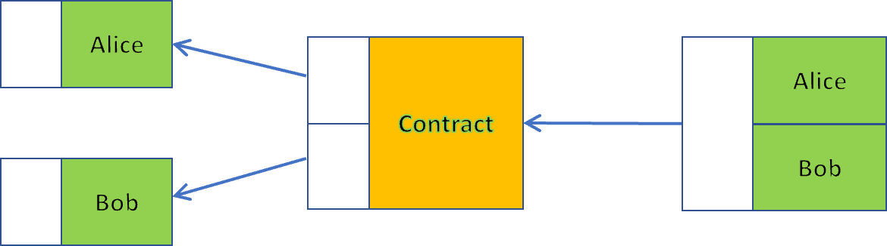
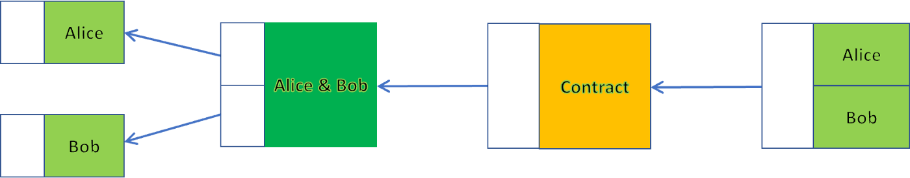
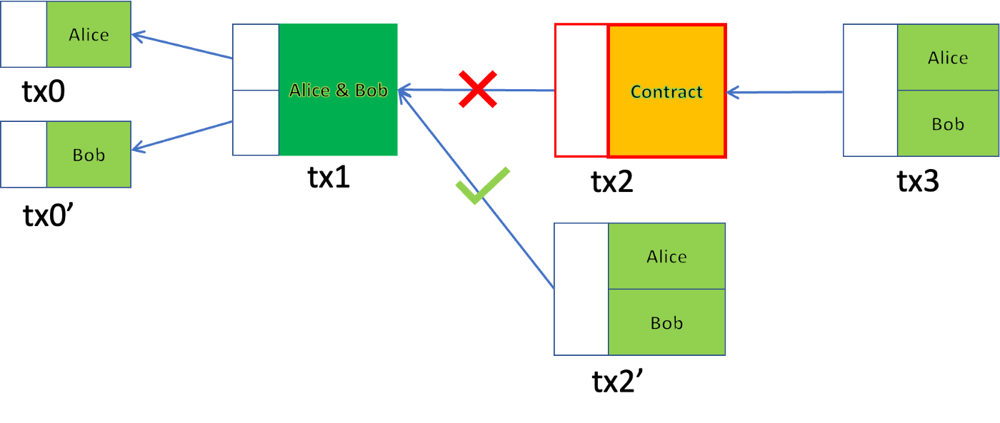
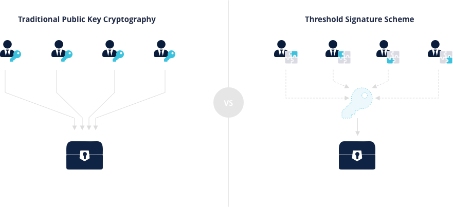

# 无合约的合约

> 在常规支付中巧妙地隐藏任何智能合约

我们发明了一种称为无合约合约的技术，以忠实地执行常规支付 (P2PKH) 交易中的任何智能合约。当多方合作时，它极大地提高了任意多方智能合约的隐私和效率。

## 无合约的合约

我们将说明无合约的合约是如何在两方之间运作的。它可以简单地扩展到多方。在典型的两方合约中，工作流程如下：

图1: 合约工作流程：之前

Alice 和 Bob 各自存入合约。合约执行后，它会根据合约的逻辑1将输出拆分给 Alice 和 Bob。例如，可以通过释放哈希原像、签名或由预言机签名的体育比赛的结果来触发合约执行。

我们修改工作流程如下：

图2: 合约工作流程：之后

我们不是直接存入合约，而是先存入一个联合地址，只有双方签字才能解锁。之后，共同基金被锁定在合同中。

乍一看，这个额外的步骤似乎是多余的，只会增加复杂性。**关键思想是合约交易 (tx2) 不会被 Alice 和 Bob 广播并保持在链下。合约在链下执行。如果 Alice 和 Bob 就结果达成一致，他们都可以签署新的交易 tx2' 并花费 tx1。**

图3: 合约工作流程：合作签约

就 Alice 和 Bob 收到的比特币数量而言，这与广播 tx2 和 tx3 的效果相同，但有两个好处。

**隐私**: 所有交易（tx1 和 tx2'）看起来与常规支付（P2PKH）交易相同。外部方甚至不知道有一个隐藏的潜在合约的存在。

**效率**: 无论合约多么复杂和庞大，只有两笔支付交易最终在区块链上，节省了大量的矿工费用。

## 不合作场景

当任何一方不合作并拒绝签署 tx2' 时，另一方始终可以广播预先签署的 tx2 并在 tx3 中终止合同。追索权激励各方合作。

## Threshold 签名

在 tx1 中，我们使用 2-of -2 Threshold 签名方案 (TSS)：

- 生成联合公钥
- 要解锁它，Alice 和 Bob 都必须分别签名。结合两个签名的联合签名对联合公钥有效。

从外部看，联合公钥和签名看起来与常规公钥和签名相同。令人惊奇的是，联合公钥对应的私钥在签名时不必存在，避免了单点故障。

图4: 门限签名方案  原图来自: <a href="https://nakasendoproject.org"> nakasendo SDK </a>

TSS 如何在 ECDSA2 上工作的详细说明超出了本文的范围。有兴趣的读者可以阅读 nChain 的 [白皮书](https://nakasendoproject.org/Threshold-Signatures-whitepaper-nchain.pdf) 和 这份[资料](https://medium.com/kzen-networks/threshold-signatures-private-key-the-next-generation-f27b30793b)。

TSS 已在[此处](https://youtu.be/mOLiwmudaws)进行了演示，并广泛用于 [HandCash](https://handcash.medium.com/handcash-goes-keyless-b86d27339254) 和 [Volt](https://volt.id/) 等生产钱包。

## Nakamoto 签名协议

遵循图 2 中的工作流程的一种简单方法是让 Alice 和 Bob 依次签名和广播 tx0/tx0'、tx1 和 tx2。但是，有几个问题。 Bob 得到 Alice 部分签名的 tx1 后，他可以:

- 将资金重定向到另一份合约
- 或签名并广播 tx1，但稍后拒绝签名。爱丽丝的资金会被锁住

为了克服这些问题，我们受中本聪的启发，分两步设置合约，我们称之为 Nakamoto 签名协议。

1. Alice 和 Bob 交换 tx0 和 tx0' 的 txid，这足以创建和签署 tx1 和 tx2。但是他们还没有相互共享原始交易 tx0 和 tx0' 并让它们保持在链下。

2. Alice 检查 tx1 和 tx2 都已签名，并且它们的输出包含预期的联合地址和合约。如果是，她广播 tx0。如果没有，她会终止。Bob 做同样的事情。

合约只有在双方都没有中止时才会继续进行，因为 tx1 需要 tx0 和 tx0' 都有效。

## 与合作合约相比

无合约合约类似于我们之前介绍的[合作合约](https://xiaohuiliu.medium.com/cooperative-smart-contracts-730c7186fc6c)，当各方就最终输出达成一致时，走捷径。它比后者更私密、更高效：

- 在后者中，整个智能合约始终暴露在链上，而在前者中，如果各方合作，则不会暴露。
- 在后者中，当各方合作签名时，解锁交易需要所有签名，而前者只需要一个签名。

------------

[1] 存款和拆分金额都可以为零，即只有一方存款和赎回。

[2] 与许多人的想法相反，Schnorr 签名不需要将多个签名聚合为一个。
