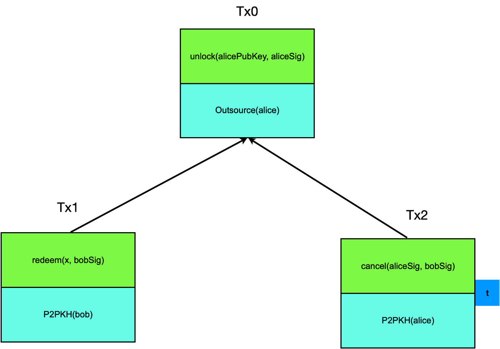

# 智能合约协作
> 在链下诚实可以节省链上计算

我们引入了一种通用方法来跳过比特币智能合约中的链上计算，同时确保存在恶意方时的安全性。在这种方法中，诚实的缔约方可以在链下点对点达成协议，同时有机会决定是否执行复杂的计算替代方案。

## 外包示例

Alice 要求 Bob 计算一个输入/见证 `x`，这使得函数 `f(x)` 返回 `true`。例如，`f` 可以是哈希谜题、[数独谜题](https://blog.csdn.net/freedomhero/article/details/112758212)的解决方案或[旅行商问题](https://blog.csdn.net/freedomhero/article/details/122885550) (TSP)。如果 Bob 可以提供 `x`，他将在 *Tx1* 中获得报酬，如下所示。否则，Alice 可以在时间 t 之后取消并在 *Tx2* 中取回她的资金，这是由 Bob 预先签署的。这与我们之前介绍的[定时承诺方案](https://blog.csdn.net/freedomhero/article/details/115862217) (TCS) 是相同的，因为 Bob 必须及时响应，而不是 Alice。

外包 Tx 图表

## 外包协作

现在让我们稍微修改一下上面的合约/协议。Bob 没有通过广播 *Tx1* 来赎回 Alice 的资金，而是直接与 Alice 分享他的见证人 `x`。Alice 可以在链下验证它并确保它是预期的（即 `f(x)` 评估为真）。之后，她有两个选择：

1. 即使她获得了 Bob 的秘密 `x`，她也拒绝签名。
2. 她签署了一个没有时间锁的新交易 *Tx3* 并将其发送给 Bob，Bob 签署并广播它以获取资金，如下所示。这是可能的，因为合约的链上部分，以比特币脚本外包（alice）的形式，只要 Alice 和 Bob 都签署，就可以取消，无论时间锁如何。 与 TCS 具有相同的代码结构，外包商 (alice) 根本不检查花费的 UTXO 所在的交易的锁定时间。

外包协作 Tx 图表

在选择 1 中，Bob 仍然可以创建 *Tx1* 并赎回 Alice 的资金。爱丽丝不能作弊，也得不到任何东西。

在选择 2 中，Alice 选择诚实，可以享受显着的收益。

## 隐私

通常，Alice 不希望 `x` 公开。也许是哈希谜题中的原像，作为访问她租车的令牌，或者 TSP 问题的答案是她物流公司路线的秘密。x 将在 *Tx1* 中暴露并在 *Tx3* 中被屏蔽。

## 效率

`f(x)` 可以是计算密集型函数，如果使用 *Tx1*，则必须由所有矿工评估。如果使用 *Tx3*，矿工根本不会评估 `f(x)`，因为合约函数仅在支出交易中用于解锁时才被调用。相反，只需要检查两个签名，它们可以小很多数量级，并且与 `f(x)` 的复杂性无关。

从 Alice 的角度来看，她被激励诚实行事并选择 2 来获得隐私。她的诚实也将繁重的计算从链上卸载，减少了比特币网络上的整体任务。

## 总结

该思想适用于所有类型的智能合约，其中多方可以在链下达成相互协议，从而避免繁重的链上计算并通过诚实地遵循合约/协议获得额外的隐私。这是在不损失安全性和公平性的情况下实现的，即使某些方试图作弊。预计将在实践中得到广泛采用。