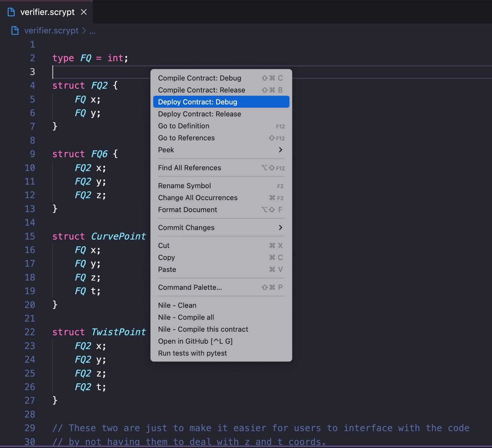
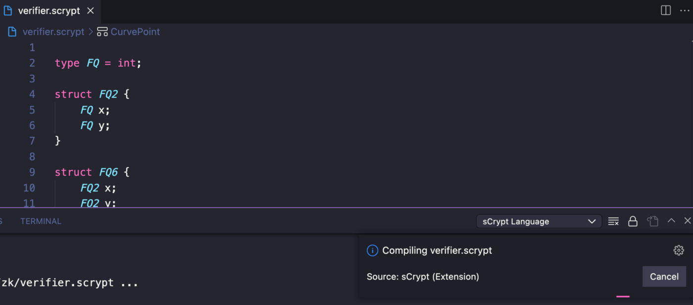
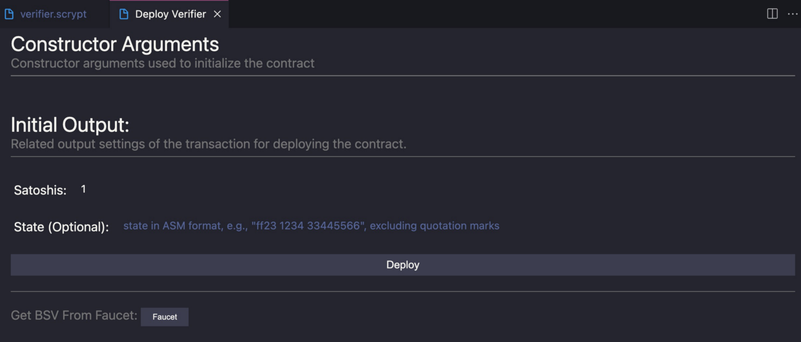
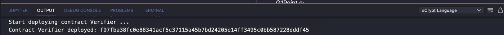
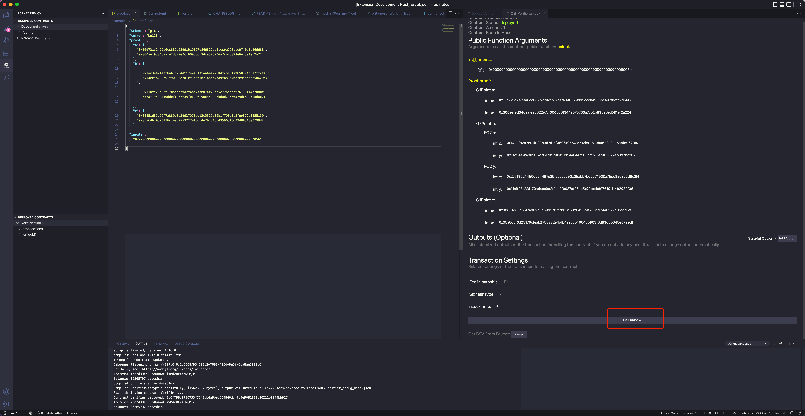

# 在比特币上创建你的第一个零知识证明程序


[ZoKrates](https://zokrates.github.io/)  是 [zkSNARKs](https://blog.csdn.net/freedomhero/article/details/125599764) 的工具箱，隐藏了零知识证明 (ZKP) 固有的显着复杂性。它为开发人员提供了一种类似于 python 的高级语言来编写他们想要证明的计算问题。


我们扩展了它，使其支持在比特币上生成和验证的证明。


## 安装Zokrates

**二进制包安装**

下载并使用我们发布的二进制包:

二进制文件可以从我们的 [发布页面](https://github.com/sCrypt-Inc/zokrates/releases/latest) 下载。

**编译源码安装**

```bash
git clone -b main https://github.com/sCrypt-Inc/ZoKrates
./build_release.sh
cd target/release
```

## Zokrates 工作流程

整个工作流程与原始 ZoKrates 相同，只是验证步骤是在比特币上完成的。

### 1. 编写电路

创建一个名为 `factor.zok` 的新 Zokrates 文件，其内容如下：

```
// p and q are factorization of n
def main(private field p, private field q, field n) {
    assert(p * q == n);
    assert(p > 1);
    assert(q > 1);
    return;
}
```

这个简单的电路/程序证明了某人知道将整数 `n` 分解为两个整数，而无需透露整数。该电路有两个名为 `p` 和 `q` 的私有输入和一个名为 `n` 的公共输入。

### 2. 编译电路

使用以下命令编译电路：

```
zokrates compile -i factor.zok
```

这会生成两个对电路进行编码的文件，一个是二进制格式和一个人类可读的格式。


### 3. 设置

这将为该电路生成一个证明密钥和一个验证密钥。

```
zokrates setup
```

### 4. 计算见证人

一份证明可以证明证明者知道满足电路的隐私信息。这个秘密信息被称为见证人。在以下示例中，`7` 和 `13` 是见证，因为它们是 `91` 的因数。

```
zokrates compute-witness -a 7 13 91
```

生成一个名为 `witness` 的文件。

### 5. 生成证明

它使用证明密钥和见证人生成证明。

```
zokrates generate-proof
```

证明文件 proof.json 如下所示：

```json
{
  "scheme": "g16",
  "curve": "bn128",
  "proof": {
    "a": [
      "0x0a7ea3ca37865347396645d017c7623431d13103e9107c937d722e5da15f352b",
      "0x040c202ba8fa153f84af8dabc2ca40ff534f54efeb3271acc04a70c41afd079b"
    ],
    "b": [
      [
        "0x0ec1e4faea792762de35dcfd0da0e6859ce491cafad455c334d2c72cb8b24550",
        "0x0985ef1d036b41d44376c1d42ff803b7cab9f9d4cf5bd75298e0fab2d109f096"
      ],
      [
        "0x265151afd8626b4c72dfefb86bac2b63489423d6cf895ed9fa186548b0b9e3f3",
        "0x301f2b356621408e037649d0f5b4ad5f4b2333f58453791cc24f07d5673349bf"
      ]
    ],
    "c": [
      "0x2b75a257d68763100ca11afb3beae511732c1cd1d3f1ce1804cbc0c26043cb6b",
      "0x2f80c706b58482eec9e759fce805585595a76c27e37b67af3463414246fbabbd"
    ]
  },
  "inputs": [
    "0x000000000000000000000000000000000000000000000000000000000000005b"
  ]
}
```

### 6. 导出 sCrypt 验证程序

这会输出一个智能合约文件 `verifier.scrypt`，其中包含验证证明所需的所有代码。

```
zokrates export-verifier-scrypt
```


### 7. 部署验证程序

您现在可以将 `verifier.scrypt` 部署到比特币。最简单的方法是使用 [sCrypt IDE](https://scrypt-ide.readthedocs.io/zh_CN/latest/deploy.html)。





右键单击并选择 **Deploy Contract: Debug**




合约将在几分钟内编译完成，之后应弹出以下面板。单击部署按钮。



如果一切顺利，应该已经部署了验证者合约。




### 8. 验证证明

接下来，您需要从 *proof.json* 复制并粘贴到 Call 面板中，然后单击 **Call unlock()**。



如果一切正常，通过支出交易可以看到证明通过验证。


## 总结

恭喜！你刚刚在比特币上创建了你的第一个零知识证明程序。接下来，您可以扩展模板 `verifier.scrypt` 并添加您自己的业务逻辑。