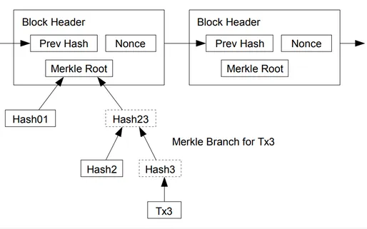
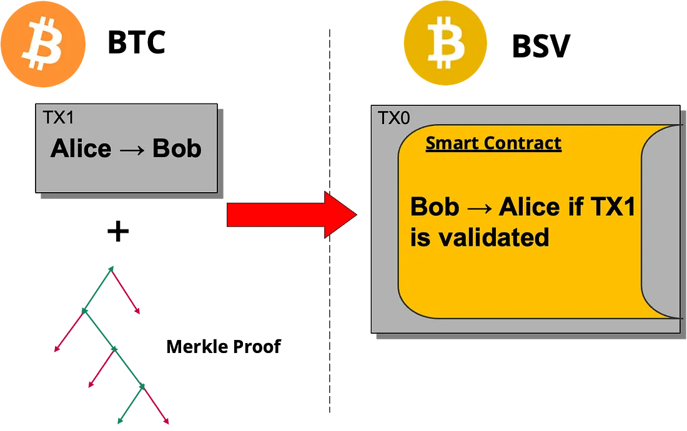

# 没有哈希时间锁定合约的跨链原子交换

在[上一篇文章](https://github.com/sCrypt-Inc/article/blob/master/Cross-chain%20Atomic%20Swaps/Cross-chain%20Atomic%20Swaps.md#L1)中，我们介绍了使用哈希时间锁定合约（HTLC）的跨链原子交换实现。 今天，我们介绍一种无需 HTLC 即可实现的替代方法。 这将原子交换扩展到缺乏哈希锁和时间锁的区块链。

## 使用 SPV 证明交易已被挖掘

让我们按照商定的价格将 Alice 的 BTC 币与 Bob 的 BSV 币进行交换。


在[这篇文章](https://github.com/sCrypt-Inc/article/blob/master/Access%20Blockchain%20Data%20from%20Bitcoin%20Smart%20Contracts%20Without%20Oracles/Access%20Blockchain%20Data%20from%20Bitcoin%20Smart%20Contracts%20Without%20Oracles.md#L1)中，我们展示了 BSV 智能合约能够验证区块链中包含的交易。 重要的是，这是在不依赖外部预言机的情况下实现的。 基本思想是使用工作难度证明来验证区块头。 使用 Merkle 证明，我们可以验证该区块中是否包含交易，类似于链下完成的 [SPV](https://wiki.bitcoinsv.io/index.php/Simplified_Payment_Verification)。



图片源于[BSV Academy](https://bitcoinsv.academy/blog/the-bitcoin-white-paper-simplified-payment-verification?trk=organization_guest_main-feed-card_feed-article-content)


这意味着 BSV 上的智能合约可以编程为根据 BTC 等区块链上特定交易的确认来执行特定操作。

在原子交换的背景下，智能合约本质上是这样说的：

> “如果您将X BTC发送到Y地址，您就可以获得该合约中当前持有的BSV资产。”

该功能之所以成为可能，是因为 BSV 合约能够验证特定交易是否已在 BTC 区块链上成功开采。 合约可以对特定的BTC交易进行验证，确保预期的BTC金额已发送到正确的地址。

为了发起报价，Bob 在智能合约中确保 BSV 币的安全，并指定接收 BTC 所需的地址。 一旦 Alice 发送了 BTC，她就可以领取合约中锁定的 BSV。 此过程不涉及任何受信任的中介机构。

## 完整的协议序列

BSV 和 BTC 之间的原子交换协议可以按照以下步骤执行。

1. **合约部署**：Bob 在 BSV 链上部署智能合约。 该合约持有 Bob 打算与 Alice 交换的 BSV 资金。 该合同还包含故障安全时间锁。

2. **付款和证明**：Alice 将约定数量的 BTC 在 BTC 链上发送给 Bob。 在该交易被开采到区块中后，她获得了该交易的 Merkle 证明。 请注意，这是一个简单的支付交易，没有 HLTC。

3. **验证和解锁**：Alice 将 Merkle 证明提交给 BSV 合约。 合约验证证明并确认将 Alice 的 BTC 交易包含给 Bob。 如果证明得到验证，Alice 就可以解锁并领取合约中的 BSV 资金。

如果Bob没有及时收到付款，他可以在时间锁定到期后取回他的币。



请注意，智能合约是在 BTC 付款广播之前部署的。 这样，Alice 就能保证在向 Bob 付款后，她会收到正确金额的 BSV。 该锁定时间还必须足够长，以便支付交易能够在 BTC 上进行挖掘。


通过稍加修改，Alice 在 Bob 合约部署时甚至可以是未知的。 Bob 的报价是公开的，任何人向他支付适量的 BTC 都可以解锁他锁定的 BSV。

## 与基于 HTLC 的原子交换相比

这种方法的一个关键优点是，即使对于没有哈希锁或时间锁的区块链，它也可以实现原子交换。 只要有一种机制可以不信任地证明其中包含交易（例如，使用 Merkle 证明），则具有智能合约功能来验证该证明的其他链就可以与其进行交换。

## 实现

在 BSV 中，智能合约可以在 sCrypt 中实现，如下所示。

```ts
export type VarIntRes = {
    val: bigint
    newIdx: bigint
}

class CrossChainSwap2 extends SmartContract {
    static readonly LOCKTIME_BLOCK_HEIGHT_MARKER = 500000000
    static readonly UINT_MAX = 0xffffffffn
    static readonly MIN_CONF = 3

    static readonly BTC_MAX_INPUTS = 3

    @prop()
    readonly aliceAddr: PubKeyHash

    @prop()
    readonly bobAddr: PubKeyHash

    @prop()
    readonly bobP2WPKHAddr: PubKeyHash

    @prop()
    readonly timeout: bigint // Can be a timestamp or block height.

    @prop()
    readonly targetDifficulty: bigint

    @prop()
    readonly amountBTC: bigint

    @prop()
    readonly amountBSV: bigint

    // ...

    @method()
    checkBtcTx(btcTx: ByteString): void {
        // Most things should be the same as in BSV except the witness data and flag.
        // - Check (first) output is P2WPKH to Bobs public key.
        // - Check (first) output amount is equal to this.amountBTC

        let idx = 4n

        // Make sure to serialize BTC tx without witness data.
        // See https://github.com/karask/python-bitcoin-utils/blob/a41c7a1e546985b759e6eb2ae4524f466be809ca/bitcoinutils/transactions.py#L913
        assert(
            slice(btcTx, idx, idx + 2n) != toByteString('0001'),
            'Witness data present. Please serialize without witness data.'
        )

        //// INPUTS:
        const inLen = CrossChainSwap2.parseVarInt(btcTx, idx)
        assert(
            inLen.val <= BigInt(CrossChainSwap2.BTC_MAX_INPUTS),
            'Number of inputs too large.'
        )
        idx = inLen.newIdx
        for (let i = 0n; i < CrossChainSwap2.BTC_MAX_INPUTS; i++) {
            if (i < inLen.val) {
                //const prevTxID = slice(btcTx, idx, idx + 32n)
                idx += 32n
                //const outIdx = slice(btcTx, idx, idx + 4n)
                idx += 4n
                const scriptLen = CrossChainSwap2.parseVarInt(btcTx, idx)
                idx = scriptLen.newIdx
                idx += scriptLen.val
                //const nSequence = slice(btcTx, idx, idx + 4n)
                idx += 4n
            }
        }

        //// FIRST OUTPUT:
        // Check if (first) output pays Bob the right amount and terminate and set res to true.
        const outLen = CrossChainSwap2.parseVarInt(btcTx, idx)
        idx = outLen.newIdx
        const amount = Utils.fromLEUnsigned(slice(btcTx, idx, idx + 8n))
        assert(amount == this.amountBTC, 'Invalid BTC output amount.')
        idx += 8n
        const scriptLen = CrossChainSwap2.parseVarInt(btcTx, idx)
        idx = scriptLen.newIdx
        const script = slice(btcTx, idx, idx + scriptLen.val)
        assert(len(script) == 22n, 'Invalid locking script length.')
        assert(
            script == toByteString('0014') + this.bobP2WPKHAddr,
            'Invalid locking script.'
        )

        // Data past this point is not relevant in our use-case.
    }

    @method()
    public swap(
        btcTx: ByteString,
        merkleProof: MerkleProof,
        headers: FixedArray<BlockHeader, typeof CrossChainSwap2.MIN_CONF>,
        alicePubKey: PubKey,
        aliceSig: Sig
    ) {
        // Check btc tx.
        this.checkBtcTx(btcTx)

        // Calc merkle root.
        const txID = hash256(btcTx)
        const merkleRoot = MerklePath.calcMerkleRoot(txID, merkleProof)

        // Check if merkle root is included in the first BH.
        assert(
            merkleRoot == headers[0].merkleRoot,
            "Merkle root of proof doesn't match the one in the BH."
        )

        // Check target diff for headers.
        for (let i = 0; i < CrossChainSwap2.MIN_CONF; i++) {
            assert(
                Blockchain.isValidBlockHeader(
                    headers[i],
                    this.targetDifficulty
                ),
                `${i}-nth BH doesn't meet target difficulty`
            )
        }

        // Check header chain.
        let h = Blockchain.blockHeaderHash(headers[0])
        for (let i = 0; i < CrossChainSwap2.MIN_CONF; i++) {
            if (i >= 1n) {
                const header = headers[i]
                // Check if prev block hash matches.
                assert(
                    header.prevBlockHash == h,
                    `${i}-th BH wrong prevBlockHash`
                )
                // Update header hash.
                h = Blockchain.blockHeaderHash(header)
            }
        }

        // Verify Alices signature.
        assert(hash160(alicePubKey) == this.aliceAddr, 'Alice wrong pub key.')
        assert(this.checkSig(aliceSig, alicePubKey))
    }

    @method()
    public cancel(bobPubKey: PubKey, bobSig: Sig) {
        // Ensure nSequence is less than UINT_MAX.
        assert(
            this.ctx.sequence < CrossChainSwap2.UINT_MAX,
            'input sequence should less than UINT_MAX'
        )

        // Check if using block height.
        if (this.timeout < CrossChainSwap2.LOCKTIME_BLOCK_HEIGHT_MARKER) {
            // Enforce nLocktime field to also use block height.
            assert(
                this.ctx.locktime <
                    CrossChainSwap2.LOCKTIME_BLOCK_HEIGHT_MARKER,
                'locktime should be less than 500000000'
            )
        }
        assert(
            this.ctx.locktime >= this.timeout,
            'locktime has not yet expired'
        )

        // Verify Bobs signature.
        assert(hash160(bobPubKey) == this.bobAddr, 'Bob wrong pub key.')
        assert(this.checkSig(bobSig, bobPubKey))
    }
}
```

源码文件[crosschainswap2.ts](https://gist.github.com/xhliu/c216add326c006b9ed53499c707e929c#file-crosschainswap2-ts)

智能合约有两个公共方法：

1. `swap()`：如果 Alice 提供了她向 Bob 支付了足够数量的 BTC 的证据，则 Alice 会调用该函数来获取资金。
2. `cancel()`：由 Bob 在指定的时间过后调用以提取资金。


完整的代码和测试可以在 [GitHub](https://github.com/sCrypt-Inc/boilerplate/blob/master/src/contracts/crossChainSwap2.ts) 上找到。