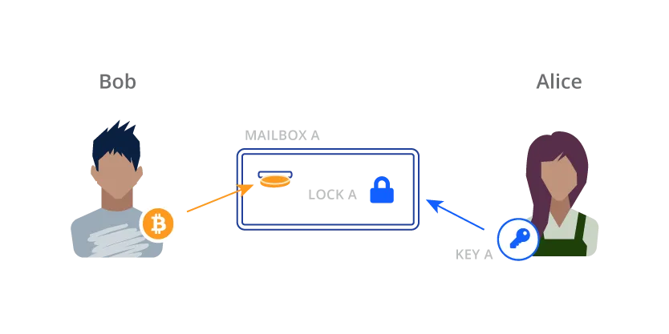
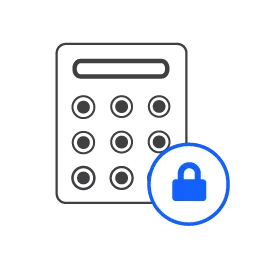
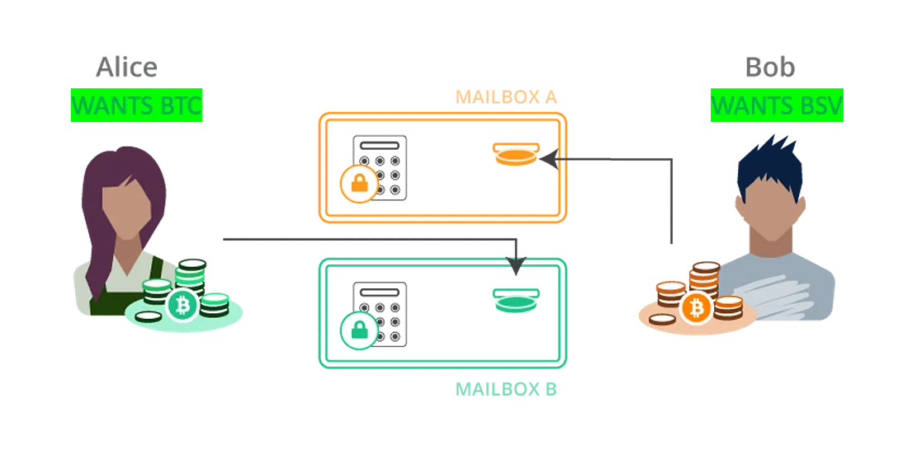
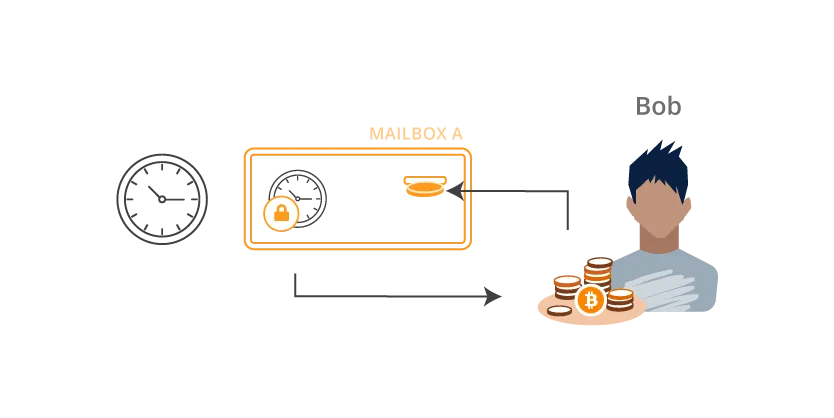

# 跨链原子交换

[原子交换](https://bitcointalk.org/index.php?topic=193281.msg2003765#msg2003765)的想法于 2013 年首次在 BitcoinTalk 论坛上提出，它可以实现两个区块链之间的代币交换。

这些交换是原子的，因为双方要么收到对方的硬币，要么都保留自己的硬币。 一方不可能欺骗另一方。 它不依赖任何可信赖的第三方，消除了交易对手风险。

有很多用例。 例如，它们可以作为非托管交易的基础，用户可以在交易的同时控制自己的资金。

## 基础知识

比特币地址就像一个带有存款槽的上锁邮箱。 当鲍勃向爱丽丝发送比特币时，他将比特币放入邮箱A的槽位，其中包含爱丽丝的“地址”。 只有爱丽丝拥有打开邮箱并取回硬币的钥匙。



有比用简单的私钥就能打开的锁更奇特的锁。 这些锁被视为比特币智能合约，可以规定任意复杂的锁定条件。

### 哈希锁

它们可以通过密码解锁，例如解锁手机的 PIN 码。 这个秘密实际上是一个散列到给定值的值/原像，该值显示在锁上供每个人查看。 对应的智能合约是一个[哈希谜题](https://by-example.scrypt.io/hash-puzzle/)。 一旦使用 PIN/原像解锁，它就会在区块链上公开可见。



### 时间锁

这些锁在到达预定时间之前无法打开，该时间可以是 UNIX 纪元时间（自 1 月 1 日到 1970 年以来的秒数）或区块高度。 相应的智能合约称为[CheckLockTimeVerify](https://by-example.scrypt.io/cltv/)。


## 原子交换

让我们使用这些锁，根据 Alice 的 BSV 币和 Bob 的 BTC 币按照双方同意的比例进行交换。

### 设置



Alice 将带有哈希锁的 BSV 放入 Bob 的邮箱中，并将哈希值告诉 Bob。 然后鲍勃将 BTC 使用相同的哈希锁放入 Alice 的邮箱中。 **这两个哈希锁共享相同的 PIN**，该 PIN 由 Alice 生成并暂时对 Bob 隐藏。

### 交换


Alice 使用她的私钥A和秘密PIN打开邮箱A以获取BTC Bob存款。 Bob 获悉Alice 刚刚在 BTC 区块链上透露的 PIN 码。 他可以使用相同的PIN打开邮箱B，连同他的私钥B，并获得BSV Alice存款。 他们在没有任何第三方的情况下交换了硬币。

打开一个邮箱可以有效地让另一方能够打开另一个邮箱。 如果 Alice 不打开她的邮箱，Bob 就无法打开她的邮箱。

## 如果爱丽丝或鲍勃终止怎么办？




如果Alice存入BSV后Bob没有将BTC放入邮箱A，她的BSV就会被卡住。 同样，如果 Alice 在设置后没有输入 PIN，Bob 的 BTC 币就会被卡住，Alice 的 BSV 也会被卡住。 这就是时间锁的用武之地。每个邮箱都有一个防卡住时间锁，因此如果没有人及时打开密码箱，硬币可以退还。 例如，Bob 可以在一定时间后用他的密钥 B 解锁邮箱 A。

请注意，Alice 在邮箱 B 上的时间锁定必须比 Bob 在主邮箱 A 上的时间锁定长。否则，Alice 可以等到邮箱 B 的时间锁定到期，取回她的 BSV 币，并使用 PIN 打开邮箱 A 来提取 Bob 的 BTC 存款。

## 哈希时间锁定合约（HTLC）

原子交换使用称为哈希时间锁定合约（HTLC）的智能合约，因为它结合了哈希锁和时间锁。

在 BSV 中，HTLC 可以在 sCrypt 中实现，如下所示。

```ts
class HashTimeLockContract extends SmartContract {
    @prop() readonly alicePubKey: PubKey

    @prop() readonly bobPubKey: PubKey

    @prop() readonly hashX: Sha256

    @prop() readonly timeout: bigint // Can be a timestamp or block height.


    // hash lock
    @method()
    public unlock(x: ByteString, aliceSig: Sig) {
        // Check if H(x) == this.hashX
        assert(sha256(x) == this.hashX, 'Invalid secret.')

        // Verify Alices signature.
        assert(this.checkSig(aliceSig, this.alicePubKey))
    }

    // time lock
    @method()
    public cancel(bobSig: Sig) {
        assert(this.ctx.locktime >= this.timeout, 'locktime has not yet expired')

        // Verify Bobs signature.
        assert(this.checkSig(bobSig, this.bobPubKey))
    }
}
```

[HLTC 合约源代码](https://github.com/sCrypt-Inc/boilerplate/blob/master/src/contracts/crossChainSwap.ts)


调用合约有两种方式，即打开邮箱：

1. `unlock()`：使用PIN交换成功
2. `cancel()`：不发生交换，币被退还。 `this.ctx` 是 [ScriptContext](https://docs.scrypt.io/how-to-write-a-contract/scriptcontext)，允许访问支出交易的锁定时间。

在BTC中，HTLC可以如下实现:

```
OP_IF
  // hash lock branch
  OP_SHA256
  <hash of secret>
  OP_EQUALVERIFY
  <pubKey of swap>
  OP_CHECKSIG
OP_ELSE
  // time lock branch
  <locktime>
  OP_CHECKLOCKTIMEVERIFY
  OP_DROP
  <pubKey of refund>
  OP_CHECKSIG
OP_ENDIF
```

它也有两种解锁方式，在时间锁分支中使用[OP_CHECKLOCKTIMEVERIFY](https://en.bitcoin.it/wiki/Timelock#CheckLockTimeVerify)。 使用脚本而不是 sCrypt，因为 BTC[禁用了许多操作码](https://xiaohuiliu.medium.com/the-first-high-level-language-smart-contract-on-btc-6db9a4b788d4)。

## 完整的协议序列

总之，BSV 和 BTC 之间的原子交换协议可以按照以下步骤执行。

1. Alice 生成一个安全随机数 `x` 并计算其哈希值：`h = SHA256(x)`。 Alice 将 `h` 发送给 Bob。
2. Alice 将币锁定在 BSV 上的 HTLC 中，可以通过以下两种方式之一解锁：1) 哈希到 h 和 Bob 签名的值； 2) 比如说 24 小时后 Alice 的签名。 Alice 通过向 BSV 网络广播交易来部署合约。
3. Bob 将币锁定在 BTC 的 HTLC 中，可以通过以下两种方式之一解锁：1）哈希到 h 和 Alice 签名的值； 2) Bob 在 48 小时后签名。 Bob 通过向 BTC 网络广播交易来部署合约。
4. 确认 Bob 的交易后，Alice 通过提供 `x` 和她的签名来领取 BTC。
5. Bob 在 BTC 上观察到 x，并使用 x 和他的签名来索取 BSV。


如果步骤 `3` 或 `4` 没有发生，双方都可以在时间锁定到期后取回他们的硬币。

## 概括


我们已经演示了如何在 BSV 和 BTC 区块链上自动交换硬币。 任何两条区块链都可以支持跨链原子交换，只要它们支持HTLC，即具有相同的哈希函数并支持时间锁。 例如，已实施以下交换：


- [BTC <-> ETH & ERC20 tokens](https://blog.liquality.io/liquality-atomic-swaps-on-mainnet/): using [HTLC on Ethereum](https://github.com/chatch/hashed-timelock-contract-ethereum)

- [BTC <-> LTC](https://bitcoinist.com/first-ever-cross-chain-atomic-swap-between-bitcoin-and-litecoin-has-now-taken-place/)
- [BTC <-> BCH](https://bcoin.io/guides/swaps.html)
- [BTC <-> QTUM](https://bitcoinmagazine.com/business/qtum-completes-first-atomic-swap-bitcoin-mainnet)
- [Decred <-> LTC](https://blog.decred.org/2017/09/20/On-Chain-Atomic-Swaps/)


令人惊讶的是，原子交换甚至可以在没有 HTLC 的区块链上实现，例如[门罗币](https://localmonero.co/knowledge/monero-atomic-swaps)。 使用[高级的密码学](https://eprint.iacr.org/2021/1612.pdf)，原子交换甚至可以用于任何区块链，只要它可以验证签名。