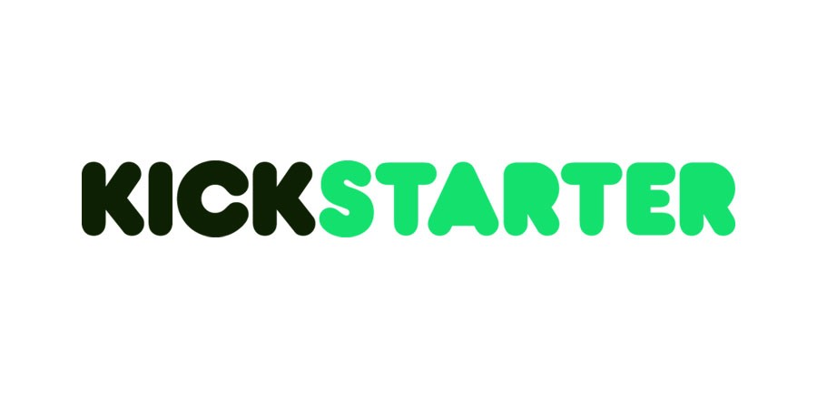
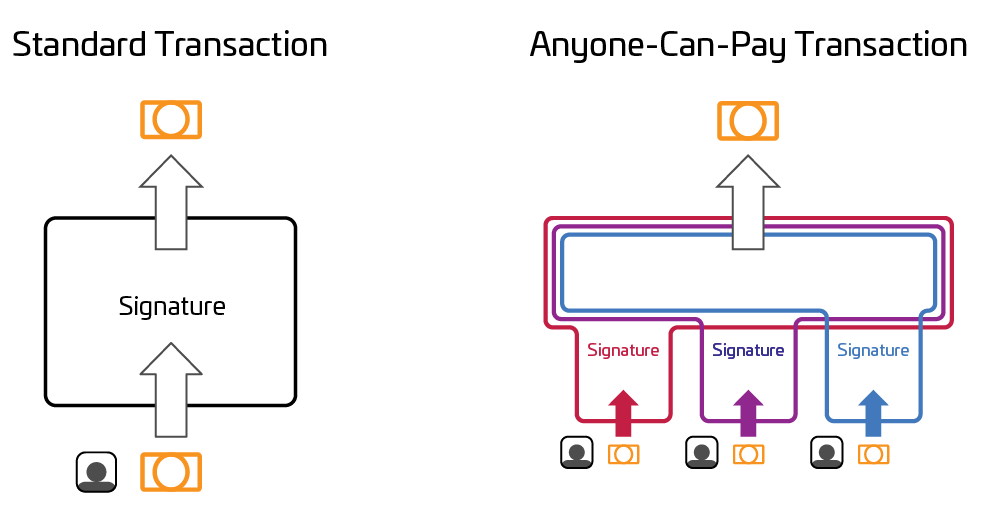
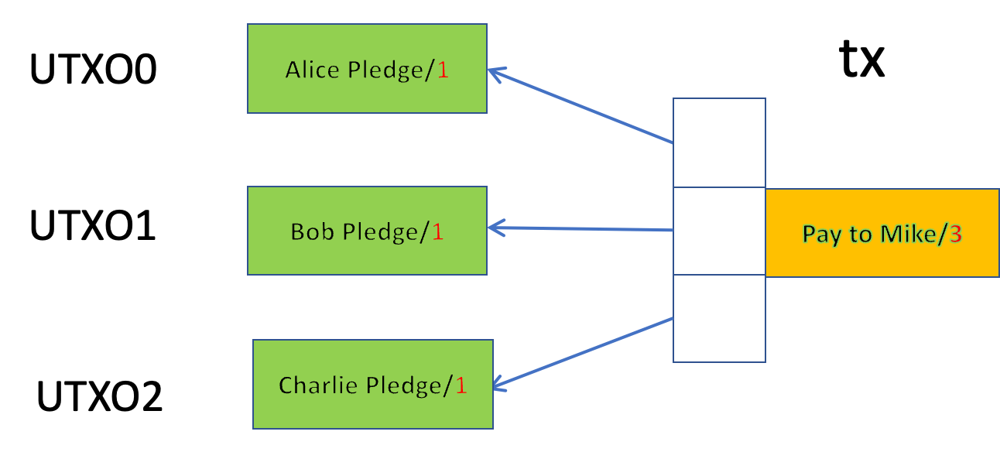

# 比特币上的众筹

> 这不是 ICO

我们展示如何在比特币上开发众筹平台。与 Kickstarter 类似，资金要么是全部，要么什么都没有。也就是说，如果没有达到筹款目标，则保证资金返还。



与 Kickstarter 相比，我们的方法由比特币自动执行，不需要将资金委托给受信任的第三方，并且费用低。

我们首先介绍一种传统的方法来实现这一点，然后介绍一个改进的版本。

## 第一次尝试：Lighthouse

早期的比特币开发者 Mike Hearn 建立了一个基于[担保合约](https://en.bitcoin.it/wiki/Contract#Example_3:_Assurance_contracts)的众筹平台 [Lighthouse](https://techcrunch.com/2014/05/23/lighthouse-is-a-crowdfunding-platform-built-on-top-of-bitcoin)。它使用 [SIGHASH 标志](https://wiki.bitcoinsv.io/index.php/SIGHASH_flags) 是 ALL | ANYONECANPAY.



<center><a href="https://news.bitcoin.com/voluntary-financing-noncustodial-app-flipstarter/">ANYONECANPAY 输入可以被合并</a></center>

- **ALL** 确保所有资金都流向所需的接收者，并且总数恰好是某个目标。签名后无法更改收件人和目标，防止捐款被重定向。
- **ANYONECANPAY** 确保每个贡献者都可以独立捐款。每个人都签署自己的输入并将部分交易交给接收者，接收者将所有输入合并到一个交易中并赎回资金。

请注意，在达到目标之前，输入值之和小于输出值，交易无效，收款人无法领取资金。

## 改进

上述众筹有几个缺点：

1. 贡献者可以随时提取他的认捐资金
2. 募集资金不得超额认购。即使人们想贡献超过目标，额外的金额也将作为费用支付给矿工，而不是支付给接受者。

为了改进，每个贡献者将她的资金锁定到以下合约中并广播包含它的交易。这锁定了她的资金，在截止日期之前不能撤回。

```javascript
contract Crowdfund {
    // receiver of the fund
    PubKeyHash recepient;
    
    PubKey contributor;

    int deadline;
    
    // minimum amount to raise
    int target;

    // pledge fund
    public function pledge(SigHashPreimage txPreimage, int raisedAmount) {
        require(Tx.checkPreimage(txPreimage));

        // reach target
        require(raisedAmount >= this.target);

        // fund goes to the recepient
        bytes lockingScript = Utils.buildPublicKeyHashScript(this.recepient);
        
        bytes output = Utils.buildOutput(lockingScript, raisedAmount);
        require(hash256(output) == SigHash.hashOutputs(txPreimage));

    }

    // contributor can take the fund back after deadline
    public function refund(Sig sig, SigHashPreimage txPreimage) {
        require(Tx.checkPreimage(txPreimage));

        // fundraising expired
        require(SigHash.nLocktime(txPreimage) >= this.deadline);

        require(checkSig(sig, this.contributor));
    }
}
```

# 比特币上的众筹
如果在截止日期之前筹集了足够的总资金，则受益人可以通过在第 `13` 行调用 `pledge()` 来收集所有已抵押的资金，如图 1 所示。否则，每个贡献者都可以在图 2 中的截止日期之后撤回她的资金，方法是在第 `28` 行调用 `refund()`。



<center>图 1：活动成功</center>


<center>图 2：活动失败</center>