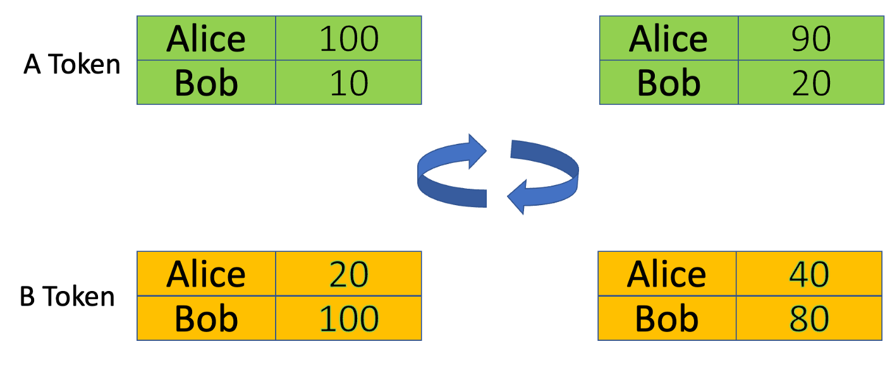
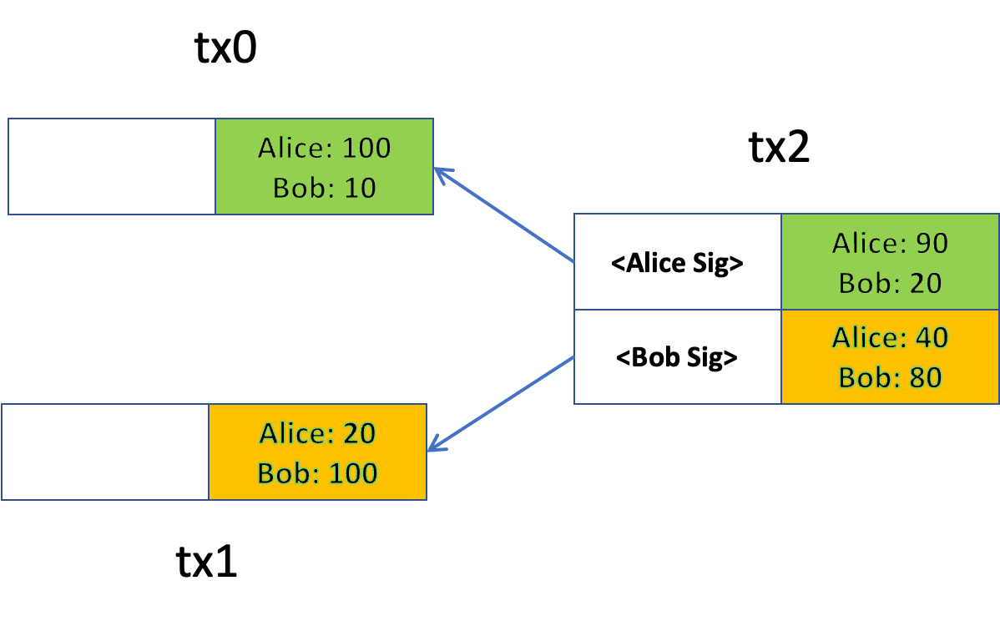

# 比特币上的 DeFi：可替代代币和代币交换 (1)

去中心化金融或 **DeFi** 最近经历了快速增长，因为它声称可以解决传统金融系统中固有的问题。

由于普遍的观点是比特币无法支持DeFi，它并未在比特币上快速发展。

在本系列中，我们将展示 DeFi 不仅在比特币上可行，而且在成本、安全性、可组合性和可扩展性方面，在比特币上运行 DeFi 实际上比在其他区块链上更有利。我们将介绍 DeFi 基础设施和原理，它们可以像组合成乐高积木一样来构建各种 DeFi 应用程序，例如交易所、借贷平台和 NFT 市场。

在本系列的第一部分中，我们展示了如何实现可替代令牌并以原子方式交换它们。

## 可替代代币（Fungible Tokens）

本质上，可替代代币合约是一个帐户表。每个帐户都包含一个用户（此处标识为比特币公钥）和她拥有的代币数量。可选地，发行人可以铸造新的代币。下面的合约实现了这样一个基本的代币，类似于以太坊中的 [ERC20](https://ethereum.org/en/developers/docs/standards/tokens/erc-20/) 代币标准。

```javascript
// a basic ERC20-like fungible token
contract ERC20 {
    PubKey minter;

    @state
    HashedMap<PubKey, int> balances;

    // mint new tokens to receiver
    public function mint(PubKey receiver, Sig minterSig, int balance, int amount, int keyIndex, SigHashPreimage preimage) {
        // authenticate
        require(checkSig(minterSig, this.minter));

        require(this.balances.canGet(receiver, balance, keyIndex));
        require(this.balances.set(receiver, balance + amount, keyIndex));

        require(this.propagateState(preimage));
    }

    // transfer tokens from sender to receiver
    public function transferFrom(PubKey sender, PubKey receiver, int amount, Sig senderSig, int senderBalance, int senderKeyIndex, int receiverBalance, int receiverKeyIndex, SigHashPreimage preimage) {
        // authenticate
        require(checkSig(senderSig, sender));

        require(this.balances.canGet(sender, senderBalance, senderKeyIndex));
        require(senderBalance >= amount);
        require(this.balances.set(sender, senderBalance - amount, senderKeyIndex));
        require(this.balances.canGet(receiver, receiverBalance, receiverKeyIndex));
        require(this.balances.set(receiver, receiverBalance + amount, receiverKeyIndex));
    
        require(this.propagateState(preimage));
    }

    // propagate state to the next UTXO
    function propagateState(SigHashPreimage preimage): bool {
        require(Tx.checkPreimageSigHashType(preimage, SigHash.SINGLE | SigHash.FORKID));
        bytes outputScript = this.getStateScript();
        bytes output = Utils.buildOutput(outputScript, SigHash.value(preimage));
        return hash256(output) == SigHash.hashOutputs(preimage);
    }
}
```

它是一个[有状态的合约](https://medium.com/coinmonks/introducing-stateful-properties-f0f6bce45a06)（第 `5` 行），该状态包含一个地址映射到帐户代币余额的表（第 `6` 行）。


- 增发代币(`mint`): 铸造新代币并将其分配给接收者。只有发行者（第 `3` 行的铸币者）才能铸币，在第 `11` 行检查。第 `13` 行检查接收者的旧余额¹，第 `14` 行增加它。第 `16` 行像往常一样使用 [OP_PUSH_TX](https://blog.csdn.net/freedomhero/article/details/107306604?spm=1001.2014.3001.5502) 保持状态。

- 转移代币(`transferFrom`): 将代币从发送者转移到接收者。第 `22` 行验证发送者。第 `24` 行检查其余额，第 `23` 行确保她有足够的代币，之后她的余额被扣除，接收者的余额增加相同的金额。第 `30` 行像以前一样保持状态。

请注意，第 `35` 行使用了 [SigHash.SINGLE](https://github.com/bitcoinbook/bitcoinbook/blob/a3229bbbc0c929dc53ec11365051a6782695cb52/ch06.asciidoc#signature-hash-types-sighash)，确保合约始终位于与调用它的输入相同的索引输出中。

## 代币交换

现在我们有了代币，让我们交换它们。

在典型的代币交换中，Alice 用来自 Bob 的 `y` 数量的 `B` 代币交易 `x` 数量的 `A` 代币。在下面的示例中，`x` 是 `10`，`y` 是 `20`，这意味着每个 `A` 代币的价值等价于 `2`个 `B` 代币。



<center>Alice 将 10 个 A 代币换成 Bob 的 20 个 B 代币：左边/右边之前/之后</center>

我们想原子地交换它们：要么 Alice 收到 `20` 个 B 代币，Bob 收到 `10` 个 A 代币，要么都没有收到任何代币。为了实现这一点，我们利用了比特币的 UTXO 模型：每笔交易都可以有多个输入和输出。Alice 或 Bob（或像交易所这样的第三方）创建交易 `tx2`。`tx2`的第一个和第二个输入来自 `tx0` 和 `tx1`，其输出分别包含最新状态的 A 和 B 代币的合约。`tx2`的第一个和第二个输出分别包含更新的 A 和 B 代币合约。

Alice 可以在签名之前验证所有内容（例如汇率和金额）是否正确。Bob 也可以。值得注意的是，在一方签名后（Alice 或 Bob 都可以先签名），另一方不能在不使现有签名失效的情况下单方面更改 `tx2`。由于交易只能整个被矿工接受或拒绝，因此交换是原子的。



## 与以太坊相比

以太坊中的代币交换通常分两个步骤进行：

1. Alice 和 Bob 授权交换合约来花费一定数量的代币，称为批准 ERC20 中的配额。
2. Swap 合约执行实际的交换。

Swap合约本质上充当受信任的第三方。在第 `1` 步之后，流氓合约可以随心所欲地转移代币并窃取它们。或者交换合约如果有BUG，可能导致批准的代币被烧毁或被盗。在我们的代币交换中，用户可以随时完全控制汇率和金额，无需信任第三方。因此，它是非托管的并且更安全。