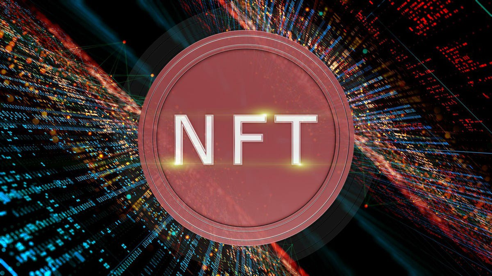
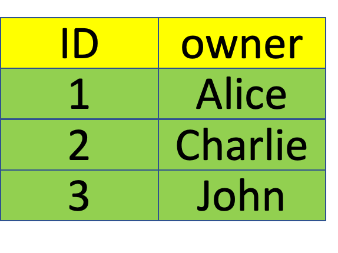
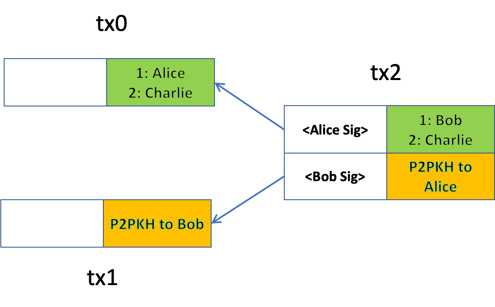

# BSV 区块链上的 DeFi: 非同质化代币(NFT) 与 市场交易
> BSV 区块链上的 OpenSea

在本系列的第 2 部分中，我们将说明如何构建非同质化代币(NFT) 并直接在比特币上出售它们。



## 非同质化代币 (Non-Fungible Tokens)

在最基本设置中，NFT 合约包含两列的表：一个 ID，唯一地代表不可替代的资产，以及它的合法所有者。



下面的合约实现了这样一个基本的 NFT 合约，类似于以太坊中的 [ERC721](https://ethereum.org/en/developers/docs/standards/tokens/erc-721/) 代币标准。

```javascript
// a basic ERC721-like non-fungible token
contract ERC721 {
    PubKey minter;

    @state
    HashedMap<int, PubKey> owners;

    // mint a new token to receiver
    public function mint(PubKey to, int tokenId, Sig minterSig, int keyIndex, SigHashPreimage preimage) {
        // token not minted
        require(this.owners.has(tokenId, keyIndex));
        // authenticate
        require(checkSig(minterSig, this.minter));

        require(this.owners.set(tokenId, to, keyIndex));

        require(this.propagateState(preimage));
    }

    // burn a token
    public function burn(int tokenId, PubKey from, Sig fromSig, int keyIndex, SigHashPreimage preimage) {
        // verify ownership
        require(this.owners.canGet(tokenId, from, keyIndex));
        // authenticate
        require(checkSig(fromSig, from));

        require(this.owners.delete(tokenId, keyIndex));

        require(this.propagateState(preimage));
    }

    // transfer a token from sender to receiver
    public function transferFrom(PubKey from, PubKey to, Sig fromSig, int tokenId, int keyIndex, SigHashPreimage preimage) {
        // verify ownership
        require(this.owners.canGet(tokenId, from, keyIndex));
        // authenticate
        require(checkSig(fromSig, from));

        require(this.owners.set(tokenId, to, keyIndex));
    
        require(this.propagateState(preimage));
    }

    function propagateState(SigHashPreimage preimage): bool {
        require(Tx.checkPreimageSigHashType(preimage, SigHash.SINGLE | SigHash.FORKID));
        bytes outputScript = this.getStateScript();
        bytes output = Utils.buildOutput(outputScript, SigHash.value(preimage));
        return hash256(output) == SigHash.hashOutputs(preimage);
    }
}
```

<center>ERC721 合约<a href="https://github.com/sCrypt-Inc/boilerplate/blob/master/contracts/erc721.scrypt">代码</a></center>

它与我们开发的[同质化代币合约](https://blog.csdn.net/freedomhero/article/details/122735828)非常相似。最显着的区别是第 `6` 行的代币表，将资产 `ID`， 而不是代币代币余额，映射到其所有者。

## 出售 NFT

让我们出售一些 NFT 来换取比特币。这类似于交换同质化代币。在以下示例中，Alice 仅在 `tx2` 的第二个输出中收到比特币，并且支付金额满足她的价格要求时才签名。Bob 只有在 `tx2` 的第一个输出中成为 `id` 为 `1` 的 NFT 的新所有者时才签名。



## 扩展

有多个方面可以扩展出售NFT。我们列举几个例子：

- 出售 NFT 以换取其他代币: `tx2` 的第二个输出应该包含支付给 Alice 的代币（同质化代币或非同质化代币），而不是由 `tx1` 支付比特币。
- 平台费: 第三个输出可以添加到 `tx2`，向平台支付费用，例如，第二个输出金额的 `3%`。