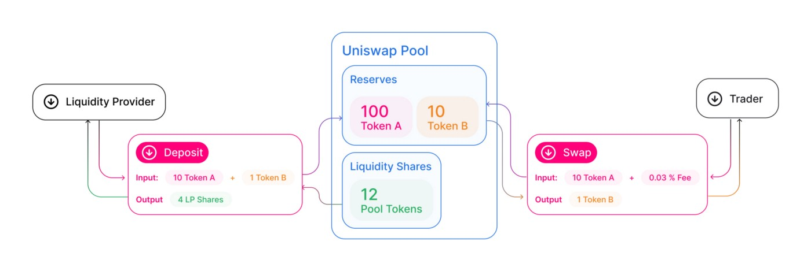

# BSV 区块链上的 DeFi: Uniswap (3)

我们将说明了如何直接在比特币上构建类似 [Uniswap](https://uniswap.org) 的交易所。


## Uniswap

Uniswap 是所谓的“去中心化交易所”（DEX）。它允许个人, 或称为流动性提供者， 将代币/比特币汇集到智能合约中，并为交易所提供流动性。



## 概述

我们实现了 [Uniswap V1](https://docs.uniswap.org/protocol/V1/introduction)，它只在比特币和代币之间直接交换。如@state 装饰器所示，我们使用一个带有 [@state 装饰器](https://scryptdoc.readthedocs.io/zh_CN/latest/state.html#state-decorator) 的有状态合约来表示池子。它包含两个代币：一个用于我们正在交换的代币（第 `7` 行），另一个是治理代币（第 `11` 行），称为流动性池（LP）代币。该池将比特币直接存储在 `UTXO` 中（以 `satoshis` 为单位），将代币存储在对应的公钥哈希下（第 `3` 行）。

```javascript
contract Uniswap {
    // pool's public key
    PubKey poolPubkey;

    // the main token
    @state
    ERC20 token;

    // the liquidity pool governance token
    @state
    ERC20 lpToken;

    ...
}
```

<center><a href="https://github.com/sCrypt-Inc/boilerplate/blob/master/contracts/uniswap.scrypt">Uniswap 合约源代码</a></center>

## 增加流动性

任何人都可以通过调用函数 `addLiquidity` 向池中添加流动性。有两种情况（在第 `9` 行检查）：

1. 首次增加流动性：可以存入任意数量的比特币和代币。
2. 添加更多流动性：比特币和代币存入的比率必须与池中的现有比率相匹配（第 `22` 行）。

```javascript
// add bitcoin and token to liquidity pool
public function addLiquidity(PubKey sender, Sig senderSig, int tokenAmount, int senderBalance, int senderKeyIndex, int oldTokenBalance,
                            int lpSenderBalance, int lpSenderKeyIndex, int newBitcoinBalance, SigHashPreimage txPreimage) {
    require(checkSig(senderSig, sender));

    int oldBitcoinBalance = SigHash.value(txPreimage);
    
    // mint new lp tokens for the liquidity provider
    if (oldBitcoinBalance == 0) {
        // initialize pool
        
        // initially, just mint new lp tokens per the amount of new bitcoins deposited
        int lpMint = newBitcoinBalance;
        require(this.lpToken.mint(sender, lpSenderBalance, lpMint, lpSenderKeyIndex));
    } else {
        // add more liquidity

        int bitcoinAmount = newBitcoinBalance - oldBitcoinBalance;
        
        // deposit ratio must be the same with current pool ration
        // i.e., oldBitcoinBalance / oldTokenBalance == bitcoinAmount / tokenAmount
        require(oldBitcoinBalance * tokenAmount == bitcoinAmount * oldTokenBalance);

        // mint new lp tokens, proportinal to the amount of new bitcoins deposited
        int lpMint = this.lpToken.totalSupply() * bitcoinAmount / oldBitcoinBalance;
        require(this.lpToken.mint(sender, lpSenderBalance, lpMint, lpSenderKeyIndex));
    }

    // transfer tokens to the pool
    require(this.token.transferFrom(sender, this.poolPubkey, tokenAmount, senderBalance, senderKeyIndex, oldTokenBalance, senderKeyIndex));
    
    require(this.propagateState(newBitcoinBalance, txPreimage));
}
```

存入比特币后，新的 LP 代币在第 `26` 行按比例铸造给流动性提供者。代币在第 `30` 行转移到池子对应的账户。

例如，如果池中有 `10` 个比特币和 `100` 个 LP 代币，而 Alice 又向其中存入了 `5` 个比特币，则将向她铸造 `50` 个新的 LP 代币。

## 移除流动性

流动性提供者调用函数 `removeLiquidity` 来提取他们的资金，包括比特币和代币。

```javascript
// remove bitcoin and token from liquidity pool
public function removeLiquidity(PubKey sender, int lpAmount, Sig senderSig, int oldTokenBalance, int senderKeyIndex, int senderBalance,
                                int lpSenderBalance, int lpSenderKeyIndex, SigHashPreimage txPreimage) {
    require(checkSig(senderSig, sender));

    int oldBitcoinBalance = SigHash.value(txPreimage);
    
    // withdraw amount
    int bitcoinAmount = oldBitcoinBalance * lpAmount / this.lpToken.totalSupply();
    int tokenAmount = oldTokenBalance * lpAmount / this.lpToken.totalSupply();

    // burn the lp tokens
    require(this.lpToken.burn(sender, lpSenderBalance, lpAmount, lpSenderKeyIndex));

    // transfer tokens from pool to the sender
    require(this.token.transferFrom(this.poolPubkey, sender, tokenAmount, oldTokenBalance, senderKeyIndex, senderBalance, senderKeyIndex));
    // transfer bitcoins to the sender
    int newBitcoinBalance = oldBitcoinBalance - bitcoinAmount;
    
    require(this.propagateState(newBitcoinBalance, txPreimage));
}
```

流动性提供者拥有的 LP 代币的数量来提取流动性（第 `9` 行和第 `10` 行）。提款后，LP 代币在第 `13` 行被烧毁。第 `16` 行将代币从池子中转移到流动性提供者。第 `18` 行和第 `20` 行对比特币做同样的事情。

请注意，除了合约输出之外，还需要在同一交易中的另一个输出将比特币返回给流动性提供者。

## 比特币 -> 代币

用户调用函数 `swapBitcoinToToken` 将比特币兑换成代币。在池子收到比特币后（在第 `7` 行计算），第 `10` 行计算要返回的代币数量，第 `13` 行将它们返回给用户。

```javascript
// swap bitcoins for tokens
public function swapBitcoinToToken(PubKey sender, int tokenAmount, Sig senderSig, int oldTokenBalance, int senderKeyIndex, int senderBalance,
                                    int newBitcoinBalance, SigHashPreimage txPreimage) {
    require(checkSig(senderSig, sender));

    int oldBitcoinBalance = SigHash.value(txPreimage);
    int bitcoinAmount = newBitcoinBalance - oldBitcoinBalance;

    // calculate tokens in return
    int tokensAmount = this.getAmount(bitcoinAmount, oldBitcoinBalance, oldTokenBalance);

    // transfer tokens from pool to the sender
    require(this.token.transferFrom(this.poolPubkey, sender, tokensAmount, oldTokenBalance, senderKeyIndex, senderBalance, senderKeyIndex));

    require(this.propagateState(newBitcoinBalance, txPreimage));
}
```

## 代币 -> 比特币

用户调用函数 `swapTokenToBitcoin` 将代币兑换成比特币。第 `9` 行计算要返回的比特币数量。第 `13` 行将代币转移到池子中。

```javascript
// swap tokens for bitcoins
public function swapTokenToBitcoin(PubKey sender, int tokenAmount, Sig senderSig, int senderBalance, int senderKeyIndex, int oldTokenBalance,
                            int lpSenderBalance, SigHashPreimage txPreimage) {
    require(checkSig(senderSig, sender));

    int oldBitcoinBalance = SigHash.value(txPreimage);

    // calculate bitcoins in return
    int bitcoinsAmount = this.getAmount(tokenAmount, oldTokenBalance, oldBitcoinBalance);
    int newBitcoinBalance = oldBitcoinBalance - bitcoinsAmount;

    // transfer tokens to the pool
    require(this.token.transferFrom(sender, this.poolPubkey, tokenAmount, senderBalance, senderKeyIndex, oldTokenBalance, senderKeyIndex));        
    
    require(this.propagateState(newBitcoinBalance, txPreimage));
}
```

与 `removeLiquidity` 类似，需要另一个输出来将比特币返回给用户。

## 讨论

我们已经演示了如何在比特币上实现一个基本的类似 `Uniswap` 的交易所合约。有很多方法可以扩展它以使其更实用。

- 价格公式：我们使用以下代码来确定价格，仅基于比特币和代币储备。它被称为恒定和公式，可能导致池子被排空。为了避免耗尽，可以使用更复杂的公式，如[恒定乘积公式](https://medium.com/coinmonks/programming-defi-uniswap-part-1-839ebe796c7b) (`x * y = k`)，如 Uniswap 中。

```javascript
// use reserve ratio as price
function getAmount(int input, int inputReserve, int outputReserve) : int {
    return outputReserve * input / inputReserve;
}
```

- 流动性挖矿：我们可以对每次交换收取费用，并用这些费用来奖励流动性提供者。
- 允许用户直接将一个代币换成另一个代币。

[TokenSwap](https://tswap.io) 实际上已经实现了以上所有以及更多。

## 致谢

本作品灵感来源于陈诚的这篇[文章](https://zhuanlan.zhihu.com/p/312024053)。
