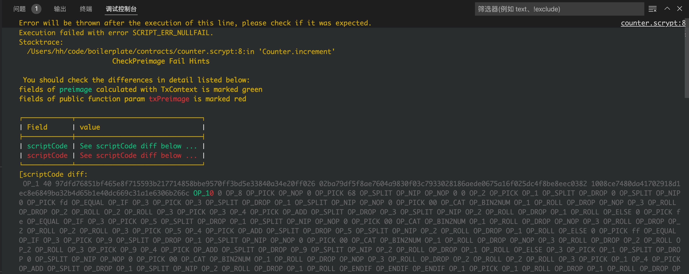
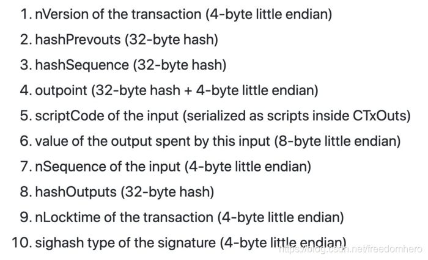
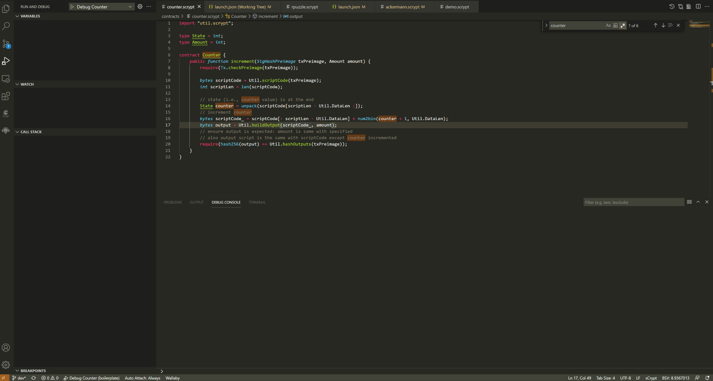
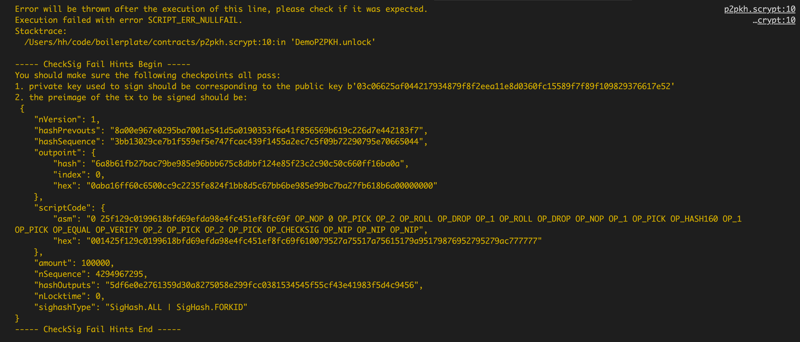

# sCrypt 合约开发调试技巧: 定位及解决 checkSig 和checkPreimage 异常

在 sCrypt 合约的开发调试过程中，最常见也最头疼的两个问题就是碰到 `checkSig` 和 `checkPreimage` 异常。虽然我们可以在 Debug 过程中定位到源码中错误的具体位置，但对于为什么失败以及如何修复总是感觉一头雾水。今天我们就来聊聊如何快速定位和修复这两类问题的一些技巧，希望能对大家有所帮助。

sCrypt [boilerplate](https://github.com/scrypt-Inc/boilerplate) 项目中包含了一些 sCrypt 合约的具体示例代码且在不断更新中，所以有时可能会碰到配置失效导致无法正常完成 Debug 的情况。下面我们以该项目中的 [tokenUtxo](https://github.com/scrypt-Inc/boilerplate/blob/master/contracts/tokenUtxo.scrypt) 合约为例来看看如何定位及解决这两类问题。

注意：本文中使用的 sCrypt 插件版本为 1.7.3。

## checkPreimage 异常

首先看下 `counter.scrypt` 的 Debug 启动配置（位于 `.vscode/launch.json` 中，为方便查看故省略了部分数值）：

```json
{
      "type": "scrypt",
      "request": "launch",
      "internalConsoleOptions": "openOnSessionStart",
      "name": "Debug Counter",
      "program": "${workspaceFolder}/contracts/counter.scrypt",
      "constructorArgs": [
        0
      ],
      "pubFunc": "increment",
      "pubFuncArgs": [
        "SigHashPreimage(b'...')",
        222222
      ],
      "txContext": {
        "hex": "...",
        "inputIndex": 0,
        "inputSatoshis": 100000,
        "opReturnHex": "0101000300000000"
      }
    }
```

上述配置指定了 Debug 的启动函数为 `increment`，并在 `pubFuncArgs` 中指定了若干启动参数；同时在 `txContext` 中指定了交易的相关的[上下文参数](https://scrypt-ide.readthedocs.io/zh_CN/latest/debugger.html#txcontext)。 当我们在 vscode 中启动这个配置准备进行 Debug 时，却发现 **Debug Console** 里输出了以下异常：




这里显示的异常位置是在 `8` 行，其代码是 `require(Tx.checkPreimage(txPreimage));`，由此可以推断是 `txPreimage` 出了问题，但具体是什么原因呢？

在之前的文章中，我们介绍过 Sighash Preiamge，它被称为交易的原像，可由交易 tx 计算出来。这里的 `Tx.checkPreimage` 失败，说明在启动配置参数 `pubFuncArgs` 中传入的 `SigHashPreimage` 与使用 `txContext` 中各项参数所计算出的结果不一致。



如上图所示，Sighash Preimage 由多个部分组合而成，如果两个原像不一致，一定是其中某些字段不相同。究竟是哪个字段的问题呢？从以上截图中我们很容易知道是 `scriptCdoe` （对应 input 的锁定脚本）这个字段不一致。

至此基本找到了问题的所在，鉴于近期的编译器的改动，导致合约编译结果发生改变，导致之前 `txPreimage` 原像失效了。于是重新计算并且更新了 `txPreimage`、`txContext.hex` 等参数后，Debug 终于得到了正确的结果。

## 输出哈希 `hashOutputs` 不匹配

还有另外一种常见的错误是交易的输出哈希与原像的输出哈希 `hashOutputs` 不匹配。 这种情况下 `require(Tx.checkPreimage(txPreimage));` 已经验证通过，说明原像是正确的。但是 `require(hash256(outputs) == SigHash.hashOutputs(txPreimage));` 验证失败，说明构造交易的输出与合约执行过程中计算出来的输出 `outputs` 不一致，才导致 `hashOutputs` 不一致。使用 `:diffoutputs(outputs)` 命令可以快速查看两个输出的不同。



截图中这例子我看到输出 `satoshis` 不一致。`txContext` 中交易的输出的 `satoshis` 是 `222222`， 但是合约执行过程中计算出来的输出的 `satoshis` 是 `22222`。

## checkSig 异常

还有是一类常见的错误是 **checkSig 异常**，通常是由于签名问题导致的。

首先看下 [p2pkh.scrypt](https://github.com/scrypt-Inc/boilerplate/blob/master/contracts/p2pkh.scrypt) 的 Debug 启动配置（位于 `.vscode/launch.json` 中，为方便查看故省略了部分数值）：

```json
{
    "type": "scrypt",
    "request": "launch",
    "internalConsoleOptions": "openOnSessionStart",
    "name": "Debug DemoP2PKH",
    "program": "${workspaceFolder}/contracts/p2pkh.scrypt",
    "constructorArgs": [
    "Ripemd160(b'25f129c0199618bfd69efda98e4fc451ef8fc69f')"
    ],
    "pubFunc": "unlock",
    "pubFuncArgs": [
    "Sig(b'3044022016567cdde8cf4ae00ae5851267243dd40da5f04d92cdb530a06dcac4b545cbe802200e8d34c96e2aeae0d93bd28f89b4f15eab5276d52ac2932b2f75c1bb43a425bb41')",
    "PubKey(b'03c06625af044217934879f8f2eea11e8d0360fc15589f7f89f109829376617e52')"
    ],
    "txContext": {
    "hex": "01000000010aba16ff60c6500cc9c2235fe824f1bb8d5c67bb6be985e99bc7ba27fb618b6a0000000000ffffffff0000000000",
    "inputIndex": 0,
    "inputSatoshis": 100000
    }
}
```

这里我们可以通过随意修改下 `sig` 的参数值来模拟一个签名错误问题，之后再启动 Debug 就可以看到如下提示信息：



上述提示信息涵盖了解决签名错误时的主要检查点，即：

1. 确定生成签名所使用私钥是否正确；

2. 确认待签名 `tx` 的原像（根据 `txContext` 自动计算得到）与传入参数是否一致。

为了对比两个原像是否一致，可以使用 `SigHashPreimage` 的 `toJSONObject()` 方法查看其内部细节。这里的小技巧是：在生成输入参数 `sig` 的地方插入一段代码，与上述异常提示中输出的原像进行对比，进而找出二者可能存在的差异。如以下代码所示：

```javascript
sig = signTx(tx, privateKey, demo.lockingScript, inputSatoshis)

// 插入的代码 开始
const preimage = getPreimage(tx, demo.lockingScript, inputSatoshis);
console.log(preimage.toJSONObject())
// 插入的代码 结束
result = demo.unlock(new Sig(toHex(sig)), new PubKey(toHex(publicKey))).verify(context)
expect(result.success, result.error).to.be.true
```

这里需要再次提醒大家的是，启动配置 `txContext` 属性下的字段都会影响原像的计算，所以在排查问题时需要逐一对比确认是否一致。


