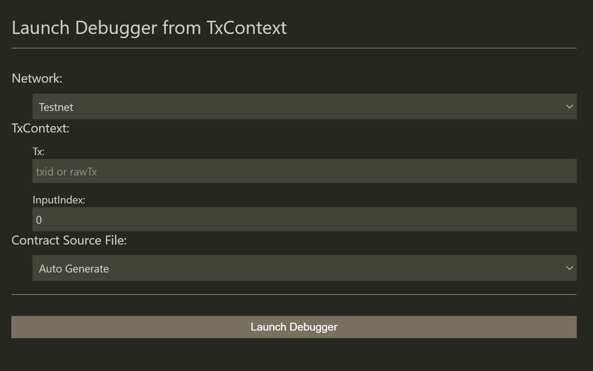
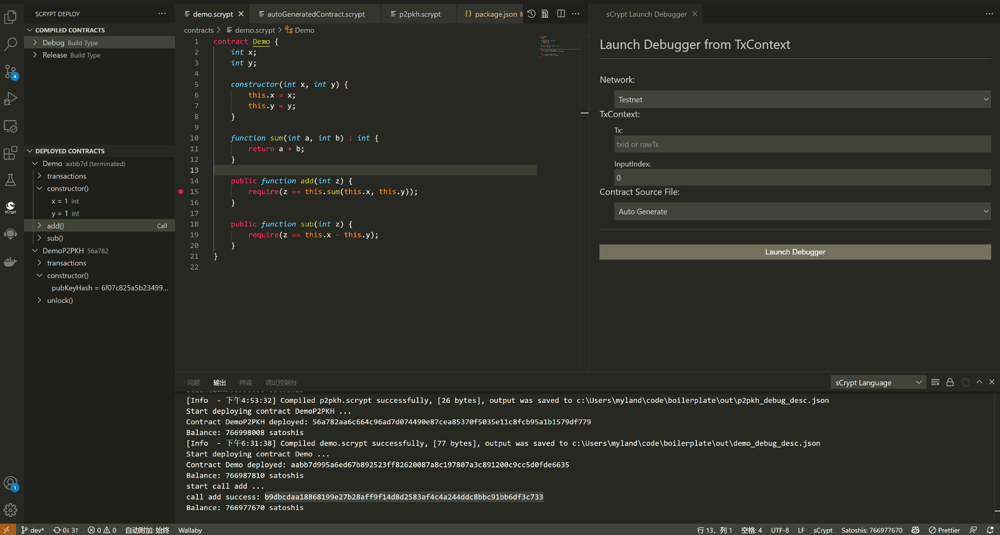
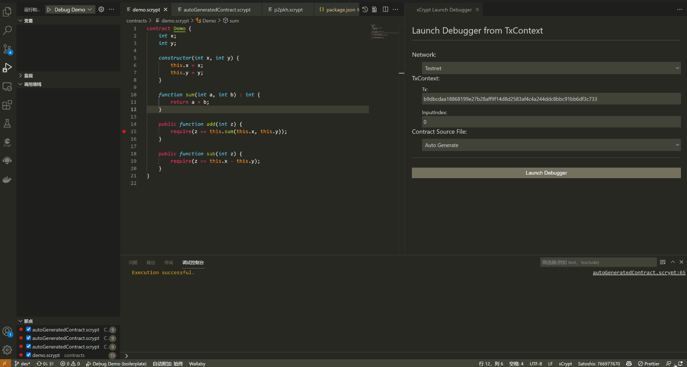

# sCrypt IDE 新功能——调试链上合约

>> 包括主网和测试网

**sCrypt IDE** 1.5.0 版本新增一个实用的调试器功能。你可以用它调试链上的合约，包括主网和测试网。

通过命令面板（Linux/Windows 上的 **Ctrl+Shift+P** 或 Mac OS 上的 **Cmd+Shift+P**）执行以下命令：

```
sCrypt: Launch debugger from TxContext
```

执行后会在 vscode 右侧打开如下视图：



接下来你只需要输入想要调试的交易 `id` 或者 `rawTx` ，然后点击 `Launch Debugger` 按钮，就可以启动调试器。



可以看到，调试器自动为被解锁的合约生成源代码 (只包含一个[内联汇编](https://scryptdoc.readthedocs.io/zh_CN/latest/asm.html)的公共方法)。

你还可以为调试的合约选择附加一个源码文件。这样调试器启动后，就会自动加载附加的源代码。这样就能像调试本地的合约一样去调试链上的合约了。如果附加的合约源代码不正确，则会选择自动生成内联汇编的合约源代码。




除此之外，你还能选择调试交易的哪个输入，以及是调试主网交易还是测试网交易。
需要注意的是： 如果选择调试主网合约，则不能为调试的合约附加源代码。

# 附录

视频介绍： [4 种启动调试器的方法](https://www.bilibili.com/video/bv1WQ4y1e7mF)
