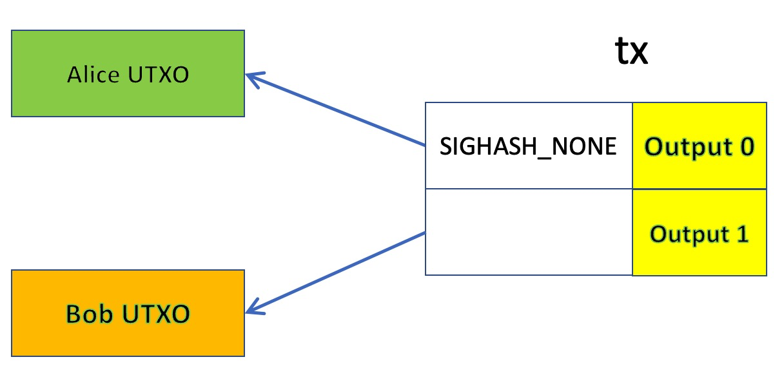

# BSV上的委托: 第二部分

> 直接委托 UTXO

我们引入了一种简单而通用的委托机制，它是我们开发的[脚本级委托](https://xiaohuiliu.medium.com/delegation-in-bitcoin-ac7afcab991e)的替代方案。

## 事务级委托

假设 Alice 想将她的 UTXO 委托给 Bob。她创建了两个输入的交易：一个花费她的 UTXO，另一个花费 Bob 的 UTXO。她使用 sighash 标志 `SIGHASH_NONE` 对她的输入进行签名，这意味着可以为交易添加任意输出。她将部分签名的交易交给 Bob。Bob 可以签署第二个输入并将 Alice 的硬币发送到他想要的任何输出。本质上，Alice 已经将她的 UTXO 委托给了 Bob。

Bob 的 UTXO 可以来自 Bob 控制的现有 UTXO。如果不存在这样的 UTXO，Alice 可以简单地创建一个并在其中存入最少的比特币。与脚本级委托相比，委托的 UTXO 不需要先转移到委托智能合约。它现在可以部署到现有的钱包中。

## 致谢

最初的想法来自比特币开发邮件列表中的[这篇文章](https://lists.linuxfoundation.org/pipermail/bitcoin-dev/2021-March/018615.html)。