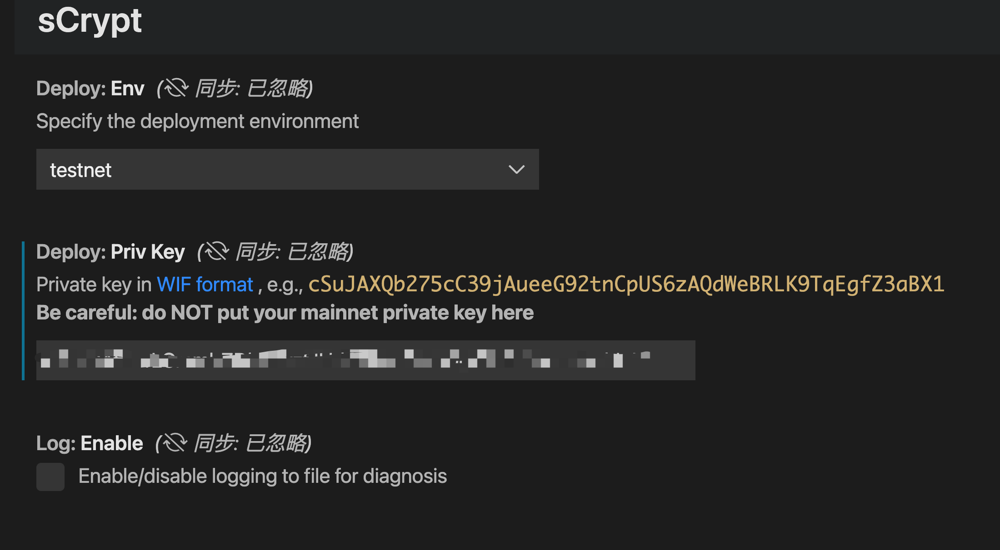
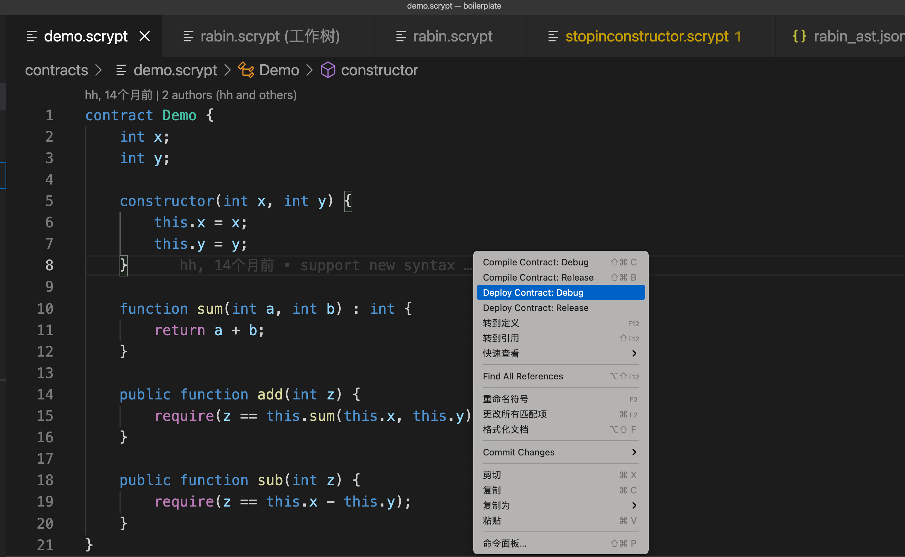
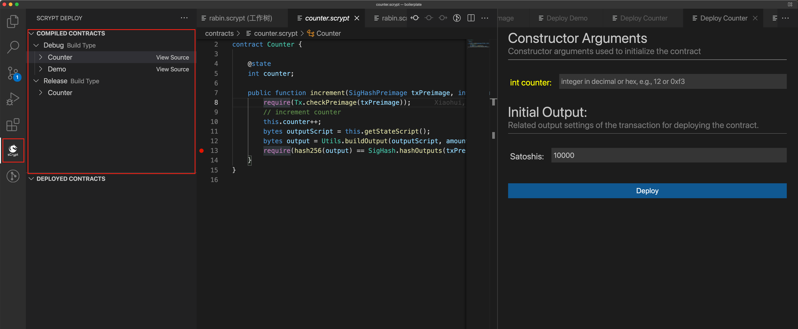
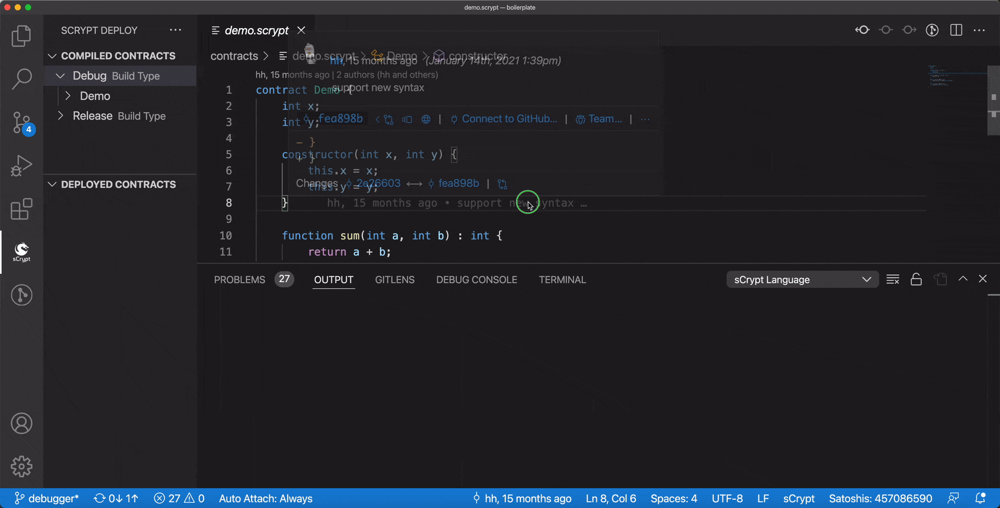

# 部署与调用合约

sCrypt IDE 允许用户将合约部署到测试网并与之交互，而无需编写任何代码。

## 准备

我们需要一个测试网的私钥来为部署和调用交易提供资金。为此，请在 VSCode 中打开 sCrypt 设置并输入您的私钥。

sCrypt 插件设置

## 部署

1. 打开将要部署的合约， 在编辑器上单击右键，选择 **Deploy Contract: Debug** 菜单。

    

2. 或者单击左侧活动栏中的 sCrypt 图标，可以看到列出的所以已编译的本地合约。单击你要部署的合约，将出现类似以下的面板。

    

3. 在面板中输入参数，然后单击部署。如果一切顺利，它应该在测试网上部署了你的合约。

4. 在已部署的合约下列出了一个新的合同实例。您可以通过单击 **View Tx** 在区块链浏览器中查看部署合约的交易。也可以查看部署时填写的构造函数参数。

    

## 调用

单击已部署的合约，您可以看到其方法列表。单击您要调用的那个，将出现一个 **Call** 面板，类似于我们看到的 **Deploy** 面板。同样，输入所有参数并单击调用。之后，你可以通过 **View Tx** 查看调用合约的交易。也可以查看调试合约时填写的公共函数参数。如果是有状态合约，还可以在 **StateProps** 条目下面查看合约的状态。

欢迎体验这个功能

