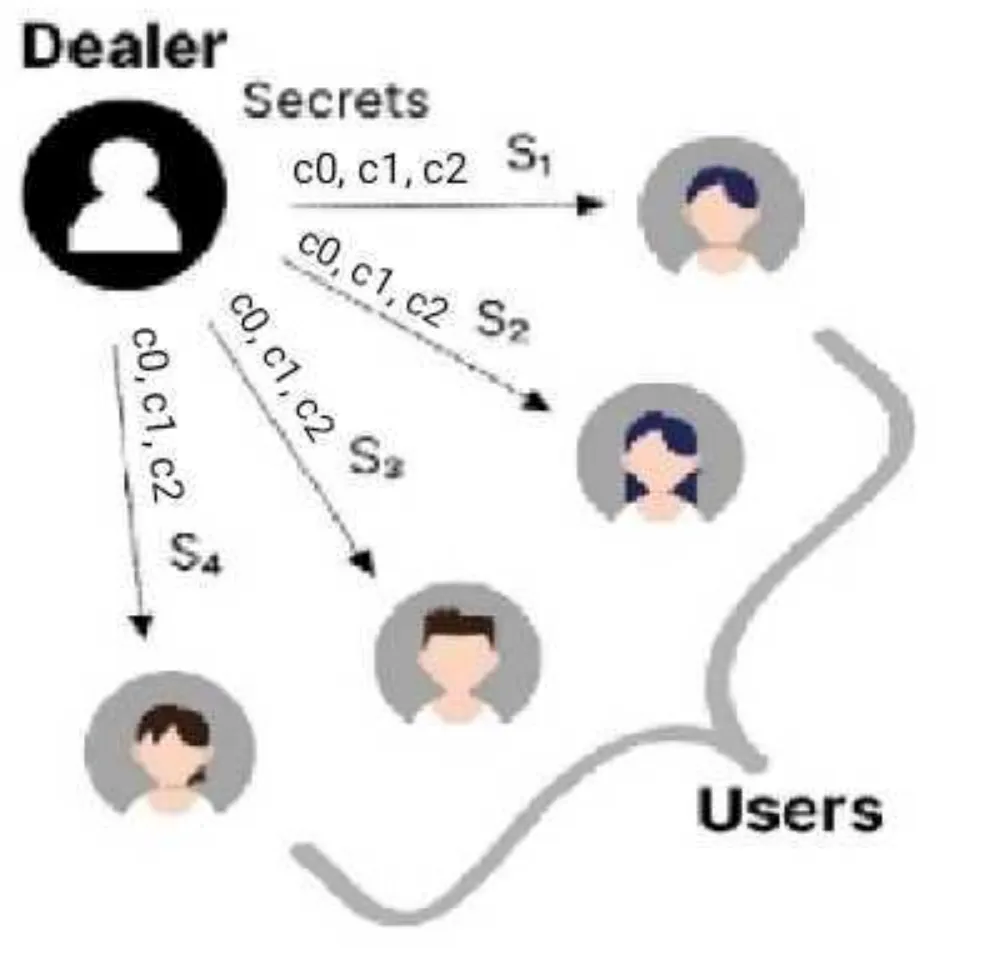
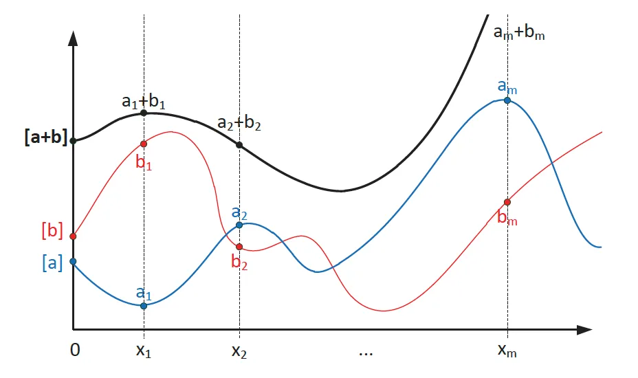

# 分布式密钥生成

> 可验证且无经销商

分布式密钥生成 (DKG) 是一种加密协议，使多方能够协作生成共享密钥，而无需任何一方完全了解密钥。 它通过在多个参与者之间分配信任来增强各种应用程序的安全性，从而降低密钥泄露的风险。 我们引入了一种可验证且无经销商的 DKG，适合在区块链中使用。

## Shamir 密钥共享（SSS）


Shamir的密钥共享 (SSS) 是一种密码学方法，允许将密钥分为多个部分，每个参与者都持有一部分密钥，称为共享。 SSS 的关键特征是，只有当预定义数量的共享（称为阈值）组合在一起时才能重建密钥。 它是一个阈值方案，表示为 `(t,n)`，其中 `n` 是分配的份额总数，`t` 是重构密钥所需的最小份额数量。


SSS 方案的核心是**点唯一定义多项式的数学概念**。 具体来说，需要两个点来定义直线，需要三个点来定义抛物线，等等。 因此，次数为 `(t-1) `的多项式由 `t` 个点唯一确定。 在此方案中，构建了一个 `(t-1)` 次多项式，使得 `n` 个参与者中的每一个都与该多项式上的一个点相关联，该点编码了一个密钥。 为了恢复多项式，从而恢复密钥，只需要这些点中的 `t` 个。 任何由 `t` 个参与者组成的组，每个人都持有自己的份额，都可以重建原始的次数多项式 `(t-1)`。 该密钥作为 `y` 截距嵌入到多项式中，表示多项式在 `x=0` 处的值，这实际上使其成为多项式的常数项。 通过这种方法，可以安全、准确地检索密钥。


让我们检查 `(3, 4)` 密钥共享方案。 负责划分密钥的实体（称为经销商）构造一个 `2` 次多项式，即 `(t-1)`：

```
f(x) = s + a₁x + a₂x²
```

`s` 表示 `y` 轴截距处的密钥值（即 `f(0)`），而 `a₁` 和 `a2` 是随机数。

[图片来源](https://medium.com/numen-cyber-labs/ledger-key-recovery-understanding-the-principles-of-mpc-wallets-dc2eacfd39f3)

<center>(3, 4) 经销商的 SSS，其中 s = f(0)</center>

SSS 由两个主要过程组成：

1. 密钥份额的分配：在分配阶段，交易者将密钥分成几个部分或份额，并将其分配给一组 `n`（即 4）个参与者。 每个参与者 `Pᵢ` 都会收到一份份额 `sᵢ = f(i)`。
2. 密钥的重建：重建过程仅允许 `t`（即 3）个参与者组合他们的份额并恢复原始密钥，而少于 `t` 份的任何其他组都无法推断出有关该密钥的任何重要信息。 例如，前 `3` 个参与者可以形成一组点 `(1, s₁)、(2, s2)` 和 `(3, s₃)` 并重建唯一的多项式 `f(x)`，通常使用拉格朗日插值方法。 密钥 `s` 就是 `f(0)`。


Youtube 上[密钥共享的可视化解释](https://www.youtube.com/watch?v=iFY5SyY3IMQ)

## 可验证的密钥共享（VSS）

在Shamir密钥共享中，参与者不知道自己收到的份额与其他参与者收到的份额是否一致。 例如，恶意经销商给予 `P₁`、`P2` 和 `P₃` 正确的份额 `f(1)`、`f(2)` 和 `f(3)`，但给予 `P₄` 错误的份额，即不是 `f(4)`。 如果稍后选择 `P₄`，则无法正确恢复密钥值。

可验证密钥共享（VSS）是 Shamir 密钥共享方案的扩展，允许验证密钥共享的正确性。 这是在不泄露共享本身的情况下完成的，否则每个人都知道所有共享，从而可以恢复密钥本身，从而破坏了密钥共享的整个目的。

在 VSS 中，除了份额之外，经销商还向每个参与者发送对所有多项式系数的承诺。 一种提交方法是使用椭圆曲线：

```
c₀ = sG

c₁ = a₁G

c₂ = a₂G
```

`cᵢ` 承诺 `aᵢ`。 `G` 是生成点。



`Pᵢ` 可以通过检查以下等式是否成立来独立验证其份额的有效性：

```
f(i)G =? c₀ + c₁i + c₂i²
```

这是因为:

```
f(i)G = (s + a₁i + a₂i²)G = sG + a₁iG + a₂i²G = c₀ + c₁i + c₂i²
```

请注意，她知道方程式中所需的所有信息。 如果等式不成立，她就知道经销商不诚实，可以直接终止。

## 分布式密钥生成

在这个阶段，我们已经掌握了分发密钥的技术，以便所有参与者都可以接收并验证它。 然而，我们面临着一个问题——经销商知道最初的密钥。

分布式密钥生成（DKG）通过允许每个参与者为密钥的整体随机性做出贡献来解决这个问题。 无经销商 DKG 基本上进行 n 次独立的 VSS 运行。 在第 i 次运行中，Pᵢ 充当经销商来分发密钥 sᵢ。 每个参与者从其他参与者那里收集密钥份额，最终份额是每次运行中份额的总和。 最终的密钥是所有运行中密钥的总和。

为了了解原因，让我们考虑以下两个代表密钥 a 和 b 的多项式：


```
f₁(x) = a + a₁x + a₂x² + …

f₂(x) = b + b₁x + b₂x² + …
```

这两个多项式可以相加形成最终的密钥多项式：

```
f(x) = (a+b) + (a₁+b₁)x + (a₂+b₂)x² + …
```

f(x) 编码密钥 `a+b`，它是两个单独密钥的总和。 它的份额也是原始两个多项式的两个单独份额的总和。



<center>两个多项式相加</center>