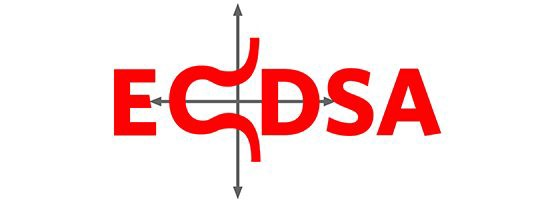
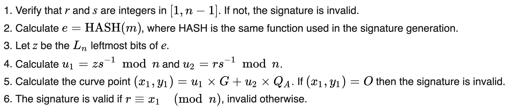
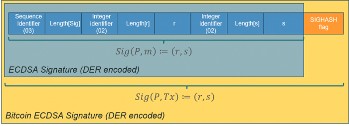

# 脚本中的 ECDSA 签名验证

> 不需要 增加新的操作码 `OP_DATASIGVERIFY`

我们使用比特币脚本实现了 [ECDSA 签名验证算法](https://en.wikipedia.org/wiki/Elliptic_Curve_Digital_Signature_Algorithm#Signature_verification_algorithm)。它可以验证任意消息是否由与给定公钥对应的私钥签名，而 [OP_CHECKSIG](https://wiki.bitcoinsv.io/index.php/OP_CHECKSIG) 只能在消息是当前花费交易时验证签名¹。令人惊讶的是，这是并不需要引入任何新操作码，比如在BCH上，通过引入 [OP_DATASIGVERIFY](https://github.com/bitcoincashorg/bitcoincash.org/blob/master/spec/op_checkdatasig.md)（又名 OP_CHECKDATASIG））的来完成相同的功能的。



## 椭圆曲线数字签名算法 (ECDSA)

ECDSA 是比特币中用于签名生成和验证的算法。下面列出了验证算法。



## 实现

如下所示，我们已经实现了该算法，使用我们之前发布的椭圆曲线库。

首先，我们需要从以 DER 格式编码的签名中提取 `r` 和 `s` 分量。由于它们是大端编码，我们必须转换为 小端编码，这就是数据在 Script/sCrypt 中的编码方式。



在检索到 `r` 和 `s` 后，我们只需运行标准的 ECDSA 验证算法。

```javascript

import "ec.scrypt";
import "util.scrypt";

struct RSPair {
    int r;
    int s;
}

// ECDSA signatures verification for secp256k1, for arbitrary message @msg
contract ECDSA {
    public function verify(Sig sig, PubKey pubKey, bytes msg,
        int invS, Point P, int lambda, Point U1, PointMulAux u1Aux, Point U2, PointMulAux u2Aux) {

        // extract (r, s) from sig
        RSPair rs = parseDERSig(sig);
        int r = rs.r;
        int s = rs.s;
        // within range
        require(r >= 1 && r < EC.n);
        require(s >= 1 && s < EC.n);

        // verify invS
        require((s * invS) % EC.n == 1);
        
        int e = unpack(sha256(msg));
        int u1 = (e * invS) % EC.n;
        int u2 = (r * invS) % EC.n;

        // U1 = u1 * G
        require(EC.isMul(EC.G, u1, U1, u1Aux));

        Point Q = pubKey2Point(pubKey);
        // U2 = u2 * Q
        require(EC.isMul(Q, u2, U2, u2Aux));

        // P == U1 + U2
        require(EC.isSum(U1, U2, lambda, P));
        // cannot be identify
        require(P != EC.ZERO);

        require((P.x - r) % EC.n == 0);
    }

    // parse signature in DER format to get (r, s) pair
    static function parseDERSig(Sig sig) : RSPair {
        int rLen = unpack(sig[3 : 4]);
        int r = fromBESigned(sig[4 : 4 + rLen]);

        int sLen = unpack(sig[6 + rLen : 7 + rLen]);
        int s = fromBESigned(sig[7 + rLen : 7 + rLen + sLen]);

        return { r , s };
    }

    // r & s are signed big endian
    static function fromBESigned(bytes b) : int {
        // convert big-endian to little-endian: either 32 or 33 bytes
        bytes bLE = len(b) == 32 ? reverseBytes(b, 32) : reverseBytes(b, 33);
        return unpack(bLE);
    }

    // convert public key to a point, assuming it's uncompressed
    static function pubKey2Point(PubKey pubKey) : Point {
        require(pubKey[: 1] == b'04');
        return { unpack(pubKey[1 : 33]), unpack(pubKey[33 : 65]) };
    }
}

```
<center> ECDSA 合约</center>


[1] 更准确地说，它针对 [sighash](https://wiki.bitcoinsv.io/index.php/OP_CHECKSIG) 验证签名。