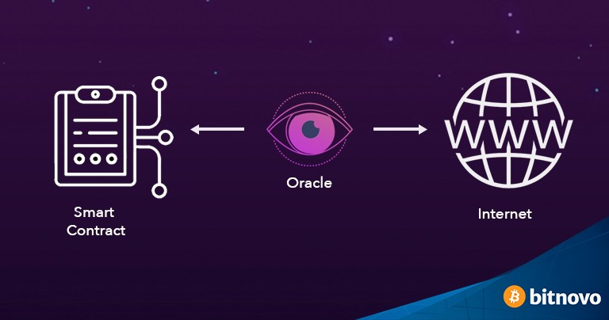

# 基于 ECDSA 的比特币预言机

> 基于 Rabin 签名的 Oracle 的替代方案

我们开发了一种有效的算法来验证比特币智能合约中某一方签署的任意数据。与之前基于 [Rabin 签名](https://blog.csdn.net/freedomhero/article/details/107237537) 的签名算法相比，它是基于 [ECDSA](https://en.wikipedia.org/wiki/Elliptic_Curve_Digital_Signature_Algorithm) 签名算法的，因此可以直接重用原生比特币密钥来生成和验证。



<center> 图片来自bitnove</center>

## 概述

比特币智能合约需要预言机导入外部数据，例如天气和商品价格。导入后，智能合约需要验证数据实际上来自授权的预言机。更具体地说，我们需要解决以下问题。

> 如何验证一条数据是否由具有已知公钥的预言机签名？

*P* 和 *p* 分别表示预言机的公钥和私钥。我们首先对要签名的数据进行哈希处理。结果与 *p* 相加，产生一个新的私钥 *p'* 。

> x = sha256(data)

> p’ = p + x

对应的公钥 *P'* 可以如下推导出：

> P’ = p’ * G = (p + x) * G = P + x * G

*G* 是比特币中使用的椭圆曲线的基点。

预言机使用派生的私钥 *p'* 来签名，而不是原始的 *p*。

这里的一切都是公开的，除了私钥 *p*。由于只有预言机知道 *p*，所以只有他知道 *p'*，并且可以用它来对 *P'* 签名。要计算合约中的 *P'*，我们需要计算 *x * G*，然后将结果与 *P* 相加。

## 在脚本中高效计算 x * G

计算 *x * G* 的简单方法是在椭圆曲线上使用[点乘法](https://xiaohuiliu.medium.com/efficient-elliptic-curve-point-addition-and-multiplication-in-scrypt-script-f7e143a752e2)。但是，它的计算成本很高。我们注意到 *G* 是椭圆曲线上的一个特殊点。如果我们把 *x* 看作一个私钥，那么 *x * G* 本质上就是 *x* 的公钥 X。

> X = x * G

因此，验证 (x, X) 是一个有效的私钥和公钥对就足够了。

为了验证这一点，我们利用了 [OP_PUSH_TX](https://blog.csdn.net/freedomhero/article/details/107306604) 技术。在 OP_PUSH_TX 中，我们使用私钥对 sighash 原像进行签名，并使用本机签名检查 OP_CHECKSIG 来根据相应的公钥检查生成的签名。如果检查通过，我们可以确定 sighash 原像一定是当前支出交易的原像。此外，公钥必须从私钥派生。我们选择 *(x, X)* 作为 OP_PUSH_TX 中的密钥对，从而验证 *X* 确实是 *x* 的公钥。

## 高效的公钥点加法

使用之前的[椭圆曲线库](https://github.com/sCrypt-Inc/article/blob/master/Efficient%20Elliptic%20Curve%20Point%20Addition%20and%20Multiplication%20in%20sCrypt/Efficient%20Elliptic%20Curve%20Point%20Addition%20and%20Multiplication%20in%20sCrypt.md)，我们可以高效地将 *P* 和 *X* 相加。

> P’ = P + X

一旦我们有了 P'，我们就可以使用本机 `OP_CHECKSIG` 来验证包含数据的支出交易是否由预言机使用 *p'* 签名。完整代码如下所示。

```js
import "ec.scrypt";
import "util.scrypt";

// an oracle library signing any data using ECDSA
library Oracle {

    // verify data is signed by the oracle with given public key
    static function verifyData(bytes data, Sig sig, PubKey oraclePubKey, PubKey derivedOraclePubKey, PubKey X,
        int lambda, SigHashPreimage txPreimage) : bool {
        // sha256 data
        bytes hash = sha256(data);

        PrivKey x = PrivKey(Util.fromLEUnsigned(hash));

        // verify X = x * G?
        require(Tx.checkPreimageAdvanced(txPreimage, x, X, Util.invK, Util.r, Util.rBigEndian, SigHashType(SigHash.NONE | SigHash.FORKID)));

        // verify P' = P + X
        require(EC.isPubKeySum(oraclePubKey, X, lambda, derivedOraclePubKey));

        // verify signature is from oracle, who knows p' = p + x
        return checkSig(sig, derivedOraclePubKey);

    }
}
```

<center><a href="https://github.com/sCrypt-Inc/boilerplate/tree/master/contracts/oracle.scrypt">基于 ECDSA 的 Oracle</a></center>

第 `16` 行使用 OP_PUSH_TX 验证 *X = x * G*。第 `19` 行验证 *P' = P + X*。第 `22` 行检查签名是用 *p'* 生成的。

值得注意的是，预言机参与了交易的签署，其中数据在其输入之一的解锁脚本中。为了最大程度地灵活创建交易的剩余部分，他可以在签名时使用 sighash 标志，例如 `SIGHASH_NONE | SIGHASH_ANYONECANPAY`。相比之下，基于 Rabin 签名的预言机可以简单地发布签名数据，而无需参与创建交易。

## 总结

通过重用比特币密钥对，基于 ECDSA 的预言机可以利用比特币生态系统已经提供的现有基础设施和网络效应（包括所有比特币钱包和许多服务提供商，例如区块浏览器），从而显着降低开发成本。在实践中，它成为基于 Rabin 签名的预言机的竞争替代方案，尽管后者的脚本大小更小，交易成本更低。

## 致谢

本文是 nChain 专利 [WO2018189634](https://patents.google.com/patent/WO2018189634A1/en?oq=WO2018189634) 的扩展，作者 Ying Chan 现在在 [Cambridge Cryptographic](https://www.cambridgecryptographic.com).