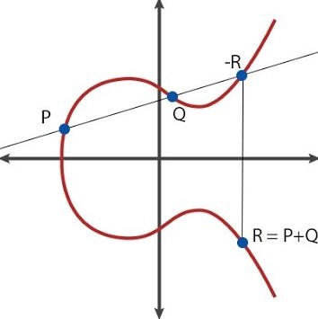
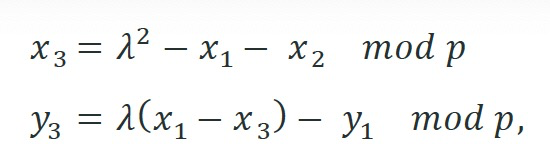
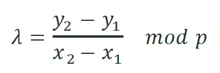
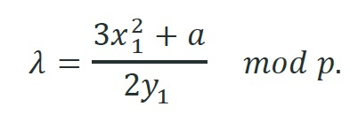
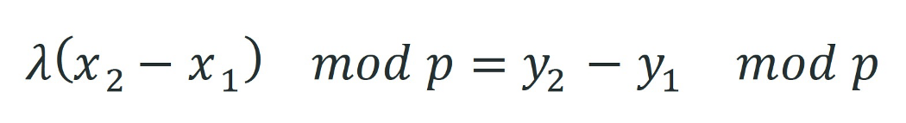
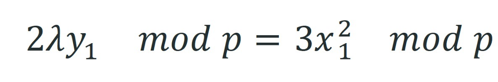

# sCrypt中高效的椭圆曲线点加法和乘法

我们提出了一种新颖有效的方法，用于在比特币脚本中计算椭圆曲线上的点加法和标量乘法。对于点添加，我们将超过 1MB 的脚本大小减少到 ~400 字节。



[Elliptic Curve](https://medium.com/@peterreid_12788/part-2-is-elliptic-curve-cryptography-ecc-a-step-towards-something-more-understanding-ecc-3c933d3922e)


## 点加法

对于每个 `i`，每个点 P<sub>i</sub> 由两个坐标 (x<sub>i</sub>, y<sub>j</sub>) 表示。为了计算 P<sub>3</sub> = P<sub>1</sub> + P<sub>2</sub>，我们使用以下公式



加点公式

如果 P<sub>1</sub> != P<sub>2</sub>，



否则



一个简单的实现需要计算模倒数，应用扩展的[欧几里德算法](https://en.wikipedia.org/wiki/Extended_Euclidean_algorithm)。然而，这会导致脚本大小过大，因为算法中的确切循环数事先未知，并且必须使用大的保守上限。

### 高效的解决方案

我们不是直接计算加点，而是通过在解锁脚本中传递预期点 P<sub>3</sub> 来解决这个问题。我们只在脚本中验证 P<sub>3</sub> = P<sub>1</sub> + P<sub>2</sub>。为了避免验证中的模倒数，我们将公式转化为以下等价形式。

当 P<sub>1</sub> != P<sub>2</sub>




当 P<sub>1</sub> == P<sub>2</sub>



与 P<sub>3</sub> 一样，λ 也是链下预先计算的，并在解锁脚本中传递，如下所示。这将产生非常紧凑的脚本，大小只有 ~400B。

```javascript

    static function isSumHelper(Point p1, Point p2, int lambda, Point p) : bool {
        // check lambda is indeed gradient
        bool lambdaOK = (p1 == p2) ?
            (2 * lambda * p1.y - 3 * p1.x * p1.x) % P == 0 :
            (lambda * (p2.x - p1.x) - (p2.y - p1.y)) % P == 0;
        // also check p = p1 + p2
        return lambdaOK && (lambda * lambda - p1.x - p2.x - p.x) % P == 0 && 
            (lambda * (p1.x - p.x) - p1.y - p.y) % P == 0;
    }

    // return true if lambda is the gradient of the line between p1 and p2
    // and p = p1 + p2 
    static function isSum(Point p1, Point p2, int lambda, Point p) : bool {
        // special handling of point ZERO
        bool ret = p1 == ZERO ? p2 == p : (p2 == ZERO ? p1 == p : (p1.x == p2.x && (p1.y + p2.y) % P == 0) ? p == ZERO : true);

        return ret && isSumHelper(p1, p2, lambda, p);
    }

```

<center> <a href="https://github.com/sCrypt-Inc/boilerplate/blob/master/contracts/ec.scrypt#L35">点加验证</a> </center>
## 点乘法

> x * P = (x0 + x1 * 2 + x2 * 4 + x3 * 8 + … + x255 * 2²⁵⁵) * P
= x0 * P + x1 * (2P) + x2 * (4P) + x3 * (8P) + … + x255 * (2²⁵⁵P)

x0, x1, x2, ..., x255 是标量 x 的位表示，从最低有效位到最高有效位。我们预先计算 2P, 4P, 8P, …, 2²⁵⁵P 链下并将它们传递到解锁脚本中，这些在锁定脚本中得到验证，如下面的第 21-24 行所示。

```javascript

 // return true iff p * x == r
    static function isMul(Point p, int x, Point r, Point[EC.N] pMultiples,
        Point[EC.N] qs, int[EC.N1] lambdas1, int[EC.N1] lambdas2) : bool {

        // validate pMultiples = [p, 2p, 4p, 8p, ...]
        loop (N) : i {
            require(i == 0 ? pMultiples[i] == p : isSum(pMultiples[i - 1], pMultiples[i - 1], lambdas1[i - 1], pMultiples[i]));
        }

        // // x * p = x0 * p + x1 *(2p) + x2 * (4p) + x3 * (8p) + ...
        // // xi is the i-th bit of x
        Point P0 = ZERO;
        loop (N) : i {
            Point P = x % 2 ? pMultiples[i] : ZERO;

            // right shift by 1
            x /= 2;

            if (i == 0) {
                P0 = P;
            } else if (i == 1) {
                // first
                require(isSum(P0, P, lambdas2[i - 1], qs[i - 1]));
            } else {
                // rest
                require(isSum(qs[i - 1], P, lambdas2[i - 1], i < N1 ? qs[i] : r));
            }
        }

        return true;
    }

```

<center> <a href="https://github.com/sCrypt-Inc/boilerplate/blob/master/contracts/ec.scrypt#L43">点乘验证</a> </center>


## 致谢

本文基于 Craig Wright 和 Owen Vaughan 的工作，以及来自 nChain 的 Enrique Larraia 和 Owen Vaughan 的宝贵反馈。