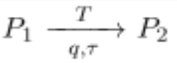
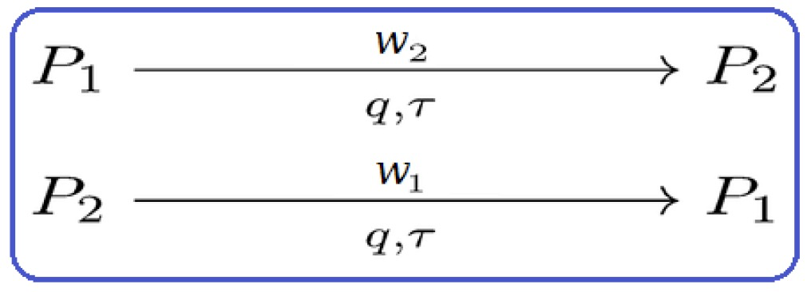
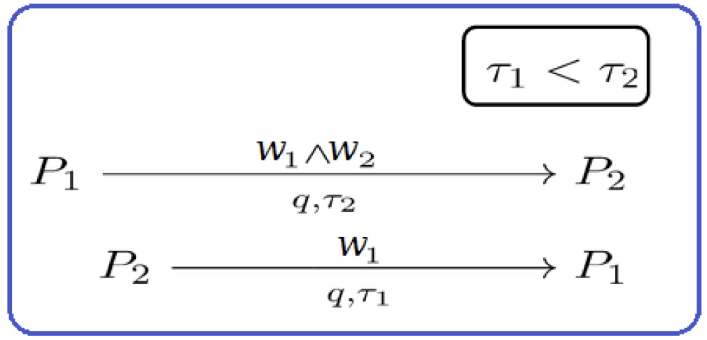
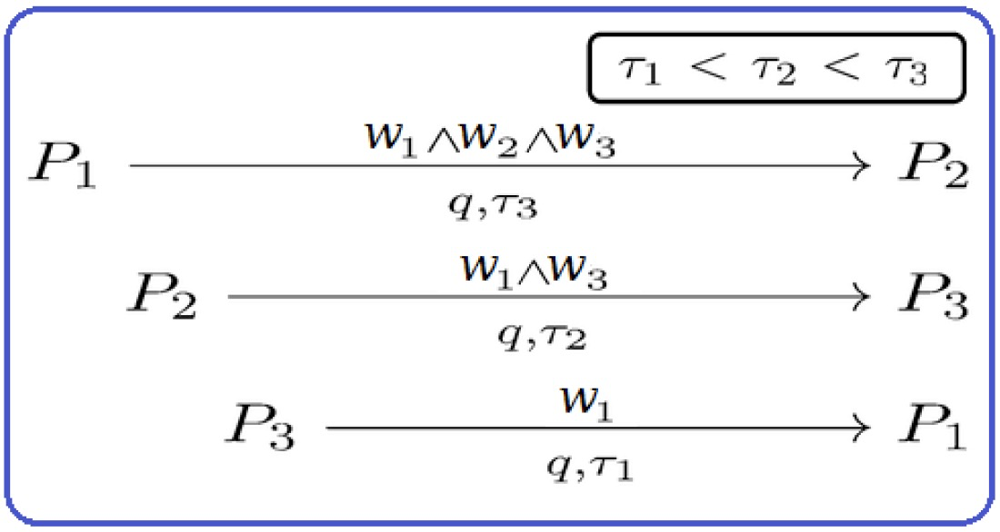
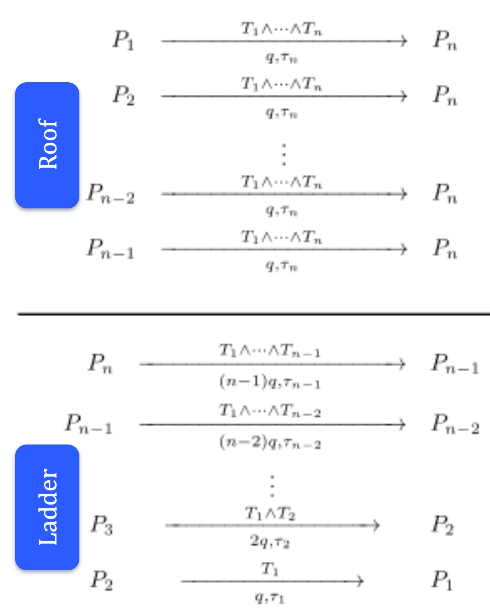

# 比特币上高效的多方公平交易

> 目前基于比特币的实用 MPC

我们为多方安全计算（MCP）引入了一种高效的协议，以公平地交换他们的秘密输入。确切地说，我们指的是以下两个保证：

1. 忠实遵守协议/合同的诚实方永远不会损失押金（如果有的话）。
2. 如果背离协议的恶意方获得了所有秘密并因此可以计算输出，则他应补偿所有诚实方。

允许安全且经济地收集所有输入，这为各种 MPC 在比特币上进行打开了大门，而无需依赖各方的合作。

## 多方安全计算（MCP）

之前，我们以[去中心化彩票](https://blog.csdn.net/freedomhero/article/details/116489380)为例介绍了如何对比特币进行 MPC。有一个严重的限制，因为它假设所有各方都是诚实的并且将提供他们的秘密输入。这种假设在实践中不太可能成立，特别是当各方发现他们会因此泄露秘密。

## 两方公平交易

一种迫使每一方透露其秘密的方法是使用如下所示的[定时承诺方案](https://blog.csdn.net/freedomhero/article/details/115870799) (TCS)。*P2* 必须在时间 `τ` 之前透露他的秘密 `T`，否则 *P1* 可以拿走他的存款 `q`。

TSC

### 不成熟的方法

不成熟的双方交易

人们可能会想在 *P1* 和 *P2* 之间使用两个 TCS 来交换秘密。但是，*P2* 可以通过步骤 1 获取 *P1* 的 `q` 个硬币，拒绝在步骤 2 中存款来攻击协议。从本质上讲，即使 *P1* 行为诚实，他也会失去他的押金，根据我们的标准 1，这种方法是不公平的。

### 公平的方法

公平的双方交易

在我们的新方案中，要让 *P2* 给予 *P1* 押金，除了他自己的 W2 之外，他还必须知道 *P1* 的秘密 W1。如果 *P2* 在第 2 步中止，他就不能再取回它。因此，它可以防止上述攻击。

## 多方公平交流

我们将把交换协议推广到 `n` 方，其中 `n > 2`。一种直接的方法是在每对之间简单地运行两方公平的协议。运行每一对需要 2 个交易。因此，它总共需要 `O(n²)` 次交易。

我们展示了一个更高效的协议，它只需要 `O(n)` 个交易。

### 不成熟的方法

不成熟的多方交易

使用上述方法扩展两方公平交易看起来很好。但是，如果 *P1* 和 *P2* 勾结，它很容易受到攻击。要了解原因，只需将 *P2* 和 *P1* 视为同一方即可。首先，*P1* 在步骤 3 中揭示 w1。作为诚实的一方，*P3* 在步骤 2 中揭示 w3。P2（本质上是 P1）在第 1 步中止，并在时间 `τ3` 后取回他的押金。现在 *P1* 拥有所有秘密，但 *P3* 不知道 w2。根据我们的标准 2，这是不公平的。

### 公平的方法

为了公平交易，它分两个阶段进行：

1. 第一阶段：各方存款到 *Pn*。这可以同时在一轮中发生。
2. 第二阶段：*Pi* 交替地给予 *P(i-1)* 押金，从 n 到 2。这种情况一个接一个地发生。

要了解为什么会这样，很明显，在第二阶段结束时，除 *Pn* 之外的所有各方都已公平。如果 *Pn* 没有提供第一阶段的押金，那么诚实的一方会通过第一阶段退款获得 `q` 个硬币。否则 *Pn* 也公平参与。如需严格证明，请参阅论文¹。

--------------------

[1] 如何使用比特币设计公平协议。伊多·本托夫；兰吉特·库马雷桑。计算机科学讲义| 2014 年 8 月。

