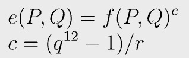
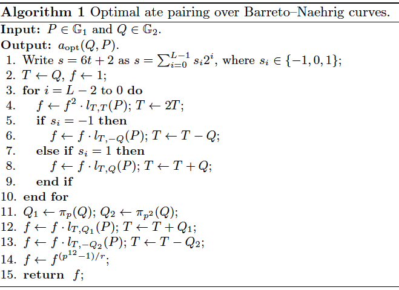
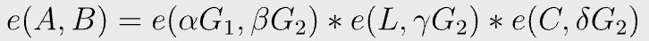
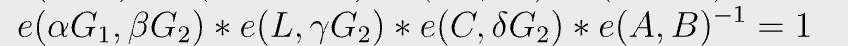
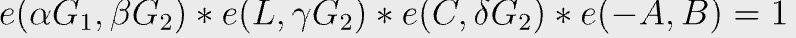

# BSV上的高效 zk-SNARK：技术解释

> 在 sCrypt 中实现 Groth16
最近，我们在 sCrypt 中实现了 zk-SNARKs，并在比特币上运行它。更具体地说，我们实现了 [Groth16](https://eprint.iacr.org/2016/260.pdf) 算法的验证器，它允许直接在链上验证零知识证明。本文深入探讨了一些细节，阐明了如何在 BSV 上有效地实施其他高级加密技术。

## 椭圆曲线上的双线性对

Groth16 [证明尺寸极小，并且可以快速验证](http://www.zeroknowledgeblog.com/index.php/groth16)。我们选择了最佳的 [Ate 配对](https://eprint.iacr.org/2010/354.pdf)，因为它的效率已在实践中得到证明。

我们在配对友好的椭圆曲线 BN256（也称为 ALT_BN128 和 BN254）上实现它。我们使用 BN256 是因为 

1. 有流行的 ZKP 工具（如 ZoKrates 和 Circom）支持； 
2. 与以太坊等其他区块链兼容。

米勒算法用于有效计算最优 Ate 配对。在高层次上，它由两部分组成：

1. 米勒循环：递归计算两个输入点 `f(P, Q)` 的中间函数
2. 最终取幂：将 `f` 提高到大幂 `c`

等式 1

最佳 Ate 配对

## 减少到3个配对

验证者需要检查以下等式是否成立。

等式 2

元组 `(A, B, C)` 是证明，`(α, β, ϒ, δ)` 是验证密钥，`L` 来自公共输入。我们总共有 4 对 配对。我们注意到 `α` 和 `β` 在设置时是已知的，因此我们预先计算了第二对，并将 `α` 和 `β` 替换为验证密钥的一部分，从而减少了一对配对的技算。

## 一个单一的最终幂

等式 1 可以改写为：

它又可以写成如下，因为 `e` 是双线性的，我们可以将指数 `(-1)` 移动到括号中。

双线性

插入等式 2，我们得到：

我们不需要计算 `4` 次最终的幂运算，幂运算是计算密集型的，我们最终只需要执行一次。

## 循环展开

在 sCrypt/Script 中，所有 `if` 分支都包含在交易中并产生交易费用，无论它们稍后是否执行。在米勒循环中，`sᵢ` 在编译时是已知的。我们展开循环并避免在第 `5` 行和第 `7` 行分支。

## 扩展域 twist

直接计算两点的配对需要在扩展域 `Fq¹²` 上进行椭圆曲线算法，这非常复杂且效率低下。我们使用 twist 将其映射到 `Fq²`，从而大大提高了效率。请参阅[这篇文章](https://hackmd.io/@benjaminion/bls12-381#Twists)以获得更详细的解释。

## 概括

经过所有这些优化，我们能够将配对的脚本大小减少 `100` 倍至 `5MB`。我们正在探索更多优化以进一步减少它。完整版本的代码可以在 [GitHub](https://github.com/sCrypt-Inc/scrypt-pairing/blob/main/bn256/bn256pairing.scrypt) 上找到。

传统上，优化程序的目标是最小化其 CPU 和/或内存使用量。在比特币中，交易费用与包含脚本的交易大小成正比，目标是最小化脚本大小。如何针对这一目标进行优化是一个有趣的开放课题，值得进行新的研究。

