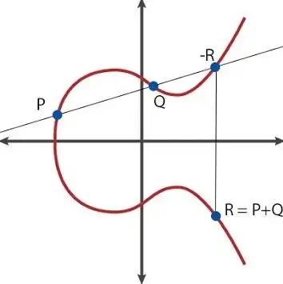
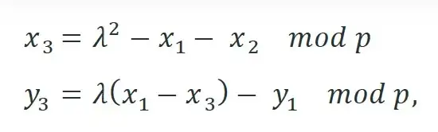
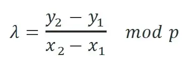
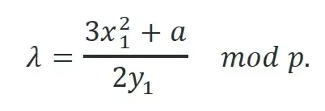
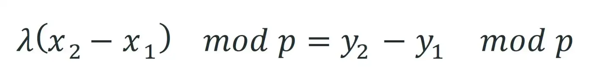
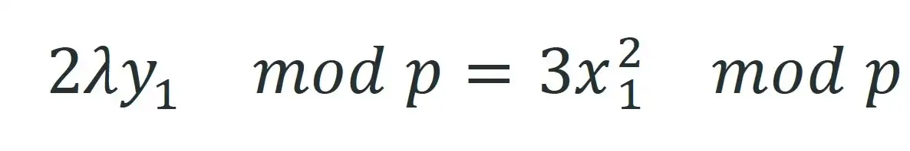

# 脚本中的椭圆曲线算法 第一部分

我们提出了一种新颖有效的方法，用于在脚本中计算椭圆曲线上的点加法和标量乘法。对于点加法，我们将超过 `1MB` 的脚本大小减少到约 `400` 字节。


<center>椭圆曲线</center>

## 点加法

对于每个 `i`，每个点 `Pi` 由两个坐标 `(xi, yi)` 表示。要计算 `P3 = P1 + P2`，我们使用以下公式：


<center>点加法公式</center>

如果 `P1 != P2`，


<center>当 P1 != P2</center>

否则


<center>当 P1 == P2</center>


原生的实现需要运用[扩展欧几里得算法](https://en.wikipedia.org/wiki/Extended_Euclidean_algorithm)计算模乘逆。但是，这会导致 Script 过大，因为事先不知道算法中确切的循环次数，并且必须使用较大的保守[上限](https://scryptdoc.readthedocs.io/en/latest/loop.html)。

## 高效解决方案

我们没有直接计算加点，而是通过在解锁脚本中传递预期点 `P3` 来解决这个问题。我们只在 Script 中验证 `P3 = P1 + P2`。为了避免验证中出现模乘逆，我们将公式转化为如下等价形式。


<center>当 P1 != P2</center>


<center>当 P1 == P2</center>

与 `P3` 一样，`λ` 也是在链下预先计算并传入解锁脚本，如下所示。这可以是的脚本大小非常紧凑，只有 `~400B`。

```js
static function isSumHelper(Point p1, Point p2, int lambda, Point p) : bool {
    // check lambda is indeed gradient
    bool lambdaOK = (p1 == p2) ?
        (2 * lambda * p1.y - 3 * p1.x * p1.x) % P == 0 :
        (lambda * (p2.x - p1.x) - (p2.y - p1.y)) % P == 0;
    // also check p = p1 + p2
    return lambdaOK && (lambda * lambda - p1.x - p2.x - p.x) % P == 0 && 
        (lambda * (p1.x - p.x) - p1.y - p.y) % P == 0;
}

// return true if lambda is the gradient of the line between p1 and p2
// and p = p1 + p2 
static function isSum(Point p1, Point p2, int lambda, Point p) : bool {
    // special handling of point ZERO
    bool ret = p1 == ZERO ? p2 == p : (p2 == ZERO ? p1 == p : (p1.x == p2.x && (p1.y + p2.y) % P == 0) ? p == ZERO : true);

    return ret && isSumHelper(p1, p2, lambda, p);
}
```

<center><a href="https://github.com/sCrypt-Inc/boilerplate/blob/master/contracts/ec.scrypt">点加法验证</a></center>

## 点乘法

> x * P = (x0 + x1 * 2 + x2 * 4 + x3 * 8 + … + x255 * 2²⁵⁵) * P

> = x0 * P + x1 * (2P) + x2 * (4P) + x3 * (8P) + … + x255 * (2²⁵⁵P)

*x0*, *x1*, *x2*, …, *x255* 是标量 `x` 的位表示，从最低有效位到最高有效位。我们在链下预先计算 2P、4P、8P、...、2²⁵⁵P 并将它们传递到解锁脚本中，这些在锁定脚本中进行了验证，如下面的第 `21-24` 行所示。

```js
// return true iff p * x == r
static function isMul(Point p, int x, Point r, Point[EC.N] pMultiples,
    Point[EC.N] qs, int[EC.N1] lambdas1, int[EC.N1] lambdas2) : bool {

    // validate pMultiples = [p, 2p, 4p, 8p, ...]
    loop (N) : i {
        require(i == 0 ? pMultiples[i] == p : isSum(pMultiples[i - 1], pMultiples[i - 1], lambdas1[i - 1], pMultiples[i]));
    }

    // // x * p = x0 * p + x1 *(2p) + x2 * (4p) + x3 * (8p) + ...
    // // xi is the i-th bit of x
    Point P0 = ZERO;
    loop (N) : i {
        Point P = x % 2 ? pMultiples[i] : ZERO;

        // right shift by 1
        x /= 2;

        if (i == 0) {
            P0 = P;
        } else if (i == 1) {
            // first
            require(isSum(P0, P, lambdas2[i - 1], qs[i - 1]));
        } else {
            // rest
            require(isSum(qs[i - 1], P, lambdas2[i - 1], i < N1 ? qs[i] : r));
        }
    }

    return true;
}
```

<center><a href="https://github.com/sCrypt-Inc/boilerplate/blob/master/contracts/ec.scrypt">点乘法验证</a></center>

## 致谢

本文基于 Craig Wright 和 Owen Vaughan 的工作，并得到了 nChain 的 Enrique Larraia 和 Owen Vaughan 的宝贵反馈。
