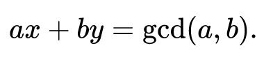
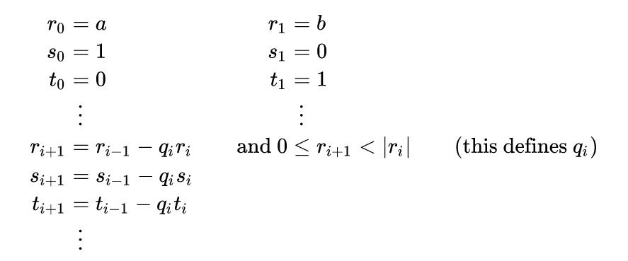
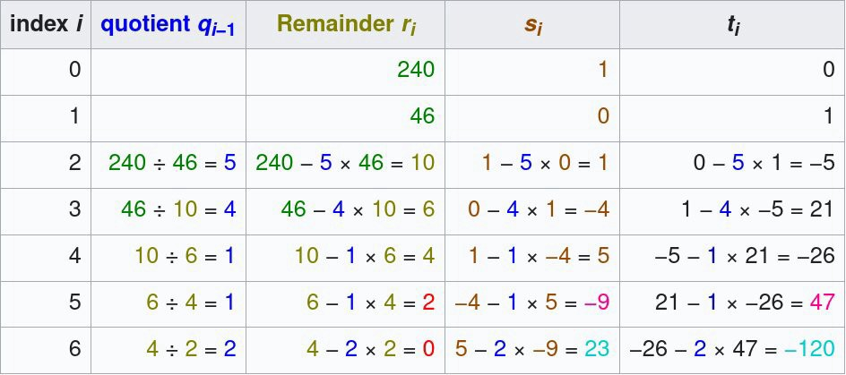
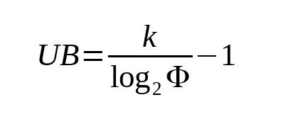
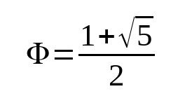
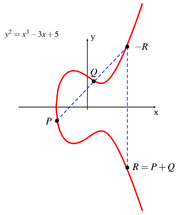
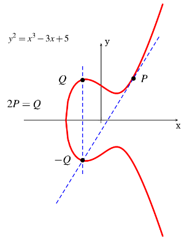

# 脚本中的椭圆曲线算法 第二部分

我们在脚本中实现了椭圆曲线 (EC) 算法。在[之前的实现](https://xiaohuiliu.medium.com/efficient-elliptic-curve-point-addition-and-multiplication-in-scrypt-script-f7e143a752e2)中，我们进行链下计算并在脚本中验证结果。我们这里直接用脚本计算。

基于EC的应用非常多，特别是在密码学领域，如数字签名、[加密](https://en.wikipedia.org/wiki/ElGamal_encryption)、[承诺方案](https://en.wikipedia.org/wiki/Commitment_scheme)等。作为具体示例，我们重新实现了 [ECDSA 签名验证](https://xiaohuiliu.medium.com/ecdsa-signature-verification-in-script-d1e8dda5f893)，允许使用任意消息验证签名。

## 模逆

在实现点加法和乘法之前，我们先介绍模逆，因为它是一个积木。

整数 `a` 的模乘逆是整数 `x`，使得 `a*x ≡ 1 mod n`。为了导出该值，我们使用[扩展欧几里得算法](https://en.wikipedia.org/wiki/Extended_Euclidean_algorithm) (eGCD)。因为在使用 EC 算法时模逆会占用大部分脚本大小，所以尽可能优化它是至关重要的。因此，我们使用[内联汇编](https://scryptdoc.readthedocs.io/zh_CN/latest/asm.html)直接在原始脚本中对其进行编码。

## 扩展欧几里德算法

扩展欧几里德算法是对标准欧几里德算法的扩展。除了找到最大公约数 (GCD) 之外，它还计算 [Bézout 恒等式](https://en.wikipedia.org/wiki/B%C3%A9zout%27s_identity)的系数，它们是整数 `x` 和 `y`，使得：



eGCD算法定义如下：



当余数 *r(i+1)* 为 `0` 时停止执行。如果 `a` 和 `b` 是互质的（在 EC 算法中它们总是应该互质，因为曲线参数 `p` 和 `n` 是质数），`x` 也是 `a mod b` 的模逆。

下面是输入`a=240`，`b=46`的eGCD算法的示例计算表：



<center>资料来源：<a href="https://en.wikipedia.org/wiki/Extended_Euclidean_algorithm#Example">维基百科</a></center>

## 实现

以下是扩展欧几里德算法在 Script 中的高度优化实现。因为我们只对 *t(i)* 序列感兴趣，所以我们不需要跟踪 *s(i)* 序列，从而使脚本大小更小。

```js
static function modInverseEGCD(int x, int n) : int {
    // The following script already does modular reduction at the start so there's no
    // need to normalize x before function call.
    asm {
        OP_2DUP OP_MOD OP_DUP OP_0 OP_LESSTHAN OP_IF OP_DUP OP_2 OP_PICK OP_ADD OP_ELSE OP_DUP OP_ENDIF OP_NIP OP_2 OP_ROLL OP_DROP
        OP_DUP OP_TOALTSTACK OP_TOALTSTACK OP_TOALTSTACK
        OP_1 OP_0 OP_1
        loop(UB) {
            OP_FROMALTSTACK OP_FROMALTSTACK OP_2DUP OP_DUP OP_IF OP_TUCK OP_MOD OP_TOALTSTACK OP_TOALTSTACK OP_DIV OP_MUL OP_SUB OP_TUCK OP_ELSE OP_TOALTSTACK OP_TOALTSTACK OP_DROP OP_DROP OP_ENDIF
        }
        OP_FROMALTSTACK OP_FROMALTSTACK OP_DROP OP_DROP OP_DROP OP_FROMALTSTACK OP_SWAP OP_NIP
    }
}
```

<center><a href="https://github.com/sCrypt-Inc/boilerplate/blob/master/contracts/ec.scrypt#L47">源代码</a></center>

## 计算循环的上限

`k` 位模数 `n` 的迭代次数上限可以使用以下等式导出：



，其中 `phi` 是黄金比例：



对于 `256` 位的模数，如比特币曲线 `secp256k1`，我们得到 `368` 的上限。`modInverseEGCD()` 生成的脚本大小约为 `7` KB。

## 点加法



椭圆曲线上的加点定义为​​通过点 *P* 和 *Q* 的直线的曲线交点的负值。如果其中一个点是无限点 `(0, 0)`，我们只返回另一个点。

```js
static function addPoints(Point p, Point q) : Point {
    Point ret = {0, 0};

    if (p.x == 0 && p.y == 0) {
        // if P == inf -> P + Q = Q
        ret = q;
    } else if (q.x == 0 && q.y == 0) {
        // if Q == inf -> P + Q = P
        ret = p;
    } else {
        int lambda = 0;
        if (p.x == q.x && p.y == q.y) {
            lambda = (3 * p.x * p.x) * modInverseEGCD(2 * p.y, P);
        } else {
            lambda = (q.y - p.y) * modInverseEGCD(q.x - p.x, P);
        }

        int rx = modReduce(lambda * lambda - p.x - q.x, P);
        int ry = modReduce(lambda * (p.x - rx) - p.y, P);

        ret = {rx, ry};
    }

    return ret;
}
```
<center><a href="https://github.com/sCrypt-Inc/boilerplate/blob/master/contracts/ec.scrypt#L91">源代码</a></center>

## 点加倍



如果 *P* 和 *Q* 处于同一坐标，我们使用曲线在该坐标处的切线交点。

```js
static function doublePoint(Point p) : Point {
    int lambda = (3 * p.x * p.x) * modInverseEGCD(2 * p.y, P);

    int rx = modReduce(lambda * lambda - 2 * p.x, P);
    int ry = modReduce(lambda * (p.x - rx) - p.y, P);
    
    Point res = {rx, ry};
    return res;
}
```

<center><a href="https://github.com/sCrypt-Inc/boilerplate/blob/master/contracts/ec.scrypt#L81">源代码</a></center>

## 标量乘法

[点与标量的乘法](https://en.wikipedia.org/wiki/Elliptic_curve_point_multiplication#Double-and-add)是我们定义的计算量最大的函数。为简单起见，我们使用了[双倍-加法算法](https://en.wikipedia.org/wiki/Elliptic_curve_point_multiplication#Double-and-add)。还有其它[更高效的方法](https://en.wikipedia.org/wiki/Elliptic_curve_point_multiplication#Point_multiplication)。

```js
static function multByScalar(Point p, int m) : Point {
    // Double and add method.
    // Lowest bit to highest.
    Point n = p;
    Point q = {0, 0};

    bytes mb =   reverseBytes(num2bin(m, S), S);
    bytes mask = reverseBytes(num2bin(1, S), S);
    bytes zero = reverseBytes(num2bin(0, S), S);

    loop (256) : i {
        if ((mb & (mask << i)) != zero) {
            q = addPoints(q, n);
        }

        n = doublePoint(n);
    }

    return q;
}
```

<center><a href="https://github.com/sCrypt-Inc/boilerplate/blob/master/contracts/ec.scrypt#L123">源代码</a></center>

## ECDSA 签名验证

现在我们已经实现了所有需要的 EC 原语，我们可以定义一个函数来检查任意消息签名的有效性，而无需任何新的操作码，例如 BTC 上的 [OP_CHECKSIGFROMSTACK](https://diyhpl.us/wiki/transcripts/bitcoin-core-dev-tech/2019-06-06-noinput-etc) 或 BCH 上的 [OP_DATASIGVERIFY](https://github.com/bitcoincashorg/bitcoincash.org/blob/master/spec/op_checkdatasig.md)（又名 [OP_CHECKDATASIG](https://medium.com/@Mengerian/the-story-of-op-checkdatasig-c2b1b38e801a)）。

```js
static function verifySig(bytes m, Signature sig, Point pubKey) : bool {
    Sha256 hash = hash256(m);
    int hashInt = unpack(reverseBytes(hash, 32));

    require(sig.r >= 1 && sig.r < n && sig.s >= 1 && sig.s < n);

    int sInv = modInverseEGCD(sig.s, n);
    int u1 = modReduce(hashInt * sInv, n);
    int u2 = modReduce(sig.r * sInv, n);

    Point U1 = multByScalar(G, u1);
    Point U2 = multByScalar(pubKey, u2);
    Point X = addPoints(U1, U2);

    return sig.r == X.x;
}
```

正如我们所见，该函数调用了两次标量乘法。单次调用 `multByScalar()` 会花费我们大约 `5 MB` 的脚本大小。因此，单个签名验证大约需要 `10 MB` 的脚本，可以进一步优化。我们甚至可以使用自定义曲线而不是标准的 `secp256k1` 并使用更大的密钥大小来显着提高安全性。

## 致谢

这是 nChain 白皮书 1611 的实现。


