# 在比特币上支持椭圆曲线 BLS12–381

通过使用智能合约实现来支持任何曲线

BLS12–381 是一种较新的配对友好型椭圆曲线。 与常用的 BN-256 曲线相比，BLS12-381 的安全性明显更高，并且安全目标是 128 位。

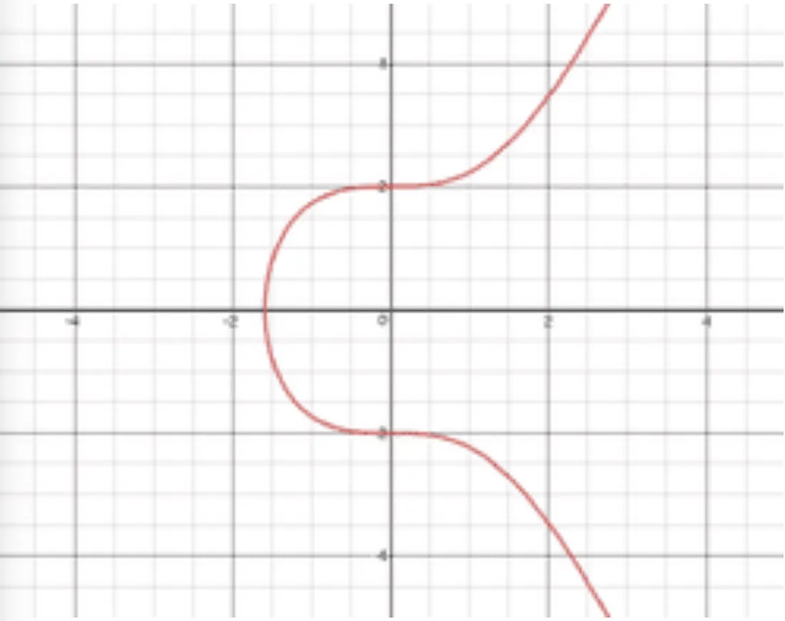

所有其他区块链，例如 Zcash 和以太坊，都必须通过硬分叉才能升级到新曲线，因为所使用的曲线是在协议级别进行硬编码的。 Zcash 花了一年多的时间在 [Sapling](https://electriccoin.co/blog/whats-new-in-sapling) 中[升级](https://github.com/zcash/zcash/issues/2502)。 [以太坊](https://eips.ethereum.org/EIPS/eip-2537) 和 [Tezos](https://medium.com/metastatedev/meanwhile-at-cryptium-labs-2-part-2-adding-the-pairing-equipped-elliptic-curve-bls12-381-to-tezos-cfce907e4be3) 在 2.5 多年前提出升级后仍未升级，如果他们打算升级的话。

比特币可以以智能合约的形式在本地运行 BLS12–381，无需任何重大更改。 下面的库为此提供了基础，使比特币成为目前唯一支持两条曲线的区块链，这要归功于其可编程性和可扩展性。 通过在智能合约中实施它们，可以类似地支持更多曲线，如 [MNT4/6](https://coinlist.co/build/coda/pages/theory) 和 [BW](https://hackmd.io/@gnark/BW6-761-changes)。


以下内容最初由 Walker 发布在 [Github](https://github.com/walker9296/BLS12-381) 上，Walker 在首届比特币零知识证明黑客马拉松中[获得第一名](https://bitcoinsv.com/bsv-zero-knowledge-hackathon-winners-announced-45000-in-prizes-awarded/)。

--------

用于比特币零知识证明智能合约支持的 sCrypt BLS12–381 库。 目前的sCrypt零知识证明库是基于BN256，比特币的BLS12-381库是第一个在比特币上实现BLS12-381曲线配对验证的库。 现在您可以选择使用 BN256 或 BLS12–381 来实现零知识证明应用。 比特币是目前唯一支持零知识证明且可以选择多条曲线的区块链。

对于与平台无关的应用程序，选择需要在性能 (BN254) 和安全性 (BLS12–381) 之间进行权衡。 我们建议选择 BLS12–381，因为它更安全，速度也足够实用，但比 BN254 慢。

- BN254 (254bit, 32byte P):

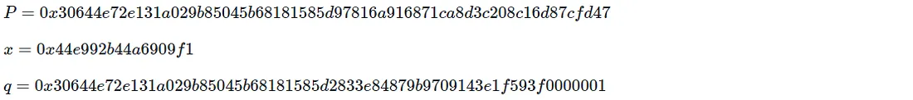

- BLS12–381 (381bit, 48byte P):

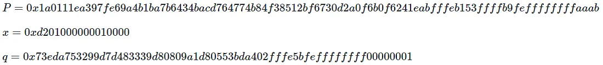

参考: 

- [Groth16](https://2π.com/22/groth16/#verifying)
- [Efficient zk-SNARKs on Bitcoin: Technical Explainer](https://hackmd.io/@benjaminion/bls12-381)
- [BLS12–381 For The Rest Of Us](https://hackmd.io/@benjaminion/bls12-381)

## 目录
- 曲线
- 曲折
- 高效配对
- 坐标系
- 蒙哥马利形式
- 先决条件
- 如何在本地运行
- 图书馆
- 应用程序接口
- 验证密钥和证明数据
- 测试

### 1. 曲线 BLS12–381
曲线 BLS12–381 既对配对友好（使其对数字签名有效）又对构建 zkSnarks 有效。 BLS12-381 的安全目标是 128 位。

####  1.1 曲线

BLS12–381 处理两条曲线，

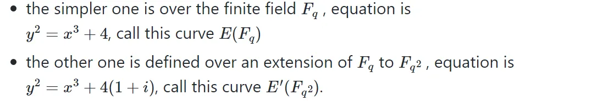

配对是一个双线性映射，它以两个点作为输入，每个点来自一组相同阶数 `r`。 这两组称为 `G1` 和 `G2` 。


####  1.2 twist 扭曲

BLS12–381 使用扭曲，将扩展场的程度降低了六倍。 因此，扭曲曲线上的 `G2` 可以在 `Fq2` 而不是 `Fq12` 上定义，这大大节省了复杂性，在 `Fq12` 中进行算术运算非常复杂且效率低下。

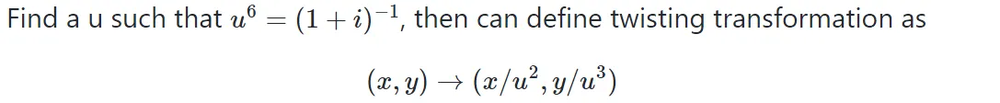

这改变了原始曲线


进入曲线


所以这些是我们将使用的两个组：

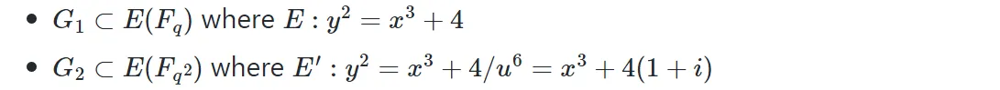

#### 1.3 高效配对

配对的计算有两个部分：

米勒循环：递归计算两个输入点 `f(pointG1, pointG2)` 的中间函数
最后求幂：将 `f` 提高到 `c` 的大幂
等式 1：


#### 1.3.1 减少到 3 对
验证等式2：


其中 `α` 和 `β` 在设置时已知，因此我们可以预先计算第二对 `e(α, β)` 并用它替换 `α` 和 `β` 作为验证密钥的一部分，从而节省一对。

#### 1.3.2 最终一次求幂

等式 2 可以重写为：


e是双线性的，把指数(-1)移到括号里。


代入等式 1，我们得到：


而不是计算 4 次计算密集型的最终指数，我们最后只需要做一次。

注意，snarkjs/circom 的 `verification_key.json` 输出文件中，有一个 `vk_alphabeta_12` 预计算项，但是你不能用它来预计算 `f(α,β)`，这个数据是通过miller循环和finanl求幂 `f( α, β)^c` 。 您可以在调试模式下运行 `testcase1.scrypt` 合约以获取预先计算的 `f(α, β)` 数据。

#### 1.4 坐标系

查找域元素的逆是一项昂贵的操作，因此椭圆曲线算法的实现会尽量避免它。

#### 1.4.1 仿射坐标

仿射坐标是仅具有 `(x, y)` 坐标对的点的传统表示，其中 x 和 y 满足曲线方程。 这是我们通常在存储和传输点时使用的。

基本思想是使用名义分数来表示坐标，减少所需的实际除法运算次数。 为此，引入了第三个坐标并使用 `(X, Y, Z)` 作为点的内部表示。

#### 1.4.2 雅可比(Jacobian)坐标

雅可比点 `(X, Y, Z)` 表示仿射点 `(X/Z², Y/Z³)`。 曲线方程变为:


请注意，导入仿射点 `(x,y)` 的最简单方法是将其映射到 `(x, y, 1)`。

#### 1.5 蒙哥马利形式

一种不需要除法的模数计算方法是所谓的蒙哥马利乘法。 要计算模乘运算，

1. 将乘数转换为蒙哥马利形式
2. 使用蒙哥马利乘法
3. 转换蒙哥马利形式的结果

### 2. 准备

- [Visual Studio Code(VSC)](https://code.visualstudio.com/download)
- [sCrypt IDE](https://scrypt-ide.readthedocs.io/en/latest/index.html)
- [Node.js](https://nodejs.org/en/download),  `version >= 12`
- PC CPU >= 2.6GHz, Memory >= 24GB


### 3.如何在本地运行

运行 npm install 来安装依赖
从 VSCode GUI 运行测试用例，选择 `testcase0.scrypttest.js` 文件，在文件编辑窗口单击鼠标右键，选择菜单 Run sCrypt Test

### 4. 库和 API

#### 4.1 库


```
├─ contracts
│    ├─ bls12381.scrypt          # bls12-381 library
│    ├─ bls12381pairing.scrypt   # bls12-381 ZKP lib(Optimized 3-pairs)
│    └─ zksnark12381.scrypt      # zk-SNARKs verifier contract example
└─ tests
     └─ js
        ├─ testcase0.scrypttest.js        # simple testcase
        ├─ testcaseAzksnark.scrypttest.js # testcase A
        ├─ testcaseBzksnark.scrypttest.js # testcase B
        ├─ testcaseCzksnark.scrypttest.js # testcase C
        └─ testcaseDzksnark.scrypttest.js # testcase D
```

#### 4.2 API

```js
static function pairCheck3Point(
            PointG1 a0, PointG2 b0,
            fe12 millerb1a1,
            PointG1 a2, PointG2 b2,
            PointG1 a3, PointG2 b3) : bool
```

参数 (3对 pairing and 1 对预先计算好的pairing)：


- a0 : A, b0 : B
- millerb1a1 : 预先计算 `miller(α, β)`
- a2 : L, b2 : ϒ
- a3 : C, b3 : δ

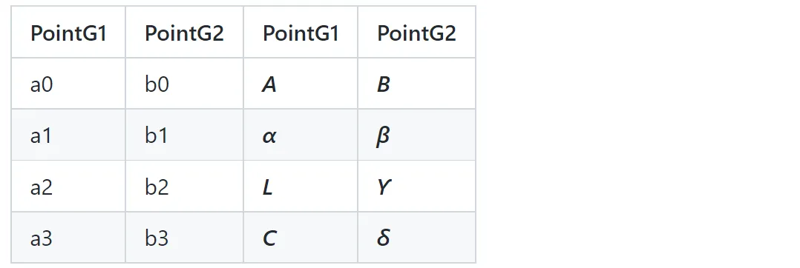

验证等式 2:


#### 4.2.1 从 snarkjs/Circom 验证密钥和证明数据

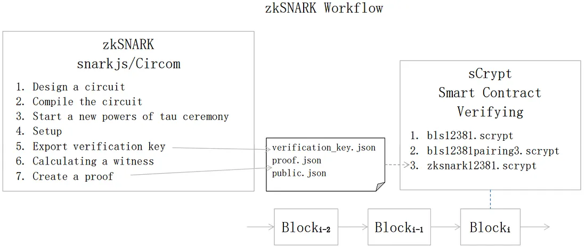

您可以通过 [scrypt.io](https://learn.scrypt.io/zh/courses/Build-a-zkSNARK-based-Battleship-Game-on-Bitcoin-630b1fe6c26857959e13e160/lessons/3/chapters/1) 找到 zkSNARK snarkjs/Circom 教程


执行snarkjs/Circom命令时需要选择bls12381曲线命令行选项，因为默认是bn128曲线。 例如，

- 编译电路
  
```
circom ../work_circom/factor.circom --r1cs --wasm --prime bls12381
```
- 开始新的 powers of tau 仪式

```
snarkjs powersoftau 新 bls12-381 12 pot12_0000.ptau
```

然后可以确认输出的 `verification_key.json` 和 `proof.json` 文件中有一个"curve": "bls12381"项，而不是"curve": "bn128"项。


从 `proof.json` 文件中获取A、B、C参数，从 `verification_key.json` 文件中获取 α、β、ϒ、δ参数，使用 `public.json` 文件中的ic item和公共输入计算 `L` 参数：


其中公共输入 `w = (1, w1, …, wi)`

#### 4.2.2 verification_key.json

[测试用例 B verification_key.json](https://github.com/walker9296/BLS12-381/blob/main/tests/snarkjs_output_json/caseB/verification_key.json)


```json
{
 "protocol": "groth16",
 "curve": "bls12381",
 "nPublic": 1,
 "vk_alpha_1": ["32346008969010......", "760490433841......", "1"],
 "vk_beta_2": [["62735191543702......", "379194604638......"],
               ["94606778762315......", "299061862927......"],
               ["1", "0"]],
 "vk_gamma_2": [["3527010695874......", "305914434424......"],
                ["1985150602287......", "927553665492......"],
                ["1", "0"]],
 "vk_delta_2": [["1895592553603......", "338057034563......"],
                ["1793381858589......", "319699776756......"],
                ["1", "0"]],
 "vk_alphabeta_12": [
      [["29062082199832......", "29798557291243......"],
       ["20107026956616......", "32289268603827......"],
       ["37794026319284......", "20272682142916......"]],
      [["11743275386962......", "32259555688411......"],
       ["30689582621397......", "26992620205415......"],
       ["75601830939387......", "26615242825680......"]]],
 "IC": [
      ["179858356000600......", "10944984983678......", "1"],
      ["341669953409364......", "26956794051246......", "1"]]
}
```

#### 4.2.3 proof.json

[测试用例 A proof.json](https://github.com/walker9296/BLS12-381/blob/main/tests/snarkjs_output_json/caseA/proof.json)

```json
{
 "pi_a": ["386406607244204......", "3355814159298......", "1"],
 "pi_b": [["28933956745182......", "3829761206156......"],
          ["36211079726457......", "6620758983513......"],
          ["1", "0"]],
 "pi_c": ["302947598381396......", "3994710045276......", "1"],
 "protocol": "groth16",
 "curve": "bls12381"
}
```

#### 4.2.4 public.json

[测试用例 A public.json](https://github.com/walker9296/BLS12-381/blob/main/tests/snarkjs_output_json/caseB/public.json)

```json
[
 "13221"
]
```

### 5. 测试用例

#### 5.1 设计电路

用 Circom 语言实现一个电路。 例如，这个简单的证明人们知道将整数 n 分解为两个整数而不透露整数。 该电路有两个名为 p 和 q 的私有输入以及一个名为 n 的公共输入。

```js

// p and q are factorizations of n
pragma circom 2.0.0;

template Factor() {
  // Private Inputs:
  signal input p;
  signal input q;
  // Public Inputs:
  signal output n;
  assert(p > 1);
  assert(q > 1);
  n <== p * q;
}
component main = Factor();
```

#### 5.2 测试用例 A, B, C, D

两个私有输入 p 和 q，以及一个公共输入 n。

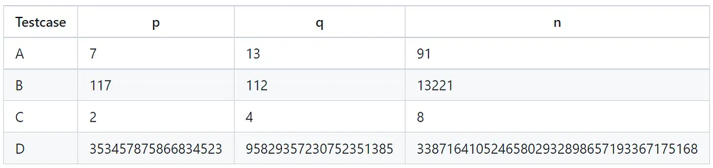

#### 5.3 测试网部署

合约：

[zksnark12381deploy.scrypt](https://github.com/walker9296/BLS12-381/blob/main/contracts/zksnark12381deploy.scrypt)

部署和解锁

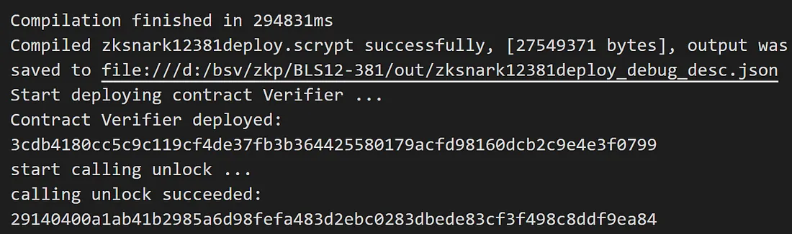


测试网部署交易:

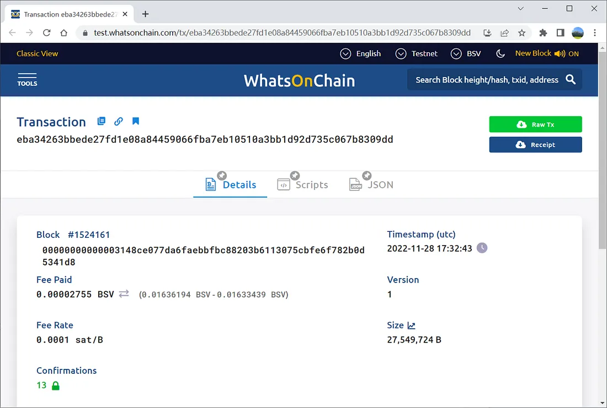

交易： [eba34263bbede27fd1e08a84459066fba7eb10510a3bb1d92d735c067b8309dd](https://test.whatsonchain.com/tx/eba34263bbede27fd1e08a84459066fba7eb10510a3bb1d92d735c067b8309dd)


