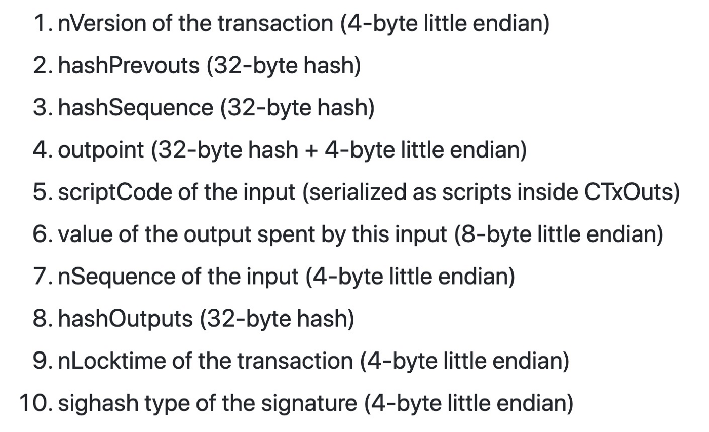
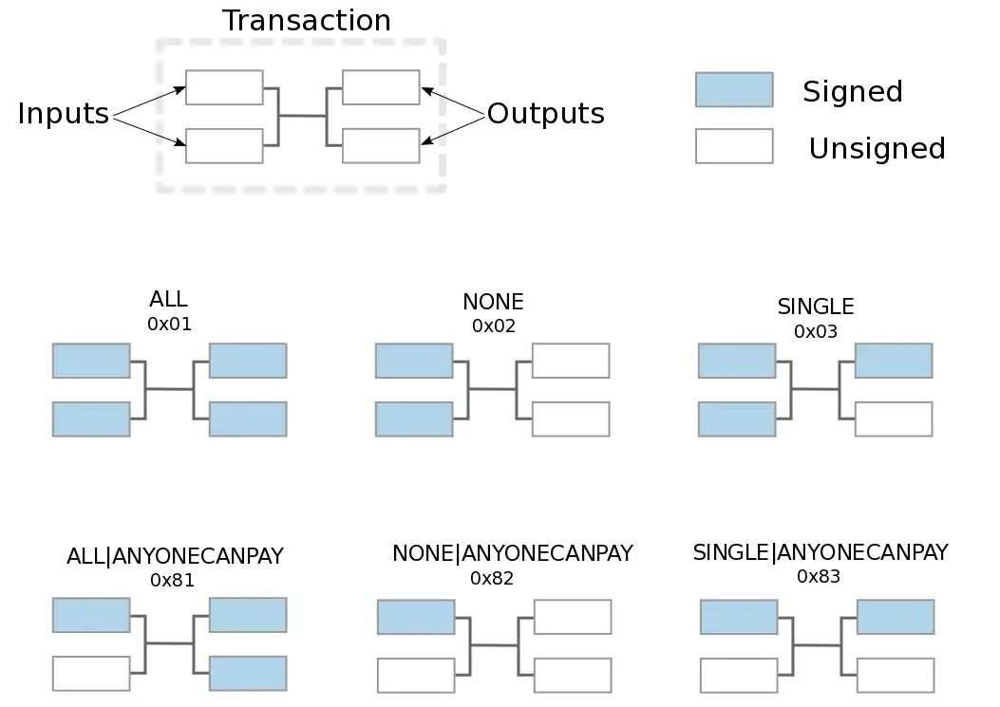

# 在没有分叉的情况下模拟任何 SIGHASH 标志

我们开发了一种新颖的方法来模拟任何 SIGHASH 标志，只需在智能合约中编写逻辑即可。它不需要更改协议，因此比每次构思新用例时通过分叉添加硬编码标志更实用和灵活。

## SIGHASH 标志

[SIGHASH](https://wiki.bitcoinsv.io/index.php/SIGHASH_flags) 标志决定交易的哪一部分由签名者签名。具体来说，它控制签名涵盖以下 10 项中的哪些项。



<center><a href="https://github.com/bitcoin-sv/bitcoin-sv/blob/master/doc/abc/replay-protected-sighash.md#digest-algorithm">SigHash 原像格式</a></center>

共有三个基本标志：*SIGHASH_ALL*、*SIGHASH_NONE* 和 *SIGHASH_SINGLE*。还有一个修饰符标志 *SIGHASH_ANYONECANPAY*，产生六种组合。



<center><a href="https://github.com/bitcoinbook/bitcoinbook/blob/develop/ch06.asciidoc#signature-hash-types-sighash">不同 sighash 组合</a></center>


已经有人提议添加更多标志，以自定义签署交易的各个部分，这在现有标志下是不可能的。下面列出了一个例子:

```js
/** Signature hash types/flags */
enum
{
    // Input Specific
    SIGHASH_WITHOUT_PREV_SCRIPTPUBKEY     = 0x01,
    SIGHASH_WITHOUT_PREV_VALUE            = 0x02,
    SIGHASH_WITHOUT_INPUT_TXID            = 0x04,
    SIGHASH_WITHOUT_INPUT_INDEX           = 0x08,
    SIGHASH_WITHOUT_INPUT_SEQUENCE        = 0x10,

    // Output Specific
    SIGHASH_WITHOUT_OUTPUT_SCRIPTPUBKEY   = 0x20,
    SIGHASH_WITHOUT_OUTPUT_VALUE          = 0x40,

    // Whether to serialize the other (other than self) inputs/outputs
    SIGHASH_WITHOUT_INPUTS                = 0x010000,
    SIGHASH_WITHOUT_OUTPUTS               = 0x020000,

    // Whether to serialize this input/output at all (these take priority over SIGHASH_WITHOUT_INPUTS and SIGHASH_WITHOUT_OUTPUTS)
    SIGHASH_WITHOUT_INPUT_SELF            = 0x040000,
    SIGHASH_WITHOUT_OUTPUT_SELF           = 0x080000,

    // Transaction specific fields
    SIGHASH_WITHOUT_TX_VERSION            = 0x100000,
    SIGHASH_WITHOUT_TX_LOCKTIME           = 0x200000,

    // Sign value not derived from transaction
    // (Whenever nHashType is negative, the script signature is for the value on the stack, e.g. stacktop(-3))
    SIGHASH_SIGN_STACK_ELEMENT            = 0x10000000,
};
```

<center><a href="https://github.com/scmorse/bitcoin-misc/blob/master/sighash_proposal.md">提议的标识</a></center>

然而，它们中的每一个都必须在节点软件中进行硬编码，因此需要一个潜在的有争议的分支。

## 模拟任何 SIGHASH 标志

我们提供了一个框架来模拟任意 SIGHASH 标志。新的 SIGHASH 标志可以简单地以智能合约的形式添加，因此根本不需要升级 BSV。总的来说，它分为三个步骤：

1. 使用 [OP_PUSH_TX](https://blog.csdn.net/freedomhero/article/details/107306604) 获取当前的 sighash
2. 根据新的标志语义修改/屏蔽 sighash
3. 使用 ECDSA 签名算法根据新的 sighash 检查签名。

例如，我们实现了 `SIGHASH_ANYPREVOUT`。

## SIGHASH_ANYPREVOUT

[BIP-118](https://github.com/bitcoin/bips/blob/master/bip-0118.mediawiki) 中的 *SIGHASH_ANYPREVOUT*（以前称为 *SIGHASH_NOINPUT*）从签名中排除了 UTXO 的标识符。
用它签名的交易不链接到特定的 UTXO，因此可以花费任何 UTXO,只要满足有正确的签名或其它满足其它花费条件。

这可以用于，例如，当用户想要授权第三方应用程序花费她的硬币时。她可以使用 *SIGHASH_ANYPREVOUT* 进行预签名，并且应用程序可以在她不在时一次又一次地重复使用签名。

以下合约检查输入签名（即 Sig sig）是否未涵盖正在花费的 UTXO，等同于使用 *SIGHASH_ANYPREVOUT* 进行签名。


```js
import "ec.scrypt";

// a template to implement any new SIGHASH flags
contract UniversalSigHash {
    PubKey pubKey;

    // sig is with SIGHASH flag SIGHASH_NOINPUT
    public function checkSigHashNoInput(Sig sig, SigHashPreimage sighash) {
        // get sighash preimage using SIGHASH_ALL
        require(Tx.checkPreimage(sighash));

        /* reconstruct the new sighash being signed */
        bytes sighash1 = sighash[: 4];
        // set item 2, 3, and 4 to 0
        bytes blankedSighash2to3 = b'00000000000000000000000000000000000000000000000000000000000000000000000000000000000000000000000000000000000000000000000000000000000000000000000000000000000000000000000000000000000000000000000000000000';
        bytes sighash5to10 = sighash[104 : ];
        bytes sighashNew = sighash1 + blankedSighash2to3 + sighash5to10;

        // check signature against the new sighash using elliptic curve library
        require(EC.verifySig(sighashNew, sig, this.pubKey));
    }
}
```

<center>UniversalSighash 合约</center>

1. 第 1 步：第 `10` 行确保 sighash 用于使用 OP_PUSH_TX 的当前交易。
2. 第 2 步：第 `13-17` 行将 sighash 的第 `2`、`3` 和 `4` 项设置为全 0，即清空输入 UTXO。
3. 第 3 步：第 `20` 行使用[椭圆曲线库](https://blog.csdn.net/freedomhero/article/details/128075578)确保签名完全覆盖新的 sighash。相当于BTC上的 [OP_CHECKSIGFROMSTACK](https://diyhpl.us/wiki/transcripts/bitcoin-core-dev-tech/2019-06-06-noinput-etc/) 或 BCH上的 [OP_DATASIGVERIFY/OP_CHECKDATASIG](https://medium.com/@Mengerian/the-story-of-op-checkdatasig-c2b1b38e801a)。

## 可扩展性

可以扩展相同的方法来模拟任何标志。例如，空白项目 2 和 3 等于 *SIGHASH_ANYONECANPAY*，空白项目 6 本质上是 *SIGHASH_WITHOUT_PREV_VALUE*。BSV 智能合约的表现力支持任意标记。