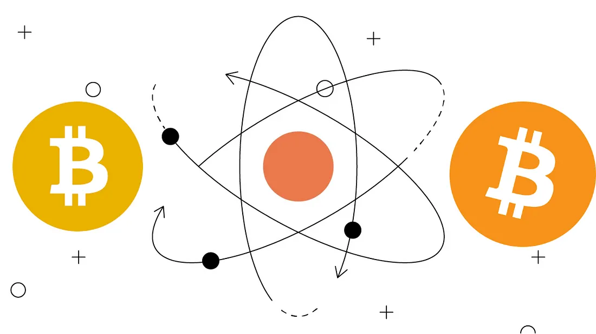

# Bitcoin SV 和 Bitcoin Core 之间首次跨链原子交换

我们已经执行了 Bitcoin SV 和 Bitcoin Core 之间的首次原子交换。 这一成就代表了比特币 SV 的重大进步，以去信任的方式促进了与其他区块链的无缝互操作性。



图片源自[Gemini](https://www.gemini.com/cryptopedia/what-is-an-atomic-swap-token-swap)

在[上一篇文章](https://github.com/sCrypt-Inc/article/blob/master/Cross-chain%20Atomic%20Swaps/Cross-chain%20Atomic%20Swaps.md#L1)中，我们解释了原子交换的高级理论。 我们深入研究了使用哈希时间锁定合约（HTLC）在 BSV 和 BTC 之间进行原子交换的实际示例。 让我们将此过程分解为四个基本步骤，每个步骤都包含您可以自己运行的代码片段。

## 第 1 步：Alice 在 BTC 上发起交易


该过程从 Alice 开始，她选择一个随机整数 `x` 并使用 SHA-256 算法创建一个哈希值 (xHash)。 接下来，Alice 部署了一个 Pay-to-Witness-Script-Hash (P2WSH) 交易，其中包括她想要与 Bob 交易的 BTC 数量。

我们使用 [bitcoinutils](https://github.com/karask/python-bitcoin-utils) 库构建 Alice 的交易：

```py
def main():
    # always remember to setup the network
    setup('testnet')

    # TODO: remember to adjust the values marked by "TODO" to your use case.
    alicePriv = PrivateKey('TODO')
    alicePub = alicePriv.get_public_key()
    bobPub = PublicKey('TODO')
    txid = 'TODO'  # Previous transaction ID
    vout = 2  # Previous transaction ouput index
    amount = 0.00001850   # Amount in output
    fee = 0.00000125      # Fee in new transaction
    x = 'f00cfd8df5f92d5e94d1ecbd9b427afd14e03f8a3292ca4128cd59ef7b9643bc'
    xHash = '1908c59a71781b7a44182ec39dd84a8a9e13dc31691fead8631730f5f5ab7b65'
    nBlocksLocked = '06'  # 6 blocks ~ 1 hr

    # HTLC script:
    htlc_redeem_script = Script(
        ['OP_IF',
            'OP_SHA256',
            xHash,
            'OP_EQUALVERIFY',
            bobPub.to_hex(),
            'OP_CHECKSIG',
        'OP_ELSE',
            nBlocksLocked,
            'OP_CHECKSEQUENCEVERIFY',
            'OP_DROP',
            alicePriv.get_public_key().to_hex(),
            'OP_CHECKSIG',
        'OP_ENDIF']
    )
    toAddress = P2wshAddress.from_script(htlc_redeem_script)

    # Create transaction input from tx id of utxo.
    txIn = TxInput(txid, vout)
    redeem_script1 = Script(
        ['OP_DUP', 'OP_HASH160', alicePub.to_hash160(), 'OP_EQUALVERIFY', 'OP_CHECKSIG'])

    # Create transaction output, which contains the P2WSH for the HTLC script.
    txOut = TxOutput(to_satoshis(amount - fee), toAddress.to_script_pub_key())

    # Create transaction.
    tx = Transaction([txIn], [txOut], has_segwit=True)

    # Sign transaction.
    sig1 = alicePriv.sign_segwit_input(tx, 0, redeem_script1, to_satoshis(amount))
    tx.witnesses.append(Script([sig1, alicePub.to_hex()]))

    # Print raw signed transaction ready to be broadcast.
    print("\nRaw signed transaction:\n" + tx.serialize())
    print("\nTxId:", tx.get_txid())
```

执行后，代码将打印原始的序列化交易，我们可以使用 [Blockstream 的区块浏览器](https://blockstream.info/testnet/tx/push)将其广播到 BTC 网络。

该 P2WSH 交易脚本由条件子句组成，这些条件子句包括需要 Bob 的公钥和秘密 x，或者 Alice 的签名和花费交易的时间延迟。

## Bob 在 BTC 上进行应答

作为回应，Bob 在 BSV 区块链上部署了等效的 sCrypt 智能合约，其中包含他准备与 Alice 交换的 BSV 金额。


```ts
class HashTimeLockContract extends SmartContract {
    @prop() readonly alicePubKey: PubKey

    @prop() readonly bobPubKey: PubKey

    @prop() readonly hashX: Sha256

    @prop() readonly timeout: bigint // Can be a timestamp or block height.


    // hash lock
    @method()
    public unlock(x: ByteString, aliceSig: Sig) {
        // Check if H(x) == this.hashX
        assert(sha256(x) == this.hashX, 'Invalid secret.')

        // Verify Alices signature.
        assert(this.checkSig(aliceSig, this.alicePubKey))
    }

    // time lock
    @method()
    public cancel(bobSig: Sig) {
        assert(this.ctx.locktime >= this.timeout, 'locktime has not yet expired')

        // Verify Bobs signature.
        assert(this.checkSig(bobSig, this.bobPubKey))
    }
}
```

Bob 获得了 `x` 的哈希值，但不是 `x` 本身，以及 Alice 的公钥。 然后，他使用以下部署代码部署智能合约：

```ts

const alicePubKey = bsv.PublicKey.fromHex('TODO')

const bobPrivKey = bsv.PrivateKey.fromWIF('TODO')
const bobPubKey = bobPrivKey.publicKey

const amount = 100000  // TODO: amount of BSV to be locked in the contract

const xHash = toByteString(
    '1908c59a71781b7a44182ec39dd84a8a9e13dc31691fead8631730f5f5ab7b65'
)
const lockTimeMin = 1688715000 // Timestamp, after which Bob can withdraw his funds.

await CrossChainSwap.compile()

// Connect Bob signer.
const provider = new DefaultProvider(bsv.Networks.testnet)
const signer = new TestWallet(bobPrivKey, provider)

const crossChainSwap = new CrossChainSwap(
    PubKey(alicePubKey.toHex()),
    PubKey(bobPubKey.toHex()),
    xHash,
    BigInt(lockTimeMin)
)
await crossChainSwap.connect(signer)


// Contract deployment.
const deployTx = await crossChainSwap.deploy(amount)
console.log('CrossChainSwap contract deployed: ', deployTx.id)
```

## 第三步：Alice 解锁 Bob 的合约

成功部署 sCrypt 合约后，Alice 现在可以通过泄露秘密 `x` 来调用 Bob 合约的公共方法 `unlock()`。 结果，Alice 拥有了 Bob 的 BSV。

```ts
const deployedContractTXID = 'TODO'
const x = toByteString('f00cfd8df5f92d5e94d1ecbd9b427afd14e03f8a3292ca4128cd59ef7b9643bc')

// Alice unlocks contract and takes the funds.
const provider = new DefaultProvider(bsv.Networks.testnet)
const signer = new TestWallet(alicePrivKey, provider)

const tx = await signer.provider.getTransaction(deployedContractTXID)
const crossChainSwap = CrossChainSwap.fromTx(tx, 0)
await crossChainSwap.connect(signer)

const { tx: callTx, atInputIndex } =
    await crossChainSwap.methods.unlock(
        x,
        (sigResps) => findSig(sigResps, alicePubKey),
        {
            pubKeyOrAddrToSign: alicePubKey,
        } as MethodCallOptions<CrossChainSwap>
    )
console.log('CrossChainSwap "unlock" method called: ', callTx.id)
```

## 第四步：Bob 取回 Alice 的 BTC

一旦 Alice 透露了 `x`，Bob 就可以用它来解锁 BTC 区块链上的 P2WSH UTXO。 这个过程允许鲍勃索取爱丽丝的比特币，从而完成原子交换。

```py
def main():
    # always remember to setup the network
    setup('testnet')

    # TODO: Set values:
    bobPriv = PrivateKey('TODO')
    bobPub = bobPriv.get_public_key()
    alicePub = PublicKey('TODO')
    txid = 'TODO'  # Previous transaction ID
    vout = 0 # Previous transaction ouput index
    amount = 0.00001725   # Amount in output
    fee = 0.00000125      # Fee in new transaction
    x = 'f00cfd8df5f92d5e94d1ecbd9b427afd14e03f8a3292ca4128cd59ef7b9643bc'
    xHash = '1908c59a71781b7a44182ec39dd84a8a9e13dc31691fead8631730f5f5ab7b65'
    nBlocksLocked = '06'  # 6 blocks ~ 1 hr
    toAddress = P2wpkhAddress.from_address('TODO')

    # HTLC Script:
    htlc_redeem_script = Script(
        ['OP_IF',
            'OP_SHA256',
            xHash,
            'OP_EQUALVERIFY',
            bobPub.to_hex(),
            'OP_CHECKSIG',
        'OP_ELSE',
            nBlocksLocked,
            'OP_CHECKSEQUENCEVERIFY',
            'OP_DROP',
            alicePub.to_hex(),
            'OP_CHECKSIG',
        'OP_ENDIF']
    )

    fromAddress = P2wshAddress.from_script(htlc_redeem_script)

    # Create transaction input from tx id of UTXO
    txin = TxInput(txid, vout)

    txOut1 = TxOutput(to_satoshis(amount - fee), toAddress.to_script_pub_key())

    tx = Transaction([txin], [txOut1], has_segwit=True)

    # NOTE: In P2WSH, the argument for OP_IF and OP_NOTIF MUST be exactly an empty vector or 0x01, or the script evaluation fails immediately.

    # Normal unlock:
    sig1 = bobPriv.sign_segwit_input(tx, 0, htlc_redeem_script, to_satoshis(amount))
    tx.witnesses.append(Script([
        sig1,
        x,
        '01',  # OP_TRUE
        htlc_redeem_script.to_hex()]))

    # print raw signed transaction ready to be broadcasted
    print("\nRaw signed transaction:\n" + tx.serialize())
    print("\nTxId:", tx.get_txid())
```

我们可以广播打印的原始交易并完成交换。

## 争议解决

在发生争议的情况下，Alice 和 Bob 都可以在一段时间后提取资金。

此功能提供了一种故障安全机制，可确保在交换不成功或有争议的情况下不会永久锁定资金。 时间限制为双方解锁各自的合同提供了足够的窗口。

在爱丽丝的例子中，我们可以修改见证人的构造：

```py
# ...

# Create transaction input from tx id of UTXO.
txin = TxInput(txid, vout, sequence=bytes.fromhex('FFFFFFFE'))

# ...

locktime = bytes.fromhex('64A7F990') # 1688730000
tx = Transaction([txin], [txOut1], has_segwit=True, locktime=locktime)

# Withdrawal:
sig1 = alicePriv.sign_segwit_input(tx, 0, htlc_redeem_script, to_satoshis(amount))
tx.witnesses.append(Script([
    sig1,
    '', # OP_FALSE
    htlc_redeem_script.to_hex()]))

#...
```

传递 `OP_FALSE` 作为第一个输入将在 `OP_ELSE` 之后执行脚本，这会检查时间锁定是否已过期。

同样，在 Bob 的情况下，我们修改代码以调用 `cancel` 方法：

```ts

// Bob withdraws after timeout passed.
const { tx: callTx, atInputIndex } =
    await crossChainSwap.methods.cancel(
        (sigResps) => findSig(sigResps, bobPubKey),
        {
            lockTime: 1688730000,
            pubKeyOrAddrToSign: bobPubKey,
        } as MethodCallOptions<CrossChainSwap>
    )
console.log('CrossChainSwap "cancel" method called: ', callTx.id)
```

# 首次成功跨链BTC-BSV互换

我们在 BSV 和 BTC 主网之间进行了首次成功的原子交换。

- BTC 上的初始 P2WSH 交易：[af7a8c31e489c18d6fe46141cf2cbc777aeb23672679eb199bde4813d6fe41d4](https://blockstream.info/tx/af7a8c31e489c18d6fe46141cf2cbc777aeb23672679eb199bde4813d6fe41d4)

- BSV 上等效的 sCrypt 智能合约交易：[8598d203e8bdd45b7025e334cdebdef06be88381dec245d95108e658e8373f9c](https://whatsonchain.com/tx/8598d203e8bdd45b7025e334cdebdef06be88381dec245d95108e658e8373f9c)

- Alice 调用 `unlock` 方法：[68c2c5a91645112df6b62a5ee6ea9e0e22f29499b88c9ccffc23f8f86ec63d09](https://whatsonchain.com/tx/68c2c5a91645112df6b62a5ee6ea9e0e22f29499b88c9ccffc23f8f86ec63d09)

- 鲍勃解锁了 BTC：[9c697bf8f0d2c11285cfab3a2b8a856a1c18ae048d481c7bb3f93f9ccd2dbaad](https://blockstream.info/tx/9c697bf8f0d2c11285cfab3a2b8a856a1c18ae048d481c7bb3f93f9ccd2dbaad)

这也是一个未完成的交换示例。 爱丽丝和鲍勃都收回了他们的资金。

- BTC: [395dde14e489208302c1d6ac3b4fc0db890c000fd79f3e836fc74043a54480ff](https://blockstream.info/tx/395dde14e489208302c1d6ac3b4fc0db890c000fd79f3e836fc74043a54480ff)
- BSV: [12e701237a1f6da2b69f1d4dab2b1208d3f6003f7b45ef178c5c7d9e00c54273](https://whatsonchain.com/tx/12e701237a1f6da2b69f1d4dab2b1208d3f6003f7b45ef178c5c7d9e00c54273)

本文中显示的所有代码都可以在[我们的 GitHub](https://github.com/sCrypt-Inc/bsv-btc-swap) 上找到。
